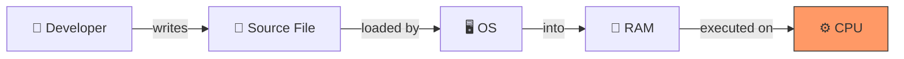
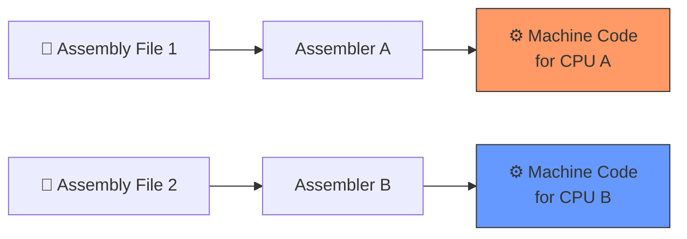
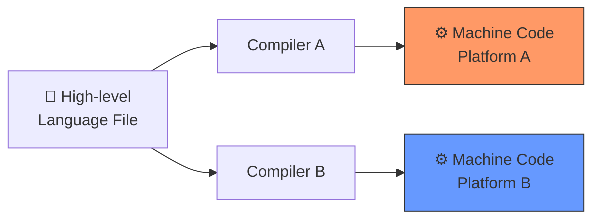
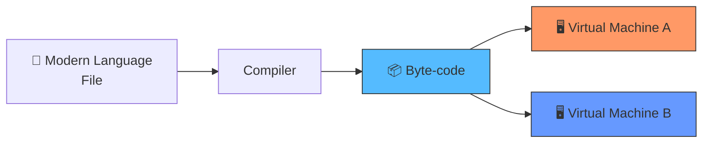
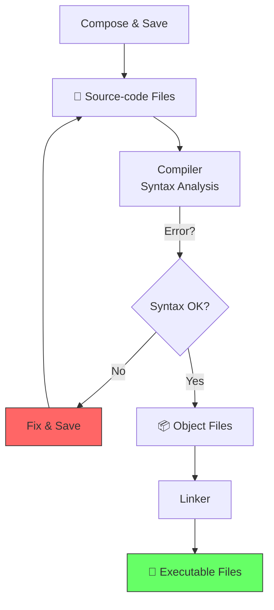
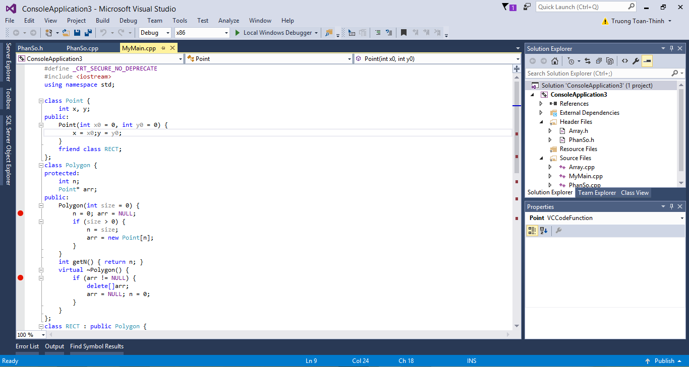
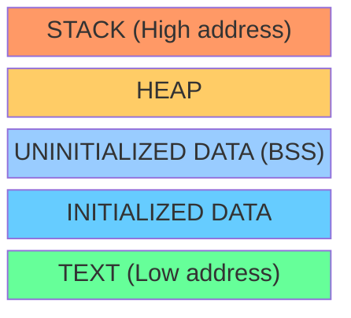

# Week 01: Introduction & Basic Operators

> **Source**: CSLTr_Week01.ppsx (33 slides)
> **Advisor**: Truong Toan Thinh
> **Note**: Extracted from PPSX XML. Images extracted to `week01_images/`. Diagrams are composed from individual icons — described in text where possible.

---

## Slide 1 — Title

INTRODUCTION & BASIC OPERATORS
Fundamentals of programming – Co so lap trinh
Advisor: Truong Toan Thinh

---

## Slide 2 — Introduction

Goals, Program, Compiler, Programming environment, Examples

---

## Slide 3 — Goals

- **Understanding** basic conceptions of programming language, for example C/C++.
- **Using** techniques in C/C++ to deal with the practical/academic problem.
- **Knowing** some programming strategy
- Programming environment: Visual Studio 2019 ...

---

## Slide 4 — Grade Scale

> *[Visual content: grade scale table — refer to original PPSX]*

---

## Slide 5 — Class Organization

- Group of about 5 members:
  - Discuss
  - Doing exercises
- Student: read more any materials
- Discuss at:
  - Forum: https://courses.ctda.hcmus.edu.vn
  - Advisor: Truong Toan Thinh
  - Email: ttthinh@fit.hcmus.edu.vn
  - Place: Room I82, Information technology department, University of Science, VNU-HCM

---

## Slide 6 — References

- Ki thuat lap trinh C – Prof Pham Van At
- Nhap mon lap trinh – Prof Tran Dan Thu, PhD Nguyen Thanh Phuong, PhD Dinh Ba Tien va Prof Tran Minh Triet
- **The C++ Programming Language** – Bjarne Stroustrup
- **Introduction to Algorithms** – Thomas H. Cormen, Charles E. Leiserson, Ronald L. Rivest, va Clifford Stein
- BAI TAP KY THUAT LAP TRINH – THAY NGUYEN TAN TRAN MINH KHANG

---

## Slide 7 — Main Contents

1. Overview of computer programming & basic operators
2. Control structure & modular programming
3. Algorithm & conditional programming strategy
4. Array & loop technique
5. Structural datatype & File-handling
6. Using pointer: allocate, free...
7. Linked list data structure, stack and queue
8. String processing
9. Search and Sort algorithms
10. Recursion
11. Pointer function & customized source code

---

## Slide 8 — What is a Program?

- A sequence of instructions
- To solve practical/academic problems
- Who programs is developer
- Two basic programs:
  - Machine code
  - Assembly & assembler

---

## Slide 9 — Process of Machine Code



Process: **Run → Search → Load → Process**

- Some limitations:
  - Depend on CPU
  - Organized by OS
  - Difficult to understand
  - Unable to directly program machine code

---

## Slide 10 — Assembly Language

- Assembly is a low-level language
- Easier to understand than machine code
- Need **Assembler** to translate into machine code
- Defect: depend on CPU
- Merit: take advantage of CPU



---

## Slide 11 — Traditional High-Level Programming Language

- More abstract than assembly
- Easier to understand than assembly
- More compatible than assembly



---

## Slide 12 — Programming Languages by Objective

- Web applications: PHP, ASP.net, Ruby
- Administration systems: Java, C#
- Science computations: Fortran
- Machine learning algorithms: Python
- Operating systems: C/C++

---

## Slide 13 — Modern High-Level Languages

- Limitation of traditional high-level programming languages: their compilers directly translate into machine code
- The modern high-level programming languages' compilers translate into intermediate code (byte-code)



---

## Slide 14 — Compiler vs Interpreter

**Compiler**:
- All source code is performed syntax analysis
- Translates a programming language into another language (machine code + management information)
- Results saved on hard-disk are execution files

**Interpreter**:
- Checks syntax at each line of codes
- Perform its behavior directly

---

## Slide 15 — Process of Compiling

1. Developer chooses another text-editor to compose source code
2. Compiler translates it into target language (intermediate code)
3. Linker connects all intermediate codes into executable files
4. Run the program

---

## Slide 16 — Compilation Diagram



---

## Slide 17 — Programming Environment (IDE)

A place where we perform some tasks, such as compiling, linking (called Integrated Development Environment)

Main features:
- Text Composing
- Source code management
- Version management
- Syntax analysis, compiling and linking
- Debug
- ...

For instances: Visual Studio 2019, 2022...

---

## Slide 18 — IDE Screenshot



Visual Studio with C++ OOP code (Point, Polygon, RECT classes). Shows Solution Explorer with Header Files (Array.h, PhanSo.h) and Source Files (Array.cpp, MyMain.cpp, PhanSo.cpp).

---

## Slide 19 — Example: Hello World

```c
//File Hello.c
#include <stdio.h>
void main()
{
    printf("Hello World!!!");
}
```

- Line 1: comment line
- Line 2: include some libraries
- Line 3: declare at the beginning
- Line 4: symbol `{` begins the definition
- Line 5: print 'Hello...' to screen
- Line 6: symbol `}` finishes the definition

---

## Slide 20 — Example: Multiple Print

```c
//File Hello.c
#include <stdio.h>
void main()
{
    printf("Hello World!!!\n");
    printf("I am a student");
}
```

---

## Slide 21 — Example: Sum of Two Numbers

```c
//File Sum.c
#include <stdio.h>
void main()
{
    int a = 2, b = 3;
    int kq = a + b;
    printf("Ket qua la: %d", kq);
}
```

- `%d` is the format specifier for integer variables

---

## Slide 22 — Example: Sum with Input

```c
//File Sum.c
#include <stdio.h>
void main()
{
    int a, b;
    printf("Nhap a: ");
    scanf("%d", &a);
    // ... nhap b tuong tu
    int kq = ...
    printf("Ket qua la: %d", kq);
}
```

---

## Slide 23 — Example: Subtraction with Input

```c
//File Subtract.c
#include <stdio.h>
void main()
{
    int a, b;
    printf("Nhap a: ");
    scanf("%d", &a);
    // ... nhap b tuong tu
    int kq = ...
    printf("Ket qua la: %d", kq);
}
```

---

## Slide 24 — Example: Sin Function

```c
//File Sin.c
#include <stdio.h>
#include <math.h>
void main()
{
    double a;
    printf("Nhap a: ");
    scanf("%lf", &a);
    double kq = sin(a);
    printf("Ket qua la: %lf", kq);
}
```

---

## Slide 25 — Example: Square Root

```c
//File Tinh_can_so.c
#include <stdio.h>
#include <math.h>
void main()
{
    double a;
    printf("Nhap a: ");
    scanf("%lf", &a);
    double kq = sqrt(a);  // Ham tinh can so trong math.h la sqrt()
    printf("Ket qua la: %lf", kq);
}
```

---

## Slide 26 — Example: Division

```c
//File Divide.c
#include <stdio.h>
void main()
{
    double a, b;
    printf("Nhap a: ");
    scanf("%lf", &a);
    // ... nhap b tuong tu
    double kq = a / b;
    printf("Ket qua la: %lf", kq);
}
```

---

## Slide 27 — Basic Operators (Section Start)

Topics:
- Introduction
- Data type, constant & variable
- Primitive data-types
- Library I/O formatting
- Exercises

---

## Slide 28 — C vs C++ Comparison

| Lines | C++ | C |
|-------|-----|---|
| 1 | `//File Hello.cpp` | `//File Hello.c` |
| 2 | `#include <iostream>` | `#include <stdio.h>` |
| 3 | `using namespace std;` | |
| 4 | `void main()` | `void main()` |
| 5 | `{` | `{` |
| 6 | `cout<<"Hello World!!!"<<endl;` | `printf("Hello World!!!\n");` |
| 7 | `}` | `}` |

---

## Slide 29 — C++ Explanation

- Line 2: library `iostream` in C++ supports input/output (similar to `scanf` & `printf`)
- Line 3: using `namespace std` to invoke `cout` (maybe typing `std::cout` without it)
- Line 6: using `cout` to print "Hello world" with operator called `endl` similar to `\n`

---

## Slide 30 — Data Types

C supports:
- **Character** (`char`): such as `'a'` or `'b'`
- **Integer number** (`int`, `long`): such as 23 or 24L
- **Single-precision floating point** (`float`): such as 1.2F or 2.2F
- **Double-precision floating point** (`double`): such as 1.2 or 2.2

Notes:
- Every datatype has min & max values
- Character & integer number can be used interchangeably (e.g., `char a = 65`)
- Integer number may be signed or unsigned

---

## Slide 31 — Constants

Constant: quantity with unchangeable values

Types:
- Character constant: `'a'`, `'b'`
- Integer number constant: 22, 22L
- Real number constant: 1.2, 1.2F
- String constant: `"hello"`

Defining constant:
- `#define PI 3.14` (C language)
- `const int PI 3.14;` (C++ language)



---

## Slide 32 — Variables

Variable: quantity with changeable values (e.g., `int a`, `char c`, `float f`)

Naming conventions:
- Descriptive: `int dienTich`, `char kt`...
- Starting with A-Z, underscore `_`
- Obeying contracts

`sizeof` operator: takes variable's name or datatype as input (unit: byte)
- `sizeof(int)` = 4 bytes
- `sizeof(c)` = 1 byte (for char)

*(Same memory layout diagram as Slide 31)*

---

## Slide 33 — Example: Circle Area

```c
//File Circle.c
#include <stdio.h>
void main()
{
    #define PI 3.14159
    float R = 1.25;
    float DienTich;
    DienTich = PI * R * R;
    printf("Hinh tron, ban kinh = %f\n", R);
    printf("Dien tich = %f", DienTich);
}
```
