# Week 02: Control Structure & Source Organization

> **Source**: CSLTr_Week02.ppsx (61 slides)
> **Advisor**: Truong Toan Thinh
> **Note**: Extracted from PPSX XML. Images extracted to `week02_images/`.

---

## Slide 1 — Title

CONTROL STRUCTURE & SOURCE ORGANIZATION
Fundamentals of programming – Cơ sở lập trình
Advisor: Trương Toàn Thịnh

---

## Slide 2 — Control Structure (Overview)

Topics:
- Block
- Branch statement
- Loop statement
- Break & Continue
- Loop condition
- Exercise

---

## Slide 3 — Block

- A set of statements between `{` and `}`
- May be nested (a block may contain other blocks inside it)
- Local variables are declared inside a block
- Global variables are declared outside any block

```c
{                                    // Block A
    int x = 1, y = 0;
    y = ++x;
    //cout << z << endl; (error)
   {                                 // Block B
      int z;
      z = x + y;
      printf("z = %d\n", z);
   }
   // cout << z << endl; (error)
}
```

---

## Slide 4 — Block (Visibility Rules)

- Variables in another block can be used only inside that block
- Two variables in the same block cannot have the same name
- Variable in block A can be used in block A and blocks which A contains
- If there is any namesake in another block and its nested blocks, the visibility of variable follows the nearest area

---

## Slide 5 — Block Example

```c
#include <stdio.h>
void main(){
  int a = 1984, b = 1988;
  printf("a(main block) = %d\n", a);
  printf("b(main block) = %d\n", b);
  {
    int b = 1996;
    a = 2001;
    printf("a(of main block is changed) = %d\n", a);
    printf("b(sub block) = %d\n", b);
  }
  printf("Now is main block:\n");
  printf("a(changed) = %d\n", a);
  printf("b(unchanged) = %d\n", b);
}
```

---

## Slide 6 — Block (Namespaces)

- Namespaces in C++ are used to organize code into logical groups and to prevent name collisions
- Example: `cin` and `cout` in namespace std and belong to `<iostream>`

```cpp
#include <iostream>
using namespace std;
```

Declaration syntax:
```cpp
namespace <Name>{
  //Entities
}
```

Usage syntax:
```cpp
using namespace <name>
```

---

## Slide 7 — Namespace Example

```cpp
#include <iostream>
using namespace std;
namespace Data2D{              namespace Data3D{
  int dX = 3, dY = 4;           float dX = 5, dY = 6, dZ = 7;
  float Area;                    float Volume;
}                                namespace Base{ float Area, h;}
                               }

void main(){
  using namespace Data2D;
  Area = dX*dY;
  cout<<"Data2D::Area = "<<Area<<endl;
  Data3D::Base::Area = Data3D::dX*Data3D::dY;
  Data3D::Volume = Data3D::Base::Area*Data3D::dZ;
  Data3D::Base::h = (Data3D::dX*Data3D::dY)/2;
  cout<<"Volume="<<Data3D::Volume<<endl;
  cout<<"h="<<Data3D::Base::h<<endl;
}
```

---

## Slide 8 — Block (Global Variables)

- Declare/define outside all blocks (usually placed at the beginning of the program)
- Using `::` if any local variable has the same name

```c
#include <stdio.h>
int dX = 7;
void main(){
  printf("dX (global) = %d\n", dX);
  {
    int dX = 9;
    printf("dX (Sub block) = %d\n", dX);
    printf("dX (global) is unchanged = %d\n", ::dX);
  }
}
```

---

## Slide 9 — Branch Statement (Simple if)

Used in case of belonging to logical conditions. C/C++ supports two kinds: `if else` and `switch`.

```c
if(<condition>){
  //statement in if
}
//Next statement
```

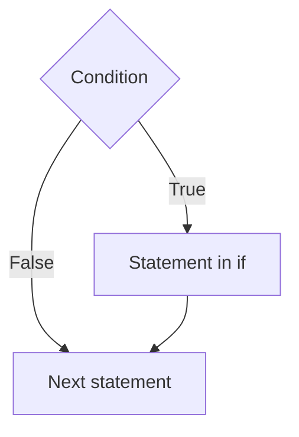

---

## Slide 10 — Branch Statement (if Example: Max/Min)

```c
#include <stdio.h>
void main(){
  int a, b, vmax, vmin;
  printf("a = "); scanf("%d", &a);
  printf("b = "); scanf("%d", &b);
  vmin = a; vmax = b;
  if(a > b){
    vmin = b; vmax = a;
  }
  printf("Max: %d, Min: %d\n", vmax, vmin);
}
```

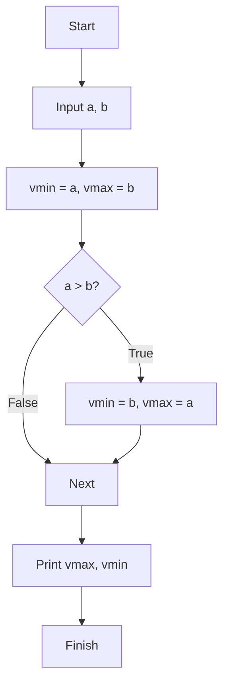

---

## Slide 11 — Branch Statement (if-else)

```c
if(<condition>){
  //Statement in if
}
else{
  //Statement in else
}
//Next statement
```

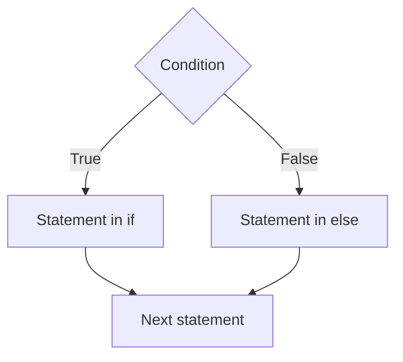

---

## Slide 12 — Branch Statement (if-else Example)

```c
#include <stdio.h>
void main(){
  int a, b, vmax, vmin;
  printf("a = "); scanf("%d", &a);
  printf("b = "); scanf("%d", &b);
  if(a > b){
    vmin = b; vmax = a;
  }
  else{
    vmax = b; vmin = a;
  }
  printf("Max: %d, Min: %d\n", vmax, vmin);
}
```

---

## Slide 13 — Branch Statement (switch)

- `switch` is used to consider many cases
- Only used with integer values
- Companied with statement `break` in each block
- Always should have `default`
- Some 'case' can be the same

---

## Slide 14 — Branch Statement (switch Example)

```c
#include <stdio.h>
void main(){
  int n;
  printf("n = "); scanf("%d", &n);
  switch(n){
    case 0:
      printf("Khong\n");
      break;
    case 1:
      printf("Mot\n");
      break;
    default: printf("Khac khong va mot\n");
  }
}
```

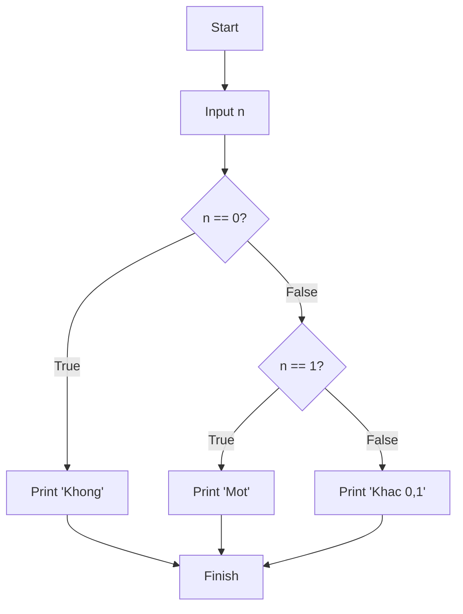

---

## Slide 15 — Loop Statement

- Used to loop a group of instructions
- C/C++ supports three kinds of loop: `while`, `do...while`, `for`
- Almost all algorithms have to use loop statement in their body

---

## Slide 16 — Loop Statement (while)

```c
while(<condition>){
  //Statement in while
}
//Next statement
```

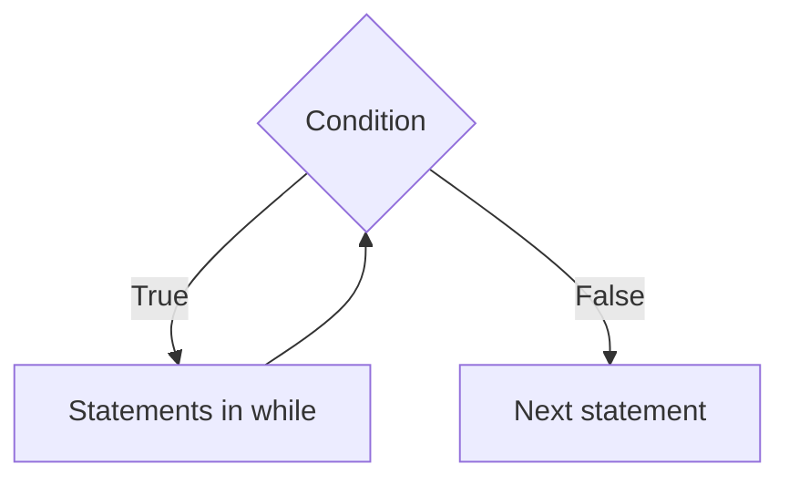

---

## Slide 17 — Loop Statement (while Example)

```c
#include <stdio.h>
void main(){
  float sum = 0, x = 1;
  while(x > 0){
      printf("Nhap x: ");
      scanf("%f", &x);
      if(x > 0) sum+=x;
  }
  printf("Tong la: %f\n", sum);
}
```

---

## Slide 18 — Loop Statement (do-while)

```c
do{
  //Statement in do-while
}while(<condition>);
//Next statement
```

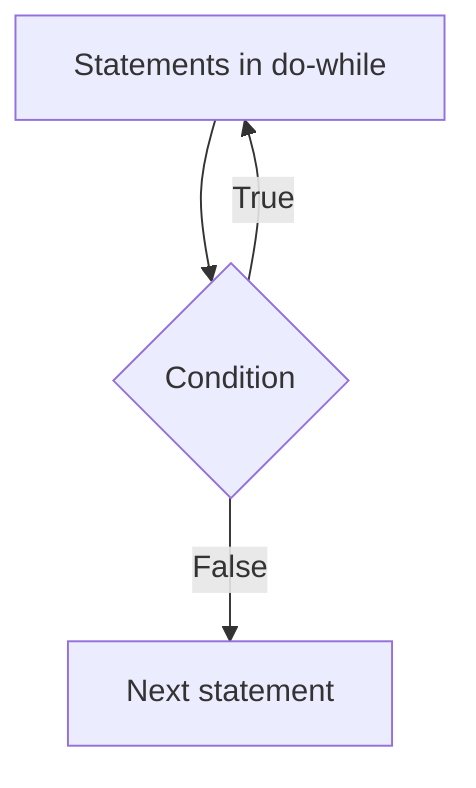

---

## Slide 19 — Loop Statement (do-while Example)

```c
#include <stdio.h>
void main(){
  float sum = 0, x;
  do{
      printf("Nhap x: ");
      scanf("%f", &x);
      if(x > 0) sum+=x;
  }while(x > 0);
  printf("Tong la: %f\n", sum);
}
```

---

## Slide 20 — Loop Statement (for)

```c
for(B; <condition>; D){
  //Statement in for
}
//Next statement
```

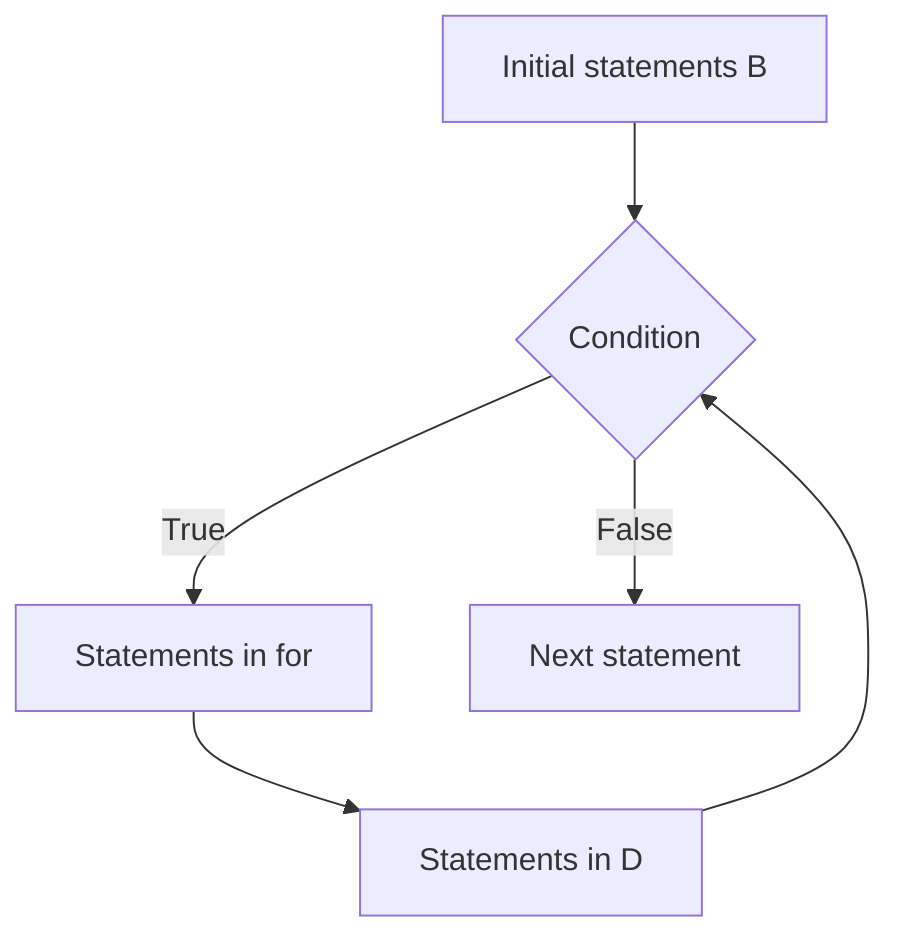

---

## Slide 21 — Loop Statement (for Example)

```c
#include <stdio.h>
void main(){
  long n; double S, x, i;
  printf("Input n: ");
  scanf("%ld", &n);
  for(i = 1; i <= n; i++){
    x = 1/(i*i);
    S+=x;
  }
  printf("Result = %lf\n", S);
}
```

---

## Slide 22 — Break & Continue (break)

`break` is used to go out of nearest loop containing it. Used in `if` or `switch`.

```c
#include <stdio.h>
void main(){
  float sum = 0, x;
  do{
      printf("Nhap x: ");
      scanf("%f", &x);
      if(x <= 0) break;
      sum+=x;
  }while(1);
  printf("Tong la: %f\n", sum);
}
```

---

## Slide 23 — Break & Continue (continue)

`continue` is used to go back to loop and ignore some statements below it. Used in `if`.

```c
void main(){
  int sum = 0, x;
  do{
      printf("Nhap x: ");
      scanf("%d", &x);
      if(x % 2 != 0) continue;
      if(x == 0) break;
      sum+=x;
  }while(1);
  printf("Tong la: %d\n", sum);
}
```

---

## Slide 24 — Loop Condition

- With loop statements, we must have loop-condition to go out of loops
- Without proper condition, we will have infinite loops
- Need to have some guarantees:
  - At least there are some statements falsifying loop-condition
  - At least there is one time `break` happens

---

## Slide 25 — Source Organization (Overview)

Topics:
- Introduction
- Passing parameters
- Aspects of functions in C/C++
- Function overloading
- Default argument
- Function pointer
- Functions in various files
- Scope of function and global variable

---

## Slide 26 — Introduction (Source Organization)

Source code is divided into following parts:
- **A source package**: including many files collaborating to set up a sub-system (files in the same package saved in the same folder)
- **A file**: including one or more sub-routines solving related problems
- **A sub-routine**: performing a specific independent task

---

## Slide 27 — Introduction (Round Function Example)

Library `<math.h>` provides `floor()` and `ceil()` functions, but not a round function.

| Giá trị x | floor(x) | ceil(x) | Số làm tròn |
|-----------|----------|---------|-------------|
| 3.2       | 3        | 4       | 3           |
| 3.7       | 3        | 4       | 4           |
| -3.2      | -4       | -3      | -3          |
| -3.8      | -4       | -3      | -4          |

---

## Slide 28 — Introduction (Round Function Implementation)

```c
#include <stdio.h>
#include <math.h>
double round(double);
double round(double x){
  double kq;
  if(x >= 0)
    kq = floor(x + 0.5);
  else
    kq = -floor(-x + 0.5);
  return kq;
}

void main(){
  double a, y;
  printf("Nhap a: ");
  scanf("%lf", &a);
  y = round(a);
  printf("round(a) = %lf", y);
}
```

---

## Slide 29 — Introduction (Function Analysis)

- **Declaration**: `<datatype return> <Function name>(<Arguments list>)` → `double round(double)`
- **Implementation** (function definition): Coding instructions in function body
- **Calling function**: invocation placed in `main()` or any function needing to call

---

## Slide 30 — Passing Parameters

- Function arguments: called formal argument
- Once invoked, calling function transmits actual argument into called function
- Formal and actual arguments can have same or different names
- Sending actual arguments to formal arguments is called **parameter passing mechanism**

---

## Slide 31 — Pass-by-Value

Once invoked, the actual arguments' values are copied into formal ones. Any modification of formal arguments does **not** affect the values of actual ones.

```c
void main(){
  double a = -2.71828, y;
  y = round(a);
  printf("Round is = %lf\n", y);
  printf("a = %lf\n", a);         // a is unchanged
}

double round(double b){
  double res;
  if(b >= 0) res = floor(b + 0.5);
  else res = -floor(-b + 0.5);
  return res;
}
```

---

## Slide 32 — Pass-by-Reference

Once invoked, actual argument and formal argument are **the same**. Any modification of formal arguments **affects** the values of actual ones.

```c
void round(double);
void round(double &x){
  if(x >= 0) x = floor(x + 0.5);
  else x = -floor(-x + 0.5);
}

void main(){
  double a = -2.71828;
  round(a);
  printf("Round is = %lf\n", a);  // a is modified to -3
}
```

---

## Slide 33 — Local & Static Local Variables

**Local variable:**
- Declared inside the function body
- Used to store temporary values
- Destroyed when computation finished
- Once another function invoked, a buffer allocates memory for local variables

**Static local variable:**
- Allocated in stable memory
- Declared inside the function body, but values are only destroyed when the program finishes

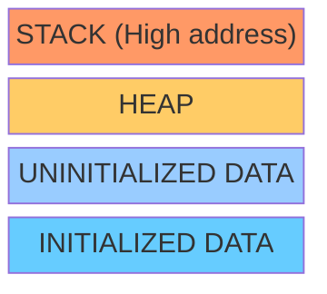

---

## Slide 34 — Static Local Variable Example

```c
#include <stdio.h>
double Accumulator(double number){
  static double sum = 0;
  sum += number;
  return sum;
}
void main(){
  double kq;
  Accumulator(1);
  Accumulator(2);
  kq = Accumulator(3);
  printf("kq = %lf\n", kq);  // kq = 6.0
}
```

---

## Slide 35 — Aspects of Functions

Data related to function divided into three categories:
- **Input objects**: available for the functions → often use pass-by-value
- **Output objects**: functions need to compute/determine → use pass-by-reference or `return` value
- **Intermediate objects**: store temporary values → often use local variable

---

## Slide 36 — Aspects of Functions (Quadratic Equation)

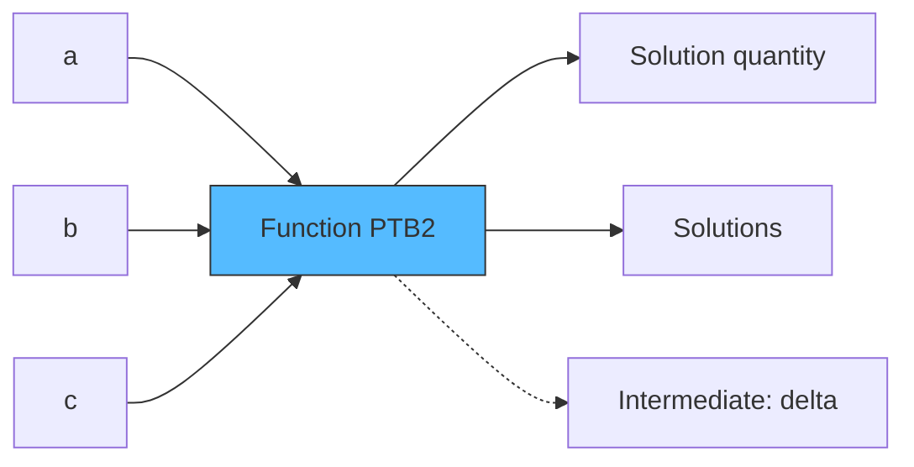

---

## Slide 37 — Quadratic Equation (Example 1)

```c
void EquaDeg2(double a, double b, double c,
              double& x1, double& x2, int& sn){
  double delta, sqrtDelta;
  delta = b*b - 4*a*c;
  if(delta > 0){
    sn = 2; sqrtDelta = sqrt(delta);
    x1 = (-b + sqrtDelta)/(2*a);
    x2 = (-b - sqrtDelta)/(2*a);
  }
  else if(delta == 0){
    sn = 1; x1 = x2 = (-b)/(2*a);
  }
  else { sn = 0; }
}
```

---

## Slide 38 — Quadratic Equation (Example 2: with return value)

```c
int EquaDeg2(double a, double b, double c,
             double& x1, double& x2){
  double delta, sqrtDelta; int sn;
  delta = b*b - 4*a*c;
  if(delta > 0){
    sn = 2; sqrtDelta = sqrt(delta);
    x1 = (-b + sqrtDelta)/(2*a);
    x2 = (-b - sqrtDelta)/(2*a);
  }
  else if(delta == 0){
    sn = 1; x1 = x2 = (-b)/(2*a);
  }
  else { sn = 0; }
  return sn;
}
```

---

## Slide 39 — Prime Number Check

```c
int isPrime(long n){
  int Prime;
  if(n < 0) n = -n;
  if(n == 0) Prime = 1;
  else if(n == 1) Prime = 0;
  else{
    long i = 2; Prime = 1;
    while(i <= sqrt(n)){
      if(n % i == 0) { Prime = 0; break; }
      i++;
    }
  }
  return Prime;
}
```

---

## Slide 40 — Prime Listing & Nth Prime

```c
// Enumerate prime numbers <= n
void PrimeListing(long n){
  for(long i = 2; i <= n; i++){
    if(isPrime(i)) printf("%ld\n", i);
  }
}

// Print nth prime number
long GetPrime(long n){
  long p = 2, c = 1, nextNum = 3;
  while(c < n){
    if(isPrime(nextNum)){ p = nextNum; c++; }
    nextNum += 2;
  }
  return p;
}
```

---

## Slide 41 — Linear Equation (ax + b = 0)

```c
#include <stdio.h>
#include <math.h>
#define NoSolution 0
#define Undetermined -1
int EqualDeg1(double a, double b, double& x){
  int nSolution;
  if(a != 0){ x = -b/a; nSolution = 1; }
  else{
    x = 0;
    if(b == 0) nSolution = Undetermined;
    else nSolution = NoSolution;
  }
  return nSolution;
}
```

---

## Slide 42 — Quadratic Equation (Full with Deg1 fallback)

```c
int EqualDeg2(double a, double b, double c,
              double& x1, double& x2){
  int nSolution; x1 = x2 = 0;
  if(a == 0) nSolution = EqualDeg1(b, c, x1);
  else{
    double delta = b*b - 4*a*c, two_a = 2*a;
    if(delta < 0) nSolution = NoSolution;
    else if(delta == 0) { x1 = x2 = -b/two_a; nSolution = 1; }
    else{
      double sqrtDelta = sqrt(delta);
      x1 = (-b - sqrtDelta)/two_a;
      x2 = (-b + sqrtDelta)/two_a;
      nSolution = 2;
    }
  }
  return nSolution;
}
```

---

## Slide 43 — Quartic Equation Theory (ax⁴ + bx² + c = 0)

Let y = x² → ay² + by + c = 0

- If no solution → original has no solution
- If one solution y = y₁ = x² → solve x² - y₁ = 0
- If two solutions:
  - y = y₁ = x² → solve x² - y₁ = 0
  - y = y₂ = x² → solve x² - y₂ = 0

Note: No need to check if y ≥ 0 because this is verified by `EqualDeg2`.

---

## Slide 44 — Quartic Equation Implementation

```c
int EqualQuartic(double a, double b, double c,
                 double& x1, double& x2, double& x3, double& x4){
  int nSolution, nSol1, nSol2; double y1, y2;
  x1 = x2 = x3 = x4 = 0;
  nSol1 = EqualDeg2(a, b, c, y1, y2);
  switch(nSol1){
    case NoSolution: case Undetermined:
      nSolution = nSol1; break;
    case 1:
      nSolution = EqualDeg2(1, 0, -y1, x1, x2); break;
    case 2:
      nSol2 = EqualDeg2(1, 0, -y1, x1, x2);
      switch(nSol2){
        case NoSolution:
          nSolution = EqualDeg2(1, 0, -y2, x1, x2); break;
        case 1:
          nSolution = 1 + EqualDeg2(1, 0, -y2, x2, x3); break;
        case 2:
          nSolution = 2 + EqualDeg2(1, 0, -y2, x3, x4); break;
      }
  }
  return nSolution;
}
```

---

## Slide 45 — Approximate Solutions (Bisection Method)

Condition for solution(s) to exist:
1. Monotonic in (L, R)
2. Product f(L) × f(R) < 0

```c
double f(double x){
  return pow(x, 9) + x + 1;  // f(x) = x⁹ + x + 1
}
void Solve(int& x){
  const double epsilon = 0.000000001;
  double left = -1, right = 0;
  while(right - left > epsilon){
    double mid = (left + right)/2;
    if(f(left)*f(mid) < 0) right = mid;
    else left = mid;
  }
  x = (left + right)/2;
}
```

---

## Slide 46 — Function Overloading

Functions with same name identified by input arguments list and return value.

- `double round(double)`: round to whole number (rule 0.5) → `round(1.9)` → 2
- `double round(double, int)`: round to n digits → `round(1.879, 2)` → 1.88

---

## Slide 47 — Function Overloading Example

```c
#include <stdio.h>
#include <math.h>
double round(double);
double round(double, int);

double round(double x){
  double kq;
  if(x >= 0) kq = floor(x + 0.5);
  else kq = -floor(-x + 0.5);
  return kq;
}

double round(double x, int n){
  double kq, s = pow(10, n);
  x *= s;
  if(x >= 0) kq = floor(x + 0.5)/s;
  else kq = -floor(-x + 0.5)/s;
  return kq;
}
```

---

## Slide 48 — Default Argument

Simplifying overloading functions if possible. Instead of implementing two functions, use one with default argument.

```cpp
double round(double, int = 0)
```

---

## Slide 49 — Default Argument Example

```c
#include <stdio.h>
#include <math.h>
double round(double, int=0);
double round(double x, int n){
  double kq, s = pow(10, n);
  x *= s;
  if(x >= 0) kq = floor(x + 0.5)/s;
  else kq = -floor(-x + 0.5)/s;
  return kq;
}
void main(){
  double a = 10.237;
  double kq1 = round(a, 2);   // 10.24
  double kq2 = round(a);      // 10
  printf("kq1 = %lf", kq1);
  printf("kq2 = %lf", kq2);
}
```

---

## Slide 50 — Template Function

Support coding independent-data-type functions.

Instead of overloading swap for each type:
```c
void swap(double& a, double& b) { double c = a; a = b; b = c; }
void swap(int& a, int& b) { int c = a; a = b; b = c; }
void swap(long& a, long& b) { long c = a; a = b; b = c; }
```

Solution with template:
```cpp
template <class T>
void swap(T& a, T& b) { T c = a; a = b; b = c; }
```

---

## Slide 51 — Function Pointer

- C/C++ allows inserting a function name into another function's arguments list
- Increases flexibility of source code organization

Example: customized counting functions
- `DemTheoYeuCau(long, int KiemTra(int))`: count if digits satisfy KiemTra
- 1239 has **2** prime digits if KiemTra is `KiemTraSNT`
- 1239 has **3** odd digits if KiemTra is `KiemTraSoLe`

---

## Slide 52 — Function Pointer Example

```c
#include <stdio.h>
int Dem(int, int KT(int));
int KTSNT(int);

int KTSNT(int n){
  if(n == 1 || n == 0) return 0;
  for(int i = 2; i < n; i++)
    if(n % i == 0) return 0;
  return 1;
}

int Dem(int a, int KT(int)){
  int tmp, count = 0;
  do{
    tmp = a%10; a = a/10;
    if(KT(tmp) == 1) count++;
  }while(a != 0);
  return count;
}

void main(){
  int a = 1239;
  int d = Dem(a, KTSNT);
  printf("d = %d\n", d);
}
```

---

## Slide 53–54 — Function Pointer (Approximate Solution Revisited)

```c
double f(double x){
  return pow(x, 9) + x + 1;  // f(x) = x⁹+x+1
}

double g(double x){
  return pow(x, 5) + 7*x + 1;  // g(x) = x⁵+7x+1
}

double Solve(double F(double x), double a, double b){
  const double epsilon = 0.000000001;
  double left = a, right = b;
  while(right - left > epsilon){
    double mid = (left + right)/2;
    if(F(left)*F(mid) < 0) right = mid;
    else left = mid;
  }
  return (left + right)/2;
}

void main(){
  double x = Solve(f, -1, 0);
  printf("%lf\n", x);
  x = Solve(g, 2, 5);
  printf("%lf\n", x);
}
```

---

## Slide 55 — Functions in Various Files

- Files with `.h` extension: programming interface (constants and function declarations)
- Files with `.cpp` or `.c` extension: implementation (function bodies declared in `.h` files). Use `#include` to reference `.h` files.

---

## Slide 56 — Multi-File Structure Diagram

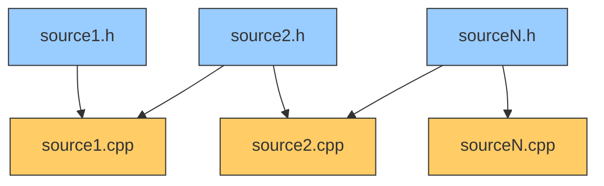

---

## Slide 57 — Multi-File Example (Equation)

```c
// File Equation.h
#ifndef _EQUATION_H_
#define _EQUATION_H_
#define NoSolution 0
#define Undetermined -1
int EquaDeg1(double, double, double&);
int EquaDeg2(double, double, double, double&, double&);
#endif

// File Equation.cpp
#include <math.h>
#include "Equation.h"
int EquaDeg1(double a, double b, double& x){ /* ... */ }
int EquaDeg2(double a, double b, double c, double& x, double& y){ /* ... */ }
```

---

## Slide 58 — Multi-File Example (EquationIO)

```c
// File EquationIO.h
#ifndef _EQUATIONIO_H_
#define _EQUATIONIO_H_
void SolutionPrint(int, double, double=0);
void EquaDisplay(double, double);
void EquaDisplay(double, double, double);
void EquationInput(double&, double&);
void EquationInput(double&, double&, double&);
#endif

// File EquationIO.cpp
#include "EquationIO.h"
#include "Equation.h"
void SolutionPrint(int n, double x, double y){ /* ... */ }
void EquaDisplay(double a, double b){ /* ... */ }
```

---

## Slide 59 — Multi-File Example (Main Program)

```c
// File MainPrg.c
#include "EquationIO.h"
#include "Equation.h"
#include <stdio.h>

void main(){
  //...
}
```

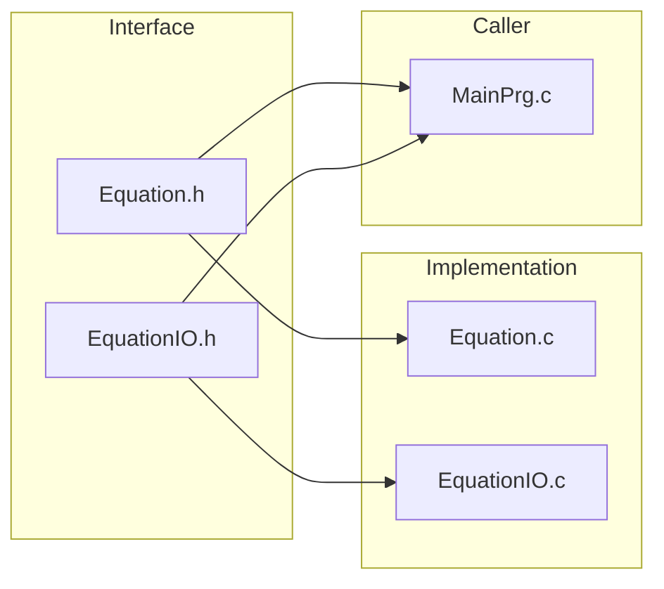

---

## Slide 60 — Scope of Function and Global Variable

- File A uses function in file B → use interface `.h` file of B
- Keep global variable/function private → add keyword `static`
- Share global variable across files → add keyword `extern` at files that want to use it

---

## Slide 61 — Scope Example

```c
// File A
static int nItem;         // private to this file
extern int nCounter;       // defined in another file
void Func(){ /* ... */ }

// File B
static int nItem;         // separate private copy
int nCounter;             // definition accessible by others
static void Func(){ /* ... */ }  // private function

// File C (main)
extern int nCounter;       // use nCounter from File B
void main(){ /* ... */ }
```
