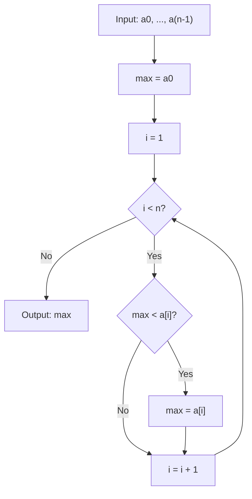
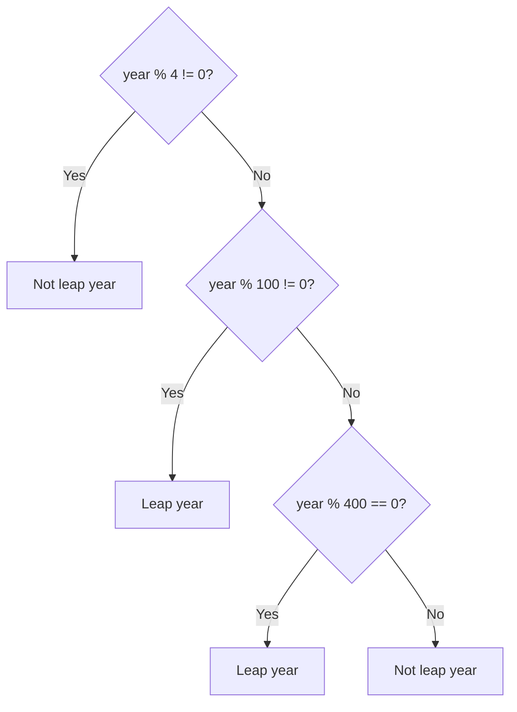

# Week 03: Algorithm & Branching Strategy

> **Source**: CSLTr_Week03.ppsx (54 slides)
> **Advisor**: Truong Toan Thinh
> **Note**: Extracted from PPSX XML. Images extracted to `week03_images/`. Diagrams are composed from individual icons — described in text where possible.

---

## Slide 1 — Title

ALGORITHM & BRANCHING STRATEGY
Fundamentals of programming – Co so lap trinh
Advisor: Truong Toan Thinh

---

## Slide 2 — Algorithm (Section Start)

Topics:
- Conception
- Description
- Analysis
- Example

---

## Slide 3 — Conception

- Before modern computer, we solve the practical problems ourselves
- Problems having big data, high precision with real time — we cannot solve ourselves
- Appearance of electronic computer is a necessary thing with 'As quick as a flash' by nature
- We need to model practice problems into data structures
- We instruct computer how to solve the practical problems
- Method of dealing with practical problems is called **algorithm**

---

## Slide 4 — Conception: Algorithm Standards

Some algorithm standards:
- **Limitation**: finish execution after amount of processing-steps
- **Determination**: Each processing-step must be apparent
- **Existence of input data**: Algorithm needs a valid input data
- **Existence of output data**: give an expected result corresponding to valid input data
- **Efficiency**: Each processing-step must have limited — deterministic time
- **Popularity**: Apply for a family of problems

---

## Slide 5 — Conception: Describe & Implement

Describe algorithm:
- Natural language
- Flow-chart
- Pseudo-code
- High-level programming language

Implement algorithm:
- Turn algorithms into executable form
- Using programming languages to realize the algorithm's processing-steps
- This transformation is called **algorithm implementation**

---

## Slide 6 — Description: Natural Language

Example: find the largest number in array including n elements: a0, a1, a2, ..., an.

Using natural language to describe our solution (algorithm):
- **Advantage**: Easy to express
- **Drawback**: Polysemy in natural language easily causes misunderstanding
- Suitable for simple short algorithm
- Need to use more symbol and various methods to efficiently enhance algorithm description

---

## Slide 7 — Description: Natural Language Example

Using natural language to describe our solution (algorithm):

- **Step 1**: Let `lc` <- the first number in array
- **Step 2**: If there is no number in array, then go to step 4
- **Step 3**: If the next number is greater than `lc`, then we assign this number to `lc`. Return to Step 2
- **Step 4**: `lc` is the largest number in array

---

## Slide 8 — Description: Trace Example

Example: consider array **4 2 8 9**

- **Step 1**: `lc` <- 4
- **Step 2**: Still, there are 3 numbers
- **Step 3**: See if 2 > `lc`, so don't assign 2 to `lc`. Return to step 2
- **Step 2**: Still, there are 2 numbers
- **Step 3**: See if 8 > `lc`, so assign `lc` <- 8. Return to step 2
- **Step 2**: Still there is one number
- **Step 3**: See if 9 > `lc`, so assign `lc` <- 9. Return to step 2
- **Step 2**: There is no number in array, then go to step 4
- **Step 4**: `lc` = 9 is the largest number in array

---

## Slide 9 — Description: Programming Language

Example: find the largest number in array including n elements: a0, a1, a2, ..., an.

Using programming language to describe algorithm:
- **Advantage**: run immediately
- **Drawback**: need to understand programming language in use
- Maybe make a 'workaround' to express some simple idea in algorithm
- Maybe cause algorithm description lose its simplicity and fail to express the nature

---

## Slide 10 — Description: Programming Language Code

Using programming language to describe algorithm:

```c
int FindTheLargestNumber(int a[], int n){
  int i, max;
  max = a[0];
  for(i = 0; i < n; i++){
    if(max < a[i])
      max = a[i];
  }
  return max;
}
```

---

## Slide 11 — Description: Flow-Chart

Using flow-chart to describe algorithm:
- **Advantage**: easy to understand
- **Drawback**: only suitable for simple short algorithms



---

## Slide 12 — Description: Pseudo-Code

Using pseudo-code to describe algorithm:
- Using syntax of some popular programming languages
- Maybe using more mathematical symbols

```
  max <- a0
  i <- 1
  while(i < n) do
    if(max < a[i]) then
      max <- a[i];
    end if
  end while
  write max;
```

---

## Slide 13 — Analysis

- Check if algorithms do what they need to do (expected things we want)
- Check if our algorithm is better or worse than others
- Algorithm has two properties:
  - **Correctness**
  - **Complexity**
    - Time complexity
    - Space complexity

---

## Slide 14 — Analysis: Correctness & Time Complexity

**Correctness**:
- Algorithm must give valid results corresponding to valid input values
- Proving our algorithm to be correct with ALL input values is not simple
- Maybe using induction in some cases

**Time complexity**:
- With the same working condition, the first algorithm giving valid results is better than the others
- With multi-purpose computers, it is difficult to force CPU to run at full capacity to compare among algorithms

Xet day so fibonacci:
- F0 = 0, F1 = 1
- Fn = F(n-1) + F(n-2) neu n >= 2
- Vi du: n = 5 -> 0, 1, 1, 2, 3, f5 = 5

---

## Slide 15 — Analysis: Fibonacci Algorithm 1

Algorithm computing Fn of fibonacci: F0 = 0, F1 = 1, Fn = F(n-1) + F(n-2) neu n >= 2

**Algorithm 1** (iterative):

```
Input: n
If n <= 1 then result = n
Else
  a = 0, b = 1
  for each k = 2 -> n do
    c = a + b
    a = b
    b = c
  end for
  result = c
End if
Write result
```

---

## Slide 16 — Analysis: Fibonacci Algorithm 2

**Algorithm 2** (recursive):

```
Input: n
If n <= 1 then result = n
Else
  A = Tinh Fibo(n - 1)
  B = Tinh Fibo(n - 2)
  result = A + B
End if
Write result
```

---

## Slide 17 — Analysis: Time Comparison

Time comparison between two algorithms:

| N | Algorithm 1 | Algorithm 2 |
|---|-------------|-------------|
| 40 | 41 ns | 1048 us |
| 60 | 61 ns | 1 s |
| 80 | 81 ns | 18 m |
| 100 | 101 ns | 13 d |
| 120 | 121 ns | 36 y |
| 160 | 161 ns | 3.8 x 10^7 y |
| 200 | 201 ns | 4 x 10^13 y |

---

## Slide 18 — Analysis: Space Complexity

**Space complexity**:
- Consider the consumption of system resources (RAM, CPU...)
- Consider data structures to process and represent data

Example: two swap algorithms

| Algorithm 1 (with temp) | Algorithm 2 (no temp) |
|---|---|
| `temp <- a;` | `a <- a + b;` |
| `a <- b;` | `b <- a - b;` |
| `b <- temp;` | `a <- a - b;` |

The second algorithm is better than the other because it consumes less memory.

---

## Slide 19 — Example: Theoretic Complexity

- Count the times of basic operations
- Don't care about physical time one basic operation consumes
- Basic operation is a computation, assignment or transmission of data values
- The times of basic operations depend on amount of input data
- It is said that theoretic complexity is a function of n, where n represents amount of input data: **f(n)**

---

## Slide 20 — Example: Linear Search

Consider n integers, find if another integer k appears in number array or not.

Worst case: must compare all n elements -> theoretic complexity is **O(n)**

```
  i <- 0
  while(i < n & (k != a[i])) do
    i++
  end while

  if(i < n) then
    result <- i
  else
    result <- -1
  end if
```

---

## Slide 21 — Example: Binary Search

Choose n integers ascending, find if integer k appears in number array or not.

```
  left <- 0, right <- n - 1
  while(left <= right) do
    mid <- (left + right)/2
    if(k = a[mid]) then
      result <- mid
      STOP
    else
      if(k < a[mid]) right <- mid - 1
      else left <- mid + 1
    end if
  end while
  result = -1
```

---

## Slide 22 — Example: Binary Search Trace

Consider n = 14 elements, find index of 38:

| a0 | a1 | a2 | a3 | a4 | a5 | a6 | a7 | a8 | a9 | a10 | a11 | a12 | a13 |
|---|---|---|---|---|---|---|---|---|---|---|---|---|---|
| 1 | 5 | 8 | 10 | 12 | 15 | 19 | 22 | 26 | 29 | 33 | 38 | 42 | 50 |

- **First loop**: mid = 6 (search-space is n/2^0). Because a6 < 38 so left = mid + 1 = 7. Consider [7, 13]
- **Second loop**: mid = 10 (search-space is n/2^1). Because a10 < 38 so left = mid + 1 = 11. Consider [11, 13]
- **Third loop**: mid = 12 (search-space is n/2^2). Because a12 > 38 so right = mid - 1 = 11. Consider [11, 11]
- **Fourth loop**: mid = 11 (search-space is n/2^3). Because a11 = 38 so index is 11 (Finish algorithm)

---

## Slide 23 — Example: Binary Search Complexity

Consider below array, find index of 38.

| a0 | a1 | a2 | a3 | a4 | a5 | a6 | a7 | a8 | a9 | a10 | a11 | a12 | a13 |
|---|---|---|---|---|---|---|---|---|---|---|---|---|---|
| 1 | 5 | 8 | 10 | 12 | 15 | 19 | 22 | 26 | 29 | 33 | 38 | 42 | 50 |

Loop until search-space is 1. So we have: **O(log2(n))**

---

## Slide 24 — Some Basic Techniques

**Sentinel technique**:

```
lc <- a0
while(i < n) do
  if(<dieu kien lc & a[i]>) then
    lc <- a[i]
  i++;
end while
write lc
```

**Flag technique**:

```
kt <- true
while(i < n) do
  if(<a[i]>) then
    kt <- false
  i++;
end while
write kt
```

---

## Slide 25 — Branching Strategy (Section Start)

Topics:
- Decision table
- Date problem
- Payments on electricity/water
- Recursion for branching programming
- Replacing branching strategy
- Exercise

---

## Slide 26 — Decision Table

- Clearly describe all paths of process
- Prepare a decision table before writing code
- Present decision table in text
- Careful analyze possible logic cases

Decision table sense:
- Logically analyze all branching-cases
- Help to easily implement
- Minimize any mistakes or logic errors
- Play a role of building source code's test cases

---

## Slide 27 — Decision Table: Nth Root Example

Example: consider pow(x, y), st x, y > 0

Comment:
- If even order: n-th root of negative doesn't exist
- If odd order: n-th root of -8 = -2

| Condition | Action |
|---|---|
| n odd, x >= 0 | compute n-th root by calling `pow(x, 1.0/n)` |
| n odd, x < 0 | result = -pow(-x, 1.0/n) |
| n even, x >= 0 | compute n-th root by calling `pow(x, 1.0/n)` |
| n even, x < 0 | does not exist |

---

## Slide 28 — Decision Table: Improved & Code

Improved decision table:

| Condition | Action |
|---|---|
| x >= 0 | Compute n-th root by calling `pow(x, 1.0/n)` |
| x < 0, n odd | result = -pow(-x, 1.0/n) |
| x < 0, n even | doesn't exist |

Code:

```c
void main(){
  double n, x, kq;
  printf("Nhap n: "); scanf("%lf", &n);
  printf("Nhap x: "); scanf("%lf", &x);
  if(x >= 0) kq = pow(x, 1.0/n);
  else {
    if(n % 2 == 1) kq = -pow(-x, 1.0/n);
    else printf("Khong ton tai\n");
  }
}
```

---

## Slide 29 — Date Problem: Leap Year

Leap year problem:
- Common year: 365 days
- Leap year: 366 days

Rule of leap year:
1. If Year % 4 != 0 then **not leap year**
2. If Year % 4 = 0 & % 100 != 0 then **leap year**
3. If Year % 100 = 0 & % 400 != 0 then **not leap year**
4. If Year % 400 = 0 then **leap year**

---

## Slide 30 — Date Problem: Leap Year Flowchart



---

## Slide 31 — Date Problem: Leap Year Code (Nested)

```c
int checkLeapYear(int y){
  if(y < 1900 || y > 10000) return -1;
  else{
    if(y % 4 != 0) return 0;
    else{
      if(y % 100 != 0) return 1;
      else{
        if(y % 400 == 0) return 1;
        else return 0;
      }
    }
  }
}
```

---

## Slide 32 — Date Problem: Leap Year Code (Reduced else)

Can be reduced 'else' portion:

```c
int checkLeapYear(int y){
  if(y < 1900 || y > 10000) return -1;
  else if(y % 4 != 0) return 0;
  else if(y % 100 != 0) return 1;
  else if(y % 400 == 0) return 1;
  else return 0;
}
```

---

## Slide 33 — Date Problem: Leap Year Code (Simplified)

A year is:
- **Leap**: year % 400 = 0 or (% 4 = 0 and % 100 != 0)
- **Not leap**: in remaining cases

```c
int checkLeapYear(int y){
  if(y < 1900 || y > 10000) return -1;
  else if((y % 4 == 0 && y%100!=0) || (y%400==0)) return 1;
  else return 0;
}
```

---

## Slide 34 — Date Problem: Days of Month

- Months: 1, 3, 5, 7, 8, 10, 12 have **31 days**
- Months: 4, 6, 9, 11 have **30 days**
- February in common year: **28 days**
- February in leap year: **29 days**

Decision table:

| Condition | Result |
|---|---|
| Year not in [1900, 10000] or Month not in [1, 12] | Not process |
| Month in {1, 3, 5, 7, 8, 10, 12} | 31 days |
| Month in {4, 6, 9, 11} | 30 days |
| Month = 2, Leap year | 29 days |
| Month = 2, Common year | 28 days |

---

## Slide 35 — Date Problem: Days of Month Code

```c
int nDayOfMonth(int m, int y){
  int isLeap = checkLeapYear(y);
  if(isLeap == -1 || m < 1 || m > 12) return -1;
  else{
    switch(m){
      case 1: case 3: case 5: case 7: case 8: case 10: case 12:
        return 31;
      case 4: case 6: case 9: case 11:
        return 30;
      default:
        if(isLeap == 1) return 29;
        else return 28;
    }
  }
}
```

---

## Slide 36 — Date Problem: Next Day

Given day, month, and year, let's compute next day.

Examples:
- 28/02/2001 has next day: 01/03/2001
- 28/02/2008 has next day: 29/02/2008
- 31/12/2008 has next day: 01/01/2009

Decision table:

| Condition | Result |
|---|---|
| Year not in [1900, 10000] or Month not in [1, 12] or Day not in [1, dayInMonth] | Not process |
| 1 <= Day < dayInMonth | Day + 1, Month, Year |
| Day = dayInMonth, Month != 12 | 1, Month + 1, Year |
| Day = dayInMonth, Month = 12 | 1, 1, Year + 1 |

---

## Slide 37 — Date Problem: Next Day Code

```c
int nextDay(int d, int m, int y){
  int nDayInMonth = nDayOfMonth(m, y);
  if(nDayInMonth == -1 || d < 1 || d > nDayInMonth) return -1;
  else{
    if(d < nDayInMonth) d++;
    else if(m < 12){
      d = 1; m++;
    }
    else{
      d = m = 1; y++;
    }
  }
  return 1;
}
```

---

## Slide 38 — Payment on Electricity

Pay on electricity by kWh a household uses. Sum = Desired value + 10% VAT.

**Tariff**:

| Rated consumption | Price (vnd/kWh) |
|---|---|
| kWh in 0-100 | 1242 |
| kWh in 101-150 | 1304 |
| kWh in 151-200 | 1651 |
| kWh in 201-300 | 1788 |
| kWh in 301-400 | 1912 |
| kWh in 401+ | 1962 |

**Example**: consuming 215 kWh needs:

| Tier | kWh | Price |
|---|---|---|
| 0-100 | 100 kWh | x 1242 |
| 101-150 | 50 kWh | x 1304 |
| 151-200 | 50 kWh | x 1651 |
| 201-215 | 15 kWh | x 1788 |
| **Sum** | 215 kWh | 298770 + 10% |

---

## Slide 39 — Payment on Electricity: Decision Table

| Cases | Computation (non-tax) |
|---|---|
| Kwh <= 100 | Kwh x 1242 |
| 100 < Kwh <= 150 | 100 x 1242 + (Kwh - 100) x 1304 |
| 150 < Kwh <= 200 | 100 x 1242 + 50 x 1304 + (Kwh - 150) x 1651 |
| 200 < Kwh <= 300 | 100 x 1242 + 50 x 1304 + 50 x 1651 + (Kwh - 200) x 1788 |
| 300 < Kwh <= 400 | 100 x 1242 + 50 x 1304 + 50 x 1651 + 100 x 1788 + (Kwh - 300) x 1912 |
| Kwh > 400 | 100 x 1242 + 50 x 1304 + 50 x 1651 + 100 x 1788 + 100 x 1912 + (Kwh - 400) x 1962 |

---

## Slide 40 — Payment on Electricity: Code

```c
double TienDien(int k){
  double s = 0;
  if(k <= 100) s = k * 1242;
  else if(k <= 150) s = 100*1242 + (k - 100)*1304;
  else if(k <= 200) s = 100*1242 + 50*1304 + (k - 150)*1651;
  else if(k <= 300) s = 100*1242 + 50*1304 + 50*1651 + (k - 200)*1788;
  else if(k <= 400) s = 100*1242 + 50*1304 + 50*1651 + 100*1788 + (k - 300)*1912;
  else s = 100*1242 + 50*1304 + 50*1651 + 100*1788 + 100*1912 + (k - 400)*1962;
  s = s*1.1;
  return s;
}
```

---

## Slide 41 — Payment on Electricity: Improved with Constants

Set 5 milestones: L1 = 100, L2 = 150, L3 = 200, L4 = 300, L5 = 400.

Set corresponding prices: P1 = 1242, P2 = 1304, P3 = 1651, P4 = 1788, P5 = 1912, P6 = 1962.

*(Same decision table as Slide 39 with highlighted milestone/price constants)*

---

## Slide 42 — Payment on Electricity: Precomputing Values

Set constant `_VAT = 0.1`

Precomputing cumulative values:
- T1 = L1 * P1
- T2 = T1 + (L2 - L1) * P2
- T3 = T2 + (L3 - L2) * P3
- T4 = T3 + (L4 - L3) * P4
- T5 = T4 + (L5 - L4) * P5

---

## Slide 43 — Payment on Electricity: Improved Code

```c
double TienDien(int k){
  double s = 0;
  if(k <= L1) s = k * P1;
  else if(k <= L2) s = T1 + (k - L1)*P2;
  else if(k <= L3) s = T2 + (k - L2)*P3;
  else if(k <= L4) s = T3 + (k - L3)*P4;
  else if(k <= L5) s = T4 + (k - L4)*P5;
  else s = T5 + (k - L5)*P6;
  s = s*(1+_VAT);
  return s;
}
```

---

## Slide 44 — Payment on Electricity: Generic Range Function

Comment: computation only uses values in a range [L, R]
- **Case 1**: value is 0 if kwh < L
- **Case 2**: value = (kwh - L) x price if L <= kwh < R
- **Case 3**: value = (R - L) x price if kwh > R

```c
#define _Extream -1
double Tinh(int L, int R, double P, int k){
  double kq = 0;
  if(k < L) return kq;
  else{
    if(k < R || R == _Extream) kq = (k - L)*P;
    else kq = (R - L)*P;
  }
  return kq;
}
```

---

## Slide 45 — Payment on Electricity: Final Improved Code

```c
double TienDien(int k){
  double s = Tinh(0, L1, P1, k) +
             Tinh(L1, L2, P2, k) +
             Tinh(L2, L3, P3, k) +
             Tinh(L3, L4, P4, k) +
             Tinh(L4, L5, P5, k) +
             Tinh(L5, _Extream, P6, k);
  s = (1 + _VAT)*s;
  return s;
}
```

---

## Slide 46 — Payment on Water

Pay on water by cubic meters of water a household uses. Sum = Desired value + 15%.

**Tariff** (based on n members):

| Consumption | Price (vnd/m3) |
|---|---|
| n x 4 m3 | 4400 d/m3 |
| n x 2 m3 | 8300 d/m3 |
| next cubic meters of water | 10500 d/m3 |

**Example**: A household has n = 4 members using 50 cubic meters of water:

| Tier | Volume | Price |
|---|---|---|
| 4 x 4 m3 | 16 m3 | x 4400 |
| 4 x 2 m3 | 8 m3 | x 8300 |
| remaining | 26 m3 | x 10500 |
| **Sum** | 50 m3 | 409800 + 15% |

---

## Slide 47 — Payment on Water: Decision Table & Code

| Cases | Computation (non-tax) |
|---|---|
| m3 <= n x 4 | m3 x 4400 |
| n x 4 < m3 <= n x (4 + 2) | (n x 4) x 4400 + (m3 - n x 4) x 8300 |
| n x (4 + 2) < m3 | (n x 4) x 4400 + (n x 2) x 8300 + [m3 - n x (4 + 2)] x 10500 |

```c
double TienNuoc(int m3, int n){
  double s = 0;
  if(m3 <= n*4) s = m3 * 4400;
  else if(m3 <= n*(4 + 2)) s = n*4*4400 + (m3 - n*4)*8300;
  else s = n*4*4400 + n*2*8300 + (m3 - n*(4 + 2))*10500;
  return (1+0.15)*s;
}
```

---

## Slide 48 — Recursion for Branching Programming

Recursive function is the one calling itself to solve a smaller problem. Branching to an easy-to-solve case.

Decision table for computing n-th root:

| Condition | Action |
|---|---|
| n = 0 | does not exist because cannot compute |
| n < 0, x = 0 | does not exist |
| n < 0, x != 0 | Set m = -n > 0 because x^(1/n) = 1/x^(1/m) |
| n > 0, x >= 0 | Compute by calling `pow(x, 1.0/n)` |
| n > 0, x < 0, n odd | result = -pow(-x, 1.0/n) |
| n > 0, x < 0, n even | does not exist |

---

## Slide 49 — Recursion for Branching Programming: Code

```c
#include <math.h>
void sqrt_N(double x, int n, bool& errorFlag){
  double kq = 0;
  errorFlag = false;
  if(n == 0) errorFlag = true;
  else if(n < 0){
      if(x == 0) errorFlag = true;
      else kq = 1/sqrt_N(x, -n, errorFlag);
  }
  else{
    if(x >= 0) kq = pow(x, 1.0/n);
    else{
      if(n % 2 == 1) kq = -sqrt_N(-x, n, errorFlag);
      else errorFlag = true;
    }
  }
}
```

---

## Slide 50 — Replacing Branching Strategy

Replacing branching structure with mathematical formula in some cases.

Consider the Collatz-like branching:
- If n is odd: result = 3*n + 1
- If n is even: result = n/2

Formulas replacing branching structure:
- `(n % 2)*(3*n + 1) + (1 - n%2)*(n/2)`
- `(n%2==1)*(3*n + 1) + (1 - n%2)*(n/2)`

---

## Slide 51 — Replacing Branching Strategy: Absolute Value & Max/Min

**Absolute value** of a:
- If a >= 0: result = a
- If a < 0: result = -a

Formula: `(a >= 0)*a + (a < 0)*(-a)` = `2*a*(a >= 0) - a`

**Max member**: `(a > b)*a + (a <= b)*b`

**Min member**: `(a > b)*b + (a <= b)*a`

---

## Slide 52 — Replacing Branching Strategy: Days of Month Formula

Formula for computing the days of month != 2:
- `30 + (m < 8)*(m%2) + (m >= 8)*(1 - m%2)`

Formula for computing the days of the month (not leap year):
- `28 + (m!=2)*(2 + (m<8)*(m%2) + (m>=8)*(1 - m%2))`

Formula for computing the days of the month (leap year):
- `28 + (m!=2)*(2 + (m<8)*(m%2) + (m>=8)*(1 - m%2)) + (m==2)*((y%4==0 && y%100!=0) || (y%400==0))`

---

## Slide 53 — Replacing Branching Strategy: Ternary Operator

Syntax for condition expression in C: `<Logical expression> ? A : B`

- Compute absolute value: `(a > 0) ? a : -a`
- Return max number: `(a > b) ? a : b`
- Compute the days of the month != 2:
  ```c
  (m < 8) ? ((m%2==1) ? 31 : 30)
           : ((m%2==1) ? 30 : 31)
  ```

---

## Slide 54 — Replacing Branching Strategy: Test-Case Table

Building test-case table. Example: Program computing n-th root.

| Range of n | Range of x | n | x | Expected value |
|---|---|---|---|---|
| n = 0 | Any | 0 | 1.3 | Does not exist |
| | | 0 | 0 | |
| | | 0 | -1.3 | |
| n < 0 | x = 0 | -1 | 0 | Does not exist |
| | | -20.7 | 0 | |
| | x > 0 | -1 | 1 | 1 |
| | | -2 | 4 | 0.5 |
| | x < 0 | -2 | -1.7 | Does not exist |
| | | -3 | 8.0 | -0.5 |
| n > 0 | x >= 0 | 2 | 0 | 0 |
| | | 102 | 1 | 1 |
| | | 4 | 81 | 3 |
| | x < 0 | 3 | -125 | -5 (n odd) |
| | | 4 | -0.115 | Doesn't exist (n even) |
