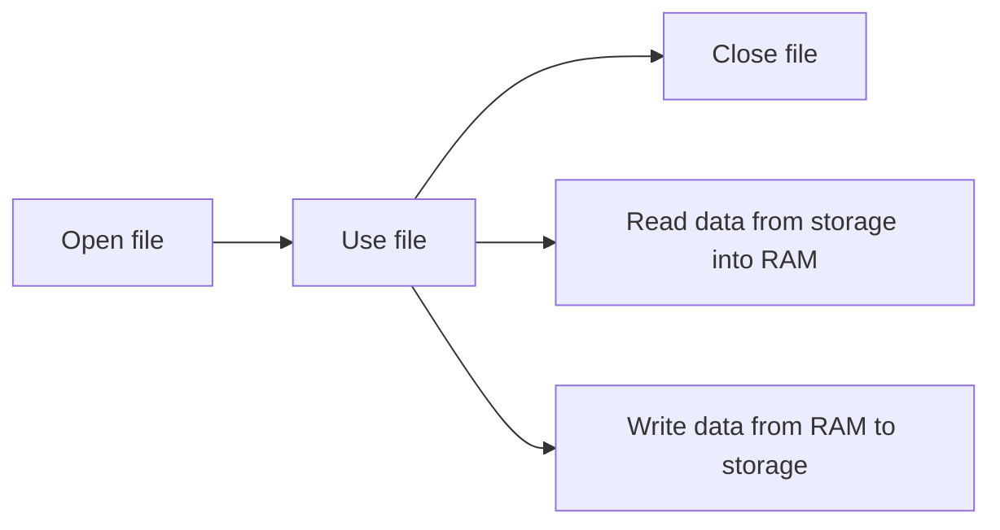

# Week 05: Structural Data & File

> **Source**: CSLTr_Week05.ppsx (63 slides)
> **Advisor**: Truong Toan Thinh
> **Note**: Extracted from PPSX XML. Images extracted to `week05_images/`. Diagrams are composed from individual icons — described in text where possible.

---

## Slide 1 — Title

STRUCTURAL DATA & FILE
Fundamentals of programming – Co so lap trinh
Advisor: Truong Toan Thinh

---

## Slide 2 — Structural Data Overview

STRUCTURAL DATA
- Introduction
- Syntax
- Exercise

---

## Slide 3 — Introduction

Manage **ONE** student as follows:
- Student code
- Name
- Birthdate
- Gender
- Grade point average

Variables proposed:
- Student code with `char[8]`
- Name with `char[31]`
- Birthdate with `char[9]`
- Gender with `char`
- GPA with `float`

> *[Visual content: memory layout diagram showing mssv, Hoten, Ntns, Phai, DTB at memory addresses]*

---

## Slide 4 — Introduction (Input/Output of ONE Student)

```cpp
void Nhap(char* MSSV, char* HoTen,
   char* NTNS, char& Phai, float& DTB){
   …
}
void Xuat(char* MSSV, char* HoTen,
   char* NTNS, char Phai, float DTB){
   …
}
```

How to manage **100** students???

---

## Slide 5 — Syntax: Declare a Structure of Student

Declare a structure of Student. Line 8 replaces `struct sinhvien` with SINHVIEN.

```cpp
struct sinhvien{
  char Mssv[3];
  char HoTen[5];
  char Ntns[3];
  char Phai;
  float Dtb;
};
typedef struct sinhvien SINHVIEN;
```

Example: declare `SINHVIEN sv`

> *[Visual content: memory layout showing sv fields Mssv, Hoten, Ntns at addresses 61ff20, 61ff23, 61ff28]*

---

## Slide 6 — Syntax: Declare a Structure of Point

Line 4 directly assigns 2 to `P.x` & 3 to `P.y`.

```cpp
struct point{float x, y;};
typedef struct point POINT;
void main(){
  POINT P = {2.0f, 3.0f}; // directly assign
  cout << &P << ", " << &P.x << endl;
  cout << &P.y << endl;
}
```

> *[Visual content: memory layout showing P at 61ff28, P.x, P.y at 61ff2c]*

---

## Slide 7 — Syntax: Declare a Structure of Point (Assignment)

Line 5 assigns `P.x` to `Q.x` & `P.y` to `Q.y`.

Note: Representation of 2.0 & 3.0 follows IEEE754 Single precision 32-bit standard.

```cpp
struct point{float x, y;};
typedef struct point POINT;
void main(){
  POINT P = {2.0f, 3.0f}, Q;
  Q = P;
  cout << &Q << ", " << &Q.x << endl;
  cout << &Q.y << endl;
}
```

> *[Visual content: memory layout showing P and Q with IEEE754 byte representations]*

---

## Slide 8 — Syntax: Declare a Structure of Triangle

```cpp
struct point{float x, y;};
typedef struct point POINT;
struct triangle{ POINT p[3];};
typedef struct triangle TRIANGLE;
void main(){
  TRIANGLE tg = { {{1, 2}, {3, 4}, {5, 6}} };
}
```

> *[Visual content: memory layout showing tg with nested POINT array at addresses 61ff18–61ff2c]*

---

## Slide 9 — Syntax: Find the Centroid of Triangle

```cpp
struct point{float x, y;};
typedef struct point POINT;
struct triangle{ POINT p[3];};
typedef struct triangle TRIANGLE;

void gravCenter(TRIANGLE t, POINT& c){
  c.x = (t.p[0].x + t.p[1].x + t.p[2].x)/3;
  c.y = (t.p[0].y + t.p[1].y + t.p[2].y)/3;
}

void inputPoint(POINT& P){
  scanf("%d", &P.x);
  scanf("%d", &P.y);
}

void inputTriangle(TRIANGLE& t){
  for(int i = 0; i < 3; i++)
    inputPoint(t.p[i]);
}

void outputPoint(POINT P){
  printf("(%d, ", P.x);
  printf("%d)", P.y);
}

void main(){
  TRIANGLE tg; POINT M;
  inputTriangle(tg);
  gravCenter(tg, M);
  outputPoint(M);
}
```

---

## Slide 10 — Syntax: Declare a Structure of Fraction

Line 5 assigns `P.tu` to `Q.tu` & `P.mau` to `Q.mau`.

Note: representation of 2 & 3 follows two's complement form (32-bit).

```cpp
struct phanso{long tu, mau;};
typedef struct phanso PHANSO;
void main(){
  PHANSO P = {2, 3}, Q;
  Q = P;
}
```

> *[Visual content: memory layout showing P and Q with two's complement byte representations]*

---

## Slide 11 — Syntax: Operations of PHANSO

```cpp
struct phanso{long tu, mau;};
typedef struct phanso PHANSO;

PHANSO add(PHANSO p, PHANSO q){
  PHANSO r;
  r.tu = p.tu * q.mau + p.mau * q.tu;
  r.mau = t.mau * q.mau;
  return r;
}

void reduce(PHANSO& p){
  long gcd = GCD(p.tu, p.mau);
  p.tu /= gcd;
}

void sub(PHANSO p, PHANSO q){
    q.tu = -q.tu;
    return add(p, q);
}

void showFraction(PHANSO p){
  reduce(p);
  printf("%d/%d", p.tu, p.mau);
}

void main(){
  PHANSO t = {1, 2}, s = {3, 4};
  showFraction(add(t, s));
  showFraction(sub(t, s));
}
```

---

## Slide 12 — Syntax: Declare a Structure of Node

Line 5 assigns address of `q.x` to `p.pNext`.

```cpp
struct node{short x, struct node* pNext;};
typedef struct node NODE;
void main(){
  NODE p = {1, NULL}, q = {2, NULL};
  p.pNext = &q;
  cout << p.pNext->val << endl;
}
```

> *[Visual content: memory layout showing p at 61ff1a and q at 61ff14, with p.pNext pointing to q]*

---

## Slide 13 — Syntax: Declare a Structure of Binary Tree

```cpp
struct person{
  char name[5];
  struct person* pa, *ma;
};
typedef struct person PERSON;
void main(){
  PERSON p = {"Bob", 0, 0};
  PERSON q = {"Jack", 0, 0}, t = {"Beth", 0 ,0};
  p.pa = &q; p.ma = &t;
}
```

> *[Visual content: memory layout showing tree structure with p pointing to q (pa) and t (ma)]*

---

## Slide 14 — Syntax: Declare a Structure of BIT

```cpp
struct bit_fields{
  unsigned short bit_0: 1;
  unsigned short bit_1_to_4: 4;
  unsigned short bit_5: 5;
  unsigned short bit_6_to_15: 10;
};
typedef struct bit_fields BF;
void main(){
  BF b = {1, 15, 1, 1023};
}
```

> *[Visual content: bit-level layout showing bit_0 (1 bit), bit_1_4 (4 bits), bit_5 (5 bits), bit_6_15 (10 bits) — all set to 1]*

---

## Slide 15 — Syntax: Operators of Fraction

```cpp
struct phanso{long tu, mau;};
typedef struct phanso PHANSO;

PHANSO operator+(PHANSO p, PHANSO q){
  PHANSO t;
  t.tu = p.tu*q.mau + p.mau*q.tu;
  t.mau = p.mau*q.mau;
  return t;
}

PHANSO operator-(PHANSO p, PHANSO q){
  q.mau = -q.mau;
  return p + q;
}

void main(){
  PHANSO P = {1, 2}, Q = {3, 4};
  showFraction(P + Q);
}
```

Example: run main

> *[Visual content: memory trace showing P={1,2}, Q={3,4}, result t={10,8}]*

---

## Slide 16 — Syntax: Operators of Fraction (+=)

```cpp
struct phanso{long tu, mau;};
typedef struct phanso PHANSO;

PHANSO operator+=(PHANSO& p, PHANSO q){
  p = p + q;
  return p;
}

void main(){
  PHANSO P = {1, 2}, Q = {3, 4};
  showFraction(P += Q);
}
```

Example: run main

> *[Visual content: memory trace showing P updated to {10,8} after += operation]*

---

## Slide 17 — Syntax: Building Function with Structural Data (Xuat)

```cpp
void Xuat(SINHVIEN sv){
  printf("Ma so: %s", sv.Mssv);
  printf("Ho ten: %s", sv.HoTen);
  printf("Ngay sinh: %s", sv.Ntsn);
  printf("Gioi tinh: %c", sv.Phai);
  printf("Diem trung binh: %f", sv.Dtb);
}
```

---

## Slide 18 — Syntax: Building Function with Structural Data (Nhap)

```cpp
void Nhap(SINHVIEN& sv){
  printf("Nhap ma so: ");
  gets_s(sv.Mssv);
  printf("Nhap ho ten: ");
  gets_s(sv.Hoten);
  printf("Nhap ngay sinh: ");
  gets_s(sv.Ntns);
  printf("Nhap gioi tinh: ");
  scanf_s("%c", &sv.Phai);
  printf("Nhap diem trung binh: ");
  scanf_s("%f", &sv.Dtb);
}
```

---

## Slide 19 — Syntax: Used in Main

```cpp
void main()
  SINHVIEN sv;
  Nhap(sv);
  Xuat(sv);
}
```

Quick assignment syntax:

```cpp
void main(){
  SINHVIEN sv = {"0989821", "Nguyen Van A", "09/01/99", 'y', 8};
  Xuat(sv);
}
```

---

## Slide 20 — Syntax: Declare with Nested Structural Data

```cpp
struct Diem{
  float x;
  float y;
};
typedef struct Diem DIEM;
struct Tamgiac{
  DIEM A, B, C;
}
typedef struct Tamgiac TAMGIAC;
```

---

## Slide 21 — Syntax: Nested Structural Data (Xuat)

```cpp
void Xuat(DIEM d){
  printf("(%f, %f)", d.x, d.y);
}
void Xuat(TAMGIAC tg){
  Xuat(tg.A);
  Xuat(tg.B);
  Xuat(tg.C);
}
```

---

## Slide 22 — Syntax: Nested Structural Data (Nhap)

```cpp
void Nhap(DIEM& d){
  scanf("%f", &d.x);
  scanf("%f", &d.y);
}
void Nhap(TAMGIAC& tg){
  Nhap(tg.A);
  Nhap(tg.B);
  Nhap(tg.C);
}
```

---

## Slide 23 — Syntax: Using Nested Structural Data in Main

```cpp
void main()
  TAMGIAC tg;
  Nhap(tg);
  Xuat(tg);
}
```

Quick assignment syntax:

```cpp
void main(){
  TAMGIAC tg = {{1, 2}, {2, 3}, {3, 4}};
  Xuat(tg);
}
```

---

## Slide 24 — Syntax: Declare with Pointer of Structural Data

Function `Xuat` needs a parameter with TAMGIAC type (NOT TAMGIAC* type) — using operator `*` to access the 'normal' memory.

```cpp
void main(){
  TAMGIAC* tg = new TAMGIAC;
  *tg = {{1, 2}, {2, 3}, {3, 4}};
  Xuat(*tg);
}
```

---

## Slide 25 — Syntax: Using '->' to Access Fields of Pointer

Access to A of pointer `tg` by using `->`.
Access to x of pointer `tg->A` by using `.`

```cpp
void main(){
  TAMGIAC* tg = new TAMGIAC;
  *tg = {{1, 2}, {2, 3}, {3, 4}};
  Xuat(*tg);
  printf("%f", tg->A.x);
}
```

---

## Slide 26 — Syntax: Declare Structural Array

```cpp
void Nhap(DIEM a[], int &n) {
  printf("Nhap n: ");
  scanf_s("%d", &n);
  for (int i = 0; i < n; i++) Nhap(a[i]);
}
void Xuat(DIEM a[], int n) {
  printf("n: %d\n", n);
  for (int i = 0; i < n; i++) Xuat(a[i]);
}
void main() {
  DIEM a[5]; int n;
  Nhap(a, n); Xuat(a, n);
}
```

---

## Slide 27 — Syntax: Quick Assign Values to Structural Array

```cpp
void main() {
  DIEM a[5] = {{1, 2}, {2, 3}};
  Xuat(a, 5);
}
```

With structural pointer, we explicitly write for every element:

```cpp
void main() {
  DIEM* a = new DIEM[2];
  a[0] = {1,2}; a[1] = {3, 4};
}
```

---

## Slide 28 — FILE

- Introduction
- File processing
- Some techniques
- Applications

---

## Slide 29 — Introduction (Files)

- Goal: storing data into hard-disk driver
- Two kinds of files: text and binary
- Text files contain the text-characters (ASCII code >= 0x20)
- Text files include line-separating characters with ASCII code 0x0D (`'\r'`) and 0x0A (`'\n'`)
- Text files in Windows include finish-character (EOF) with ASCII code 0x1A (called SUB)
- Extended plain-text files include multi-byte characters

---

## Slide 30 — Introduction (File Types)

- Text files are either structural or nonstructural
- Binary files contain a structural sequence of bytes (followed by some organizations)
- Files are stored in sub-storage (hard-disk, USB, memory card...)
- To access another file, we need its path in storage.
- Example: `"C:\\data\\list.txt"` (In C, using `'\\'` instead of `'\'`).

---

## Slide 31 — File Processing: Three Steps



1. **Open file** (need exact file path)
2. **Using file**
   - Read data from storage into RAM
   - Write data from RAM to storage
3. **Close file** (After finish working)

---

## Slide 32 — File Processing: fopen

**File-opening function**: `FILE* fopen(char* filename, char* mode)`

Description: Open file named filename at mode.

| Mode | Description |
|------|-------------|
| `"r"`, `"rt"` | Open to read |
| `"r+"`, `"r+t"` | Open to read and write |
| `"w"`, `"wt"` | Open to write, automatically create if file doesn't exist. Otherwise, file will be erased |
| `"w+"`, `"w+t"` | Same as `"w"` and `"wt"` with read-function |
| `"a"`, `"at"` | Open to append, automatically create if file doesn't exist |
| `"a+"`, `"a+t"` | Same as `"a"` and `"at"` with read-function |

Return value: NULL if failed, FILE* if successful.

---

## Slide 33 — File Processing: fclose

**File-closing function**: `FILE* fclose(FILE* fp)`

Description: Closing file (successfully opened previous file). Data committed to storage.

Return value: 0 if successful & EOF if failed.

```c
char buf[50];
printf("Nhap duong dan tuyet doi toi tap tin: ");
gets(buf); // lay du lieu tu stdin, tu them '\0'
FILE* fp = fopen(buf, "r");
if(!fp) printf("Khong ton tai tap tin: %s\n", buf);
printf("Ton tai tap tin: ");
for(int i = 0; i < 50; i++){
  if(*(buf + i) != '\0') printf("%c", *(buf + i));
  else break;
}
fclose(fp);
```

---

## Slide 34 — File Processing: fgetc

**Character-reading function**: `int fgetc(FILE* fp)`

Description: Read ONE character in file (successfully-opened previous file). Character stored into some variables in RAM.

Return value: character or EOF.

```c
FILE* fp = fopen("data.txt", "r");
if(fp != NULL){
  int c = fgetc(fp);
  while(c != EOF) {
    printf("%c", c);
    c = fgetc(fp);
  }
  fclose(fp);
```

> *[Visual content: data.txt contains "xyz". Reading: x → y → z → EOF]*

---

## Slide 35 — File Processing: fgets

**String-reading function**: `char* fgets(char* str, int n, FILE* fp)`

Description:
- Read ONE string from `fp` into memory pointed by str
- Finish when reading n - 1 characters or seeing `'\n'`
- Save character `'\n'` into string if current string-length less than n - 1
- Automatically add end-of-string character

Return value: memory address pointed by str or EOF.

```c
FILE* fp = fopen("data.txt", "r");
char buf[8];
if(fp){
  while(fgets(buf, 10, fp) != NULL){
    printf("%s", buf);
  }
  fclose(fp);
}
```

> *[Visual content: data.txt contains "dong 1\ndong 2\ndong 3", reading line by line into buf]*

---

## Slide 36 — File Processing: fscanf

**Format-reading function**: `int fscanf(FILE* fp, char* fmt)`

Description: Reading formatted data. Similarly to `scanf` with `fp` replacing stdin.

Return value: number of items read, or EOF.

```c
int a[2][3] = {0}, m, n;
FILE* fp = fopen("data.txt", "r");
fscanf(fp, "%d", &m); fscanf(fp, "%d", &n);
if(fp){
  for(int i = 0; i < m; i++)
    for(int j = 0; j < n; j++)
      fscanf(fp, "%d", &a[i][j]);
  fclose(fp);
}
```

> *[Visual content: data.txt contains "2 3\n1 2 3\n4 5 6", reading into 2x3 array]*

---

## Slide 37 — File Processing: fputc & fputs

**Character-writing function**: `int fputc(int ch, FILE* fp)`

Description: write character `ch` to `fp`. Return value: return `ch` or EOF.

**String-writing function**: `int fputs(const char* str, FILE* fp)`

Description: write string `str` to `fp` (except `'\0'`). Return value: return the final character or EOF.

```c
FILE* fp = fopen("data.ahihi", "w");
char ch = 65;
if(fp){
  if(fputc(ch, fp) != EOF){
    printf("Thanh cong");
  }
  fclose(fp);
}
```

> *[Visual content: writes 'A' (ASCII 65) to file]*

---

## Slide 38 — File Processing: fputs Example

```c
FILE* fp = fopen("data.ahihi", "w");
char ch[] = "Hello";
if(fp){
  if(fputs(ch, fp) != EOF){
    printf("Thanh cong");
  }
  fclose(fp);
}
```

> *[Visual content: writes "Hello" (H, e, l, l, o) to file]*

---

## Slide 39 — File Processing: fprintf & fflush

**Format-writing function**: `int fprintf(FILE* fp, char* fmt, ...)`

Description: Write formatted data following `fmt` to fp. Similar to `printf` where `fp` replaces `stdout`.

Return value: number of bytes written or EOF.

**Buffer-cleaning function**: `fflush(FILE* fp)` or `int flushall();`

Description: immediately commit changes into file without closing.

```c
int a[] = {1, 2, 3, 4}, n = sizeof(a)/sizeof(int);
FILE* fp = fopen("test.inp", "w");
if(fp){
  fprintf(fp, "%d ", n);
  for(int i = 0; i < n; i++)
    fprintf(fp, "%d ", a[i]);
  fclose(fp);
}
```

> *[Visual content: writes "4 1 2 3 4" to test.inp]*

---

## Slide 40 — File Processing: Binary Files

Binary-file related functions:
- Need to exactly process one byte at a time
- Replace options `'t'` with `'b'`, for example replacing `"rt"` with `"rb"`, `"wt"` with `"wb"`
- Setting 'read-position' to right read/write place

Position of pointer FILE:
- If opening FILE to read/write (`"wb"` or `"rb"`), then it is at the **beginning** of the file
- If opening FILE to append (`"ab"`), then it is at the **end** of the file

---

## Slide 41 — File Processing: Text vs Binary Reading

**Ex: reading text-file with text-style**

```c
int b[4] = {0}, n = sizeof(b)/sizeof(int);
FILE* fp = fopen("test.inp", "r");
if(fp){
  for(int i = 0; i < n; i++) fscanf(fp, "%d", &b[i]);
  fclose(fp);
}
```

> *[Visual content: reads "1 2 3" as integers: b = {1, 2, 3, 0}]*

**Ex: reading text-file with binary-style**

```c
int b[4] = {0}, n = sizeof(b)/sizeof(int);
FILE* fp = fopen("test.inp", "rb");
if(fp){
  for(int i = 0; i < n; i++) {
    fread(&b[i], sizeof(char), 1, fp); // in b[i] ra xem
    fread(&b[i], sizeof(char), 1, fp); // in b[i] ra xem
  }
  fclose(fp);
}
```

> *[Visual content: reads raw bytes — b = {49, 51, ...} (ASCII codes)]*

---

## Slide 42 — File Processing: rewind & fseek

**Setting file pointer to the start**: `void rewind(FILE* fp)`

Description: setting the position to the start of the file (byte 0). Return value: none.

**Setting position of file pointer**: `int fseek(FILE* fp, long off, int origin)`

Description: setting file-pointer to off following origin (SEEK_SET, SEEK_CUR, SEEK_END).

Return value: return 0 if successful; otherwise non-zero.

```c
FILE* fp = fopen("test.inp", "rt");
if(fp){
  fseek(fp, 5, SEEK_SET);  printf("%c\n", fgetc(fp));   // '6'
  fseek(fp, -3, SEEK_END);  printf("%c\n", fgetc(fp));  // '8'
  fseek(fp, 0L, SEEK_SET);  printf("%c\n", fgetc(fp));  // '1'
  fseek(fp, 0L, SEEK_END);  printf("%d\n", fgetc(fp));  // -1 (EOF)
  rewind(fp);               printf("%c\n", fgetc(fp));   // '1'
  fclose(fp);
}
```

> *[Visual content: file contains "1234567890". SEEK_SET counts from start, SEEK_END counts from end]*

---

## Slide 43 — File Processing: ftell

**File-pointer position determining function**: `long ftell(FILE* fp)`

Description: return current position (from 0).

Return value: return current position if successful, or -1L if failed.

```c
FILE* fp = fopen("test.inp", "rb");
if(fp){
  fseek(fp, 0L, SEEK_END);
  long size = ftell(fp);
  printf("%d\n", size);   // 10
  fclose(fp);
}
```

> *[Visual content: file contains "1234567890", ftell returns 10 at SEEK_END]*

---

## Slide 44 — Some Techniques: Example 1 — Reading Available ASCII-Text

```c
void transFile(FILE* inF, FILE* outF){
  int ch;
  while(1){
    ch = fgetc(inF);
    if(feof(inF) == false)
      fputc(ch, outF);
    else break;
  }
}
void main(){
  FILE* fp = fopen("Data.txt", "rt");
  if(fp == NULL) return;
  transFile(fp, stdout);
  fclose(fp);
}
```

> *[Visual content: Data.txt contains "abB". Output: a → b → B → EOF]*

---

## Slide 45 — Some Techniques: Example 2 — Copying ASCII-Text

```c
void main(){
  FILE* fpIn, *fpOut;
  fpIn = fopen("Data.txt", "rt");
  if(fpIn == NULL) return;
  fpOut = fopen("DataCopy.txt", "wt");
  if(fpOut == NULL) {fclose(fpIn); return;}
  transFile(fpIn, fpOut);
  fclose(fpIn);
  fclose(fpOut);
}
```

> *[Visual content: copies "abB" from Data.txt to DataCopy.txt]*

---

## Slide 46 — Some Techniques: Example 3 — Writing File (with Modification)

```c
void convertFile(FILE* inFile, FILE* outFile){
  int ch;
  while(1){
    ch = fgetc(inFile);
    if(feof(inFile) == false){
      ch = toupper(ch);
      fputc(ch, outFile);
    }
    else break;
  }
}
```

> *[Visual content: converts "abB" to "ABB" — all characters uppercased]*

---

## Slide 47 — Some Techniques: Example 4 — Editing in One File

```c
void UpcaseFile(FILE* f){
  char ch; long pos;
  while(1){
    ch = fgetc(f);
    if(feof(f)) break;
    pos = ftell(f);
    fseek(f, pos - 1, SEEK_SET);
    ch = toupper(ch);
    fputc(ch, f);
    fseek(f, pos, SEEK_SET);
  }
}
void main(){
  FILE* fp = fopen("Data.txt", "r+b")
  if(fp == NULL) return;
  UpcaseFile(fp);
  fclose(fp);
}
```

> *[Visual content: file "abc" is modified in-place to "ABC" using fseek to go back and overwrite]*

---

## Slide 48 — Some Techniques: Example 5 — Appending File

```c
void writeMoreFile(FILE* f){
  char buf[] = "def";
  fputs(buf, f);
}
void main(){
  FILE* fp = fopen("test.inp", "at");
  if(fp == NULL) return;
  writeMoreFile(fp);
  fclose(fp);
}
```

> *[Visual content: file originally contains "abc", after append contains "abcdef"]*

---

## Slide 49 — Some Techniques: Example 6 — Check File Existence & Readonly

```c
int isExist(char* fn){
  FILE* f = fopen(fn, "rb");
  if(fp == NULL) return 0;
  fclose(f);
  return 1;
}
int isReadonly(char* fn){
  FILE* f = fopen(fn, "r+b");
  if(fp == NULL) return 1;
  fclose(fp);
  return 0;
}
void checkFile(char* fn){
  if(isExist(fn)){
    printf("File %s is already exist\n", fn);
    if(isReadonly(fn))
      printf("File %s is readonly\n", fn);
    else printf("File %s can be written and edited\n", fn);
  }
  else printf("File %s not found\n", fn);
}
void main(){
  char* fname = "data.inp"; checkFile(fname);
}
```

---

## Slide 50 — Some Techniques: File Remove & Rename

**File-removing function**: `int remove(char* fname)`

Description: return 0 if successful, -1 if failed.

**File-renaming function**: `int rename(char* oldName, char* newName)`

Description: return 0 if successful, -1 if failed.

```c
void main(){
  char* oName = "datum.inp", *nName = "data.inp";
  rename(oName, nName);
  remove(nName);
}
```

---

## Slide 51 — Applications (Character & String): APP-1 — Counting Words in ASCII-File

```c
#define SIZE 10

long countWord(FILE* f){
  long c = 0; char buf[SIZE];
  while(fscanf(f, "%s", buf) > 0) c++;
  return c;
}
void main(){
  FILE* f = fopen("test.inp", "rt");
  if(fp == NULL) return;
  printf("%ld\n", countWord(fp));
  fclose(fp);
}
```

> *[Visual content: file "Hi everyone, hello world" — counts 4 words: "Hi", "everyone,", "hello", "world"]*

---

## Slide 52 — Applications (Character & String): APP-2 — Counting Lines in ASCII-File

```c
#define SIZE 10

long countLine(FILE* f){
  long c = 0; char b[SIZE];
  while(fgets(b, SIZE, f) != NULL) c++;
  return c;
}
void main(){
  FILE* f = fopen("test.inp", "rt");
  if(fp == NULL) return;
  printf("%ld\n", countLine(fp));
  fclose(fp);
}
```

> *[Visual content: file "Hi\neveryone,\nhello\nworld" — counts 4 lines]*

---

## Slide 53 — Applications (Character & String): APP-3 — Find Line Starting with String

Check if string `s` is matched with the start of another line in ASCII-text.

```c
#define SIZE 10

long findLine(FILE* fi, char* s){
  long c = 0, f = -1; char b[SIZE];
  while(fgets(b, SIZE, fi) != NULL) {
    if(strncmp(s, b, strlen(s)) == 0) {
      f = c; break;
    }
    c++;
  }
  return f;
}
void main(){
  FILE* fp = fopen("test.inp", "rt");
  if(fp == NULL) return;
  char* str = "eve";
  printf("%d\n", findLine(fp, str));   // returns 1
  fclose(fp);
}
```

> *[Visual content: file "Hi\neveryone,\nhello\nworld". Searching "eve" matches line 1 ("everyone,")]*

---

## Slide 54 — Applications (Character & String): APP-4 — Frequency of Characters

Totaling up the frequency of characters in ASCII-file.

```c
#define SIZE 'Z' - 'A' + 1  // 90 - 65 + 1 = 26

void countAlphabet(FILE* fi, long c[]){
  for(int i = 0; i < SIZE; i++) c[i] = 0;
  while(!feof(fi)){
    char ch = fgetc(fi);
    if(ch == EOF) break;
    if('A' <= toupper(ch) && toupper(ch) <= 'Z')
      c[toupper(ch) - 'A']++;
  }
}

void showCount(FILE* fo, long c[], int n){
  for(int i = 0; i < n; i++)
    fprintf(fo, "So luong %c la: %ld\n", 'A' + i, c[i]);
}

void main(){
  FILE* fp = fopen("test.inp", "rt"); long cnt[SIZE];
  if(fp == NULL) return;
  countAlphabet(fp, cnt);
  showCount(stdout, cnt, SIZE);
  fclose(fp);
}
```

> *[Visual content: file "Hi everyone hello world" — counts each letter: d=1, e=3, h=2, i=1, l=3, n=1, o=2, r=1, v=1, w=1, y=1]*

---

## Slide 55 — Applications (Character & String): APP-5 — Frequency of Words

Totaling up the frequency of words in ASCII-file.

```c
#define MaxW 11
#define wMaxLen 10

typedef struct {
  char w[wMaxLen];
  long c;
} WEntry;

void checkNewWord(WEntry W[], int& nW, char* word){
  if(!word || word[0] == 0) return;
  int n = nW;
  while(n--){
    if(strcmp(W[n].w, word) == 0){ W[n].c++; return; }
  }
  if(nW < MaxW){
    WEntry newWord;
    strcpy(newWord.w, word); newWord.c = 1;
    W[nW] = newWord; nW++;
  }
}

void countEachWord(FILE* fi, WEntry W[], int& nW){
  char word[wMaxLen] = ""; int ch, len = 0;
  while(!feof(fi)){
    ch = fgetc(fi);
    if(ch == EOF) break;
    ch = tolower(ch);
    if('a' <= ch && ch <= 'z') word[len++] = ch;
    else{
      word[len] = 0; checkNewWord(W, nW, word);
      word[0] = len = 0;
    }
  }
}
```

> *[Visual content: file "Today is a good day. Yesterday, it was a good day." — array of WEntry shows word frequencies: today=1, is=1, a=2, good=2, day=2, yesterday=1, it=1, was=1]*

---

## Slide 56 — Applications (Number): APP-1 — Compute Sum of Float Numbers in File

```c
void fSum(FILE* f){
  double sum = 0, num;
  while(fscanf(f, "%lf", &num) > 0){  //=1
    sum += num;
  }
  return sum;
}
void main(){
  FILE* fp = fopen("Data.txt", "rt");
  if(fp == NULL) return;
  printf("%lf\n", fSum(fp));
  fclose(fp);
}
```

> *[Visual content: file "1.2 2.3 3.4" — sum: 1.2 + 2.3 = 3.5, + 3.4 = 6.9]*

---

## Slide 57 — Applications (Number): APP-2 — Max Value in File

**APP-2.1: print positive max value in file**

```c
void fMax(FILE* f){
  double max = 0, num;
  while(fscanf(f, "%lf", &num) > 0){
    if(max < num) max = num;
  }
  return max;
}
```

> *[Visual content: file "1.2 2.3 3.4"]*

**APP-2.2: print max value in float number file**

```c
double fMax(FILE* f, int& err){
  double max = 0, num;
  err = 0;
  while(fscanf(f, "%lf", &num) <= 0){
    err = 1; return max;
  }
  max = num;
  while(fscanf(f, "%lf", &num) > 0) {
    if(max < num) max = num;
  }
  return max;
}
void main(){
  FILE* fp = fopen("data.inp", "rt");
  if(!fp) return;
  int err; double m = fMax(f, error);
  if(!err) printf("%lf\n", max);
  fclose(fp);
}
```

> *[Visual content: file "-1.2 2.3 0 3.4" — max = 3.4]*

---

## Slide 58 — Applications (Number): APP-3 — Positive Min Value in File

```c
double fMinPositive(FILE* f){
  double Min = -1, n;
  while(fscanf(f, "%lf", &n) > 0){
    if(n > 0) {
      if(Min == -1 || Min > n) Min = n;
    }
  }
  return Min;
}
void main(){
  FILE* fp = fopen("data.inp", "rt");
  if(!fp) return;
  double m = fMinPositive(fp);
  if(m > 0) printf("%lf\n", m);
  fclose(fp);
}
```

> *[Visual content: file "-1.2 2.3 0 3.4 1.1" — positive min = 1.1]*

---

## Slide 59 — Applications (Number): APP-4 — Print n Prime Numbers to File

```c
int isPrime(long n){ // ... }

#define NUMBERLINE 20

void PrimesListing(int n, FILE* fo){
  long p = 2, c = 1, nextn = 3;
  fprintf(fo, "%ld ", p);
  while(c < n){
    if(isPrime(nextn)){
      fprintf(fo, "%ld ", nextn);
      c++;
      if(c % NUMBERLINE == 0)
        fprintf(fo, "\n");
    }
    nextn += 2;
  }
}

void main(){
  int n; FILE* fp = fopen("prime.txt", "wt");
  printf(" n = ");
  scanf("%ld", &n);
  if(fp != NULL)
    PrimesListing(n, fp);
    fclose(fp);
  }
}
```

> *[Visual content: n=3 produces "2 3 5"; n=4 produces "2 3 5 7"]*

---

## Slide 60 — Applications (Number): APP-5 — Filter Prime Numbers in File

```c
int isPrime(long n){ // ... }

void selectPrimes(FILE* fi, FILE* fo){
  long p;
  while(fscanf(fi, "%ld", &p) > 0){
    if(isPrime(p))
      fprintf(fo, "%ld ", p);
  }
}

void main(){
  FILE* fI = fopen("numbers.txt", "rt");
  FILE* fO = fopen("primes.txt", "wt");
  if(fI == NULL || fO == NULL) return;
  selectPrimes(fI, fO);
  fclose(fO);
  fclose(fI);
}
```

> *[Visual content: numbers.txt "2 3 4 5 6 7" → primes.txt "2 3 5 7"]*

---

## Slide 61 — Applications (Number): APP-6 — Find Two Numbers with Smallest Distance

```c
double minPair(double a[], int n, int &idi, int &idj){//...}

typedef SIZE 4;  // chi xu ly trong RAM toi da 4 phan tu

void getArray(FILE* f, double a[], int &n){
    double x; n = 0;
    while(fscanf(f, "%lf", &x) > 0) {
      a[n] = x; n++;
      if(n >= SIZE) break;
    }
}

double findMinXY(FILE* f, double &x, double &y){
  double a[SIZE], d; int n, i, j;
  getArray(f, a, n);
  x = y = 0; d = minPair(a, n, i, j);
  if(d != -1) { x = a[i]; y = a[j]; }
  return d;
}
```

> *[Visual content: file "1.2 3.4 1.5 -2.1" — smallest distance is 0.3 between 1.2 and 1.5]*

---

## Slide 62 — Applications (Number): APP-7 — Find Row-Index with Maximum Sum

```c
double getCurRow(FILE* fi, int n){
  double s = 0, tmp;
  for(int i = 0; i < n; i++){
    if(fscanf(fi, "%lf", &tmp) > 0) s += tmp;
  return s;
}

double maxRow(FILE* fi, int &idRow){
  double S, lc = -1; int n, i; idRow = -1;
  fscanf(fi, "%d", &n);
  for(i = 0; i < n; i++){
    S = getCurRow(fi, n);
    if(idRow == -1 || lc < S){ lc = S; idRow = i; }
  return lc;
}
```

> *[Visual content: file "3\n2.1 -8.9 7.2\n1.2 7 -3.7\n7.5 4.3 -3.6" — row sums: 0.4, 4.5, 8.2. Max row index = 2 with sum 8.2]*

---

## Slide 63 — Applications (Structural Data): File with Information of HOCSINH

File format:
```
0807621
7.5 10.0 9.5
0800682
8.9 8.3 7.0
0800455
9.1 6.5 8.0
0801516
6.8 9.0 8.5
0708334
8.5 5.5 8.0
```

- Ma so: kieu `char[]`
- Diem: kieu `float`

```cpp
struct pupil{
  char Code[8];
  double Gra1, Gra2, Gra3;
  double GPA;
};
typedef struct pupil PUPIL;

char* fgetline(FILE* f, char* str, int maxSize){
  if(feof(f)) return NULL;
  int ch, len = 0; str[len] = 0;
  do {
    ch = fgetc(f);
    if(ch == '\n' || ch == EOF) break;
    if(len < maxSIZE - 1) str[len++] = ch;
  } while(1);
  str[len] = 0;
  return str;
}

int getPupil(FILE* f, PUPIL& p){
  fgetline(f, p.Code, 8);
  double s1, s2, s3;
  if(fscanf(f, "%lf %lf %lf", &s1, &s2, &s3) <= 0) return 0;
  fgetc(f);
  p.Gra1 = s1; p.Gra2 = s2; p.Gra3 = s3;
  p.GPA = (s1 + s2 + s3)/3;
  return 1;
}

void getAll(FILE* f, PUPIL lst[], int& n){
  PUPIL p; n = 0;
  while(!feof(f)){
    if(n < 100 && getPupil(f, p)) { lst[n] = p; n++;}
    else break;
  }
}
```
