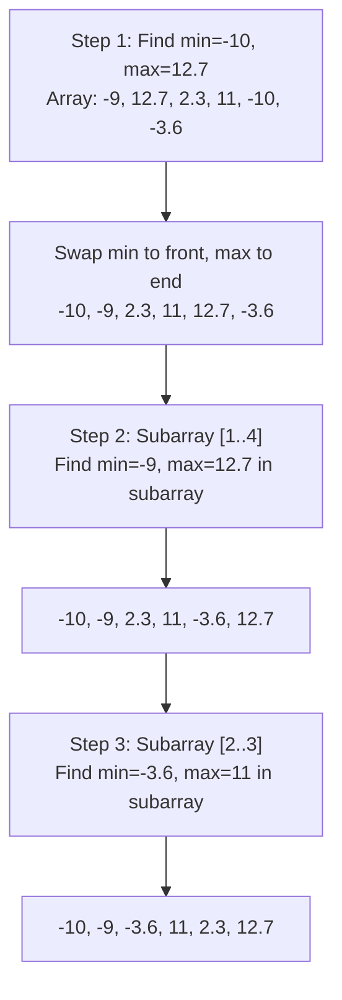
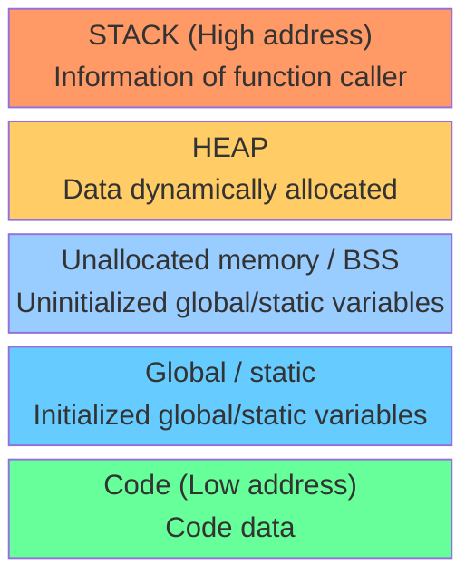

# Week 06: POINTER (P1)

> **Source**: CSLTr_week06.ppsx (111 slides)
> **Advisor**: Truong Toan Thinh
> **Note**: Extracted from PPSX XML. Images extracted to `week06_images/`. Diagrams are composed from individual icons -- described in text where possible.

---

## Slide 1 — Title

POINTER (P1)
Fundamentals of programming -- Co so lap trinh
Advisor: Truong Toan Thinh

---

## Slide 2 — Contents

- Using vector<T>
- Pointer
- String datatype
- Memory function
- Operation with pointer
- Pointer techniques
- Heap & stack
- Memory support functions
- Memory manipulation functions
- Allocate & use dynamic array
- Pointer-checking techniques
- Exercise

---

## Slide 3 — Using vector<T>

- Belong to Standard Template Library (STL)
- Implemented in standard C++
- Being capable of resizing the array-size
- Used with various datatypes
- Being able to declare a nested type for multidimensional array

---

## Slide 4 — Using vector<T>: Example 1

```cpp
#include <iostream>                    // 1
#include <vector>                      // 2
using namespace std;                   // 3
                                       // 4
void arrayOutput(vector<float> &a){    // 5
  for(int i = 0; i < a.size(); i++)    // 6
    cout << a[i] << " ";               // 7
}                                      // 8
                                       // 9
void arrayInput(vector<float> &a){     // 10
  int n; cin >> n;                     // 11
  if(n < 1) return;                    // 12
  a.resize(n);                         // 13
  for(int i = 0; i < a.size(); i++)    // 14
    cin >> a[i];                        // 15
}                                      // 16
                                       // 17
void main(){                           // 18
  vector<float> a;                     // 19
  arrayInput(a);                       // 20
  arrayOutput(a);                      // 21
}                                      // 22
```

---

## Slide 5 — Using vector<T>: Example 2

Example 1: need to know prior size. Example 2:

```cpp
#include <iostream>                            // 1
#include <vector>                              // 2
using namespace std;                           // 3
                                               // 4
void arrayOutput(const vector<float> &a){      // 5
  for(int i = 0; i < a.size(); i++)            // 6
    cout << a[i] << " ";                       // 7
}                                              // 8
                                               // 9
void arrayInput(vector<float> &a){             // 10
  float x;                                     // 11
  while(cin >> x)                              // 12
    a.push_back(x);                            // 13
}  // cin.clear();                             // 14
                                               // 15
void main(){                                   // 16
  vector<float> a;                             // 17
  arrayInput(a);                               // 18
  arrayOutput(a);                              // 19
}                                              // 20
```

---

## Slide 6 — Using vector<T>: Basic Methods

Some basic methods of `vector<T>`:

- `size()`: return a current size of array
- `resize(int)`: change array-size, automatically add/remove the item
- `push_back(T)`: add an item at the end of array
- `pop_back()`: remove the last item of array, array size is decreased by one

---

## Slide 7 — Using vector<T>: Create Vector from Array

Build some basic functions -- Create a vector from an integer array:

```cpp
void intArrayMake(vector<int> &a, int e[], int n){
  int i = 0;
  a.resize(0);
  while(i < n){
    a.push_back(e[i]);
    i++;
  }
}
```

> *[Diagram: array `e` with indices 0-7 being copied into vector `a`]*

---

## Slide 8 — Using vector<T>: Print Vector

Build some basic functions -- Print a vector to an output device:

```cpp
void intArrayOut(vector<int> &a, ostream& outDev){
  for(int i = 0; i < a.size(); i++)
    outDev << a[i] << " ";
  outDev << endl;
}
```

---

## Slide 9 — Using vector<T>: Merge Two Vectors

Build some basic functions -- Merge two vectors into one:

```cpp
void intArrayCat(vector<int> &dest, vector<int> &src){
  int s1 = dest.size(), s2 = src.size();
  int idx = s1, newsize = s1 + s2, i = 0;
  dest.resize(newsize);
  while(i < s2){
    dest[idx] = src[i];
    idx++; i++;
  }
}
```

> *[Diagram: `src` (indices 0-3) appended to `dest` (indices 0-5)]*

---

## Slide 10 — Using vector<T>: Split Vector

Build some basic functions -- Split a vector from another index and move to another vector:

```cpp
void intArrayCut(vector<int> &a, int pos, vector<int> &b){
  int size = a.size(), j = pos;
  if(j < 0 || j >= size) return;
  b.resize(0);
  while(j < size){
    b.push_back(a[j]);
    j++;
  }
  a.resize(pos);
}
```

> *[Diagram: vector `a` split at `pos`, tail moved to vector `b`]*

---

## Slide 11 — Using vector<T>: Insert Item

Build some basic functions -- Insert an item into a vector at another index:

```cpp
void intArrayInsert(vector<int> &a, int pos, int e){
  if(pos < 0 || pos >= a.size()) return;
  vector<int> b;
  intArrayCut(a, pos, b);
  a.push_back(e);
  intArrayCat(a, b);
}
```

> *[Diagram: vector `a` is cut at `pos`, element `e` is inserted, then `b` is concatenated back]*

---

## Slide 12 — Using vector<T>: Demo main()

Build some basic functions -- Function main demonstrates how to use:

```cpp
void main(){
  int x[] = {3, 5, 2, 4, 9, 7, 8, 6};
  int n = sizeof(x)/sizeof(x[0]);
  vector<int> a, b, c;
  intArrayMake(a, x, n);
  intArrayOut(a, cout);
  intArrayCut(a, 3, b); intArrayOut(a, cout); intArrayOut(b, cout);
  intArrayCat(b, a);
  intArrayInsert(b, 3, 999); intArrayOut(b, cout);
}
```

---

## Slide 13 — Using vector<T>: Using struct

```cpp
struct pupil{
  char name[31];
  char code[6];
  float grade;
};
typedef struct pupil PUPIL;

void inputPupil(PUPIL &p){
  cin >> p.grade;
  cin.ignore();
  cin.getline(p.code, 6);
  cin.getline(p.name, 31);
}
```

- Operator `>>` leaves character `'\n'` => Need `cin.ignore` to read `'\n'` out
- Method `getline` of `cin` reads `'\n'` out

Alternative ordering (getline first, then `>>`):

```cpp
void inputPupil(PUPIL &p){
  cin.getline(p.code, 6);
  cin.getline(p.name, 31);
  cin >> p.grade;
}
```

---

## Slide 14 — Using vector<T>: struct with vector

```cpp
#include <iostream>                          // 1
#include <vector>                            // 2
using namespace std;                         // 3
                                             // 4
void arrayOutput(vector<PUPIL> a){           // 5
  for(int i = 0; i < a.size(); i++)          // 6
    outputPupil(a[i]);                       // 7
}                                            // 8
                                             // 9
void arrayInput(vector<float> &a){           // 10
  PUPIL x;                                   // 11
  while(inputPupil(x)) a.push_back(x);      // 12
  cin.clear();                               // 13
}                                            // 14
                                             // 15
int inputPupil(PUPIL &p){                    // 16
  cin >> p.grade;                            // 17
  cin.ignore();                              // 18
  cin.getline(p.code, 6);                    // 19
  cin.getline(p.name, 31);                   // 20
  return cin.good();                         // 21
}                                            // 22
```

---

## Slide 15 — Using vector<T>: 2D Array Declaration

Declare nested type with `vector<T>` to create 2D array:

```cpp
typedef vector<float> Floats;
typedef vector<Floats> float2D;
```

> *[Diagram: 2D grid with rows 0-2 and columns 0-5]*

---

## Slide 16 — Using vector<T>: 2D Array Functions

```cpp
#include <iostream>                                      // 1
#include <vector>                                        // 2
using namespace std;                                     // 3
typedef vector<float> Floats;                            // 4
typedef vector<Floats> float2D;                          // 5
                                                         // 6
void float2DInit(float2D &a, int n){                     // 7
  a.resize(n);                                           // 8
  for(int i = 0; i < n; i++) a[i].resize(n);             // 9
}                                                        // 10

void float2DInput(float2D &a){                           // 11
  for(int i = 0; i < a.size(); i++)                      // 12
    for(int j = 0; j < a[i].size(); j++)                 // 13
      cin >> a[i][j];                                    // 14
}                                                        // 15

void float2DOutput(float2D &a){                          // 16
  for(int i = 0; i < a.size(); i++)                      // 17
    for(int j = 0; j < a[i].size(); j++){                // 18
      cout << a[i][j] << "\t";}                          // 19
    cout << endl;}                                       // 20
```

---

## Slide 17 — Pointer

- Used to store valid memory address
- Also have datatype as normal variables

```cpp
void main(){
  int *p;
  int a = 19, b;
  p = &a;
  *p = 23;
  p = &b;
  *p = 31;
}
```

> *[Memory diagram: `p` at <100>, `a` at <200> = 19 -> 23, `b` at <204> = 31. `p` first holds <200>, then <204>]*

---

## Slide 18 — Pointer: Arrays & Typeless Pointer

- Store address of the items of an array
- Can declare a typeless pointer (`void*`)

```cpp
void main(){
  float x; unsigned short a[10] = {0};
  unsigned short *pshort;
  unsigned long *plong; void* p;
  pshort = a; *pshort = 5;
  pshort = &a[2]; *pshort = 19;
  p = &x; *(float*)p = 1.5F;
  p = &a[8]; *(unsigned short*)p = 23;
  plong = (unsigned long*)&a[5];
  *plong = 0xDEADBEEF;
}
```

> *[Memory diagram: array `a[0..9]` at addresses <10>..<28>, showing values 5, 19, 23, DEADBEEF placed via different pointer types]*

---

## Slide 19 — Pointer: Value-type Pointer Parameter

Function with pointer param has 2 cases: **Value-type pointer** and **Reference-type pointer**.

```cpp
void upperCase(unsigned char* c){
  if(*c >= 'a' && *c <= 'z')
    *c = (*c) - 32;
}

void main(){
  unsigned char ch, *pch = new unsigned char;
  scanf("%c", &ch); scanf("%c", pch);
  upperCase(&ch); upperCase(pch);
  printf("%c", ch); printf("%c", pch);
}
```

> *[Memory diagram: `c` at <100>, `ch` at <200> = 't' -> 'T', `pch` at <204> -> <31>, 'a' -> 'A']*

---

## Slide 20 — Pointer: Reference-type Pointer Parameter

```cpp
void upperCase(unsigned char*& c){
  if(*c >= 'a' && *c <= 'z')
    *c = (*c) - 32;
}

void main(){
  unsigned char *pch = new unsigned char;
  scanf("%c", pch);
  upperCase(pch);
  printf("%c", pch);
}
```

> *[Memory diagram: `pch` at <204>, reference-type parameter `c` shares the same pointer]*

---

## Slide 21 — Pointer: Transmit Pointer to Multiple Functions

```cpp
void swap(float* x, float* y){
  float u = *x; *x = *y; *y = u;
}

void adjust(float* x, float* y){
  if(fabs(*x) > fabs(*y))
    swap(&(*x), &(*y));
}

void main(){
  float a = 1.2F, b = 2.1F;
  adjust(&a, &b);
  cout << a << b << endl;
}
```

> *[Memory diagram: nested pointer passing -- `adjust` receives addresses of `a` and `b`, then passes them to `swap`]*

---

## Slide 22 — Pointer: Return Pointer Value

```cpp
float* pointerMin(float a[], int n){
  int i = 1, idx = 0;
  while(i < n){
    if(fabs(a[i]) < fabs(a[idx])) idx = i;
    i++;
  }
  return &a[idx];
}

void main(){
  float B[] = {-9, 1.2F, 11, -3.6F};
  int n = sizeof(B)/sizeof(B[0]);
  float* pMin = pointerMin(B, n);
  cout << *pMin << endl;
}
```

> *[`pMin` points to `B[1]` (value 1.2), the element with smallest absolute value]*

---

## Slide 23 — Pointer: Return Pointer with String Functions

Return pointer value: use to interact with the functions in `<string>`

```cpp
char* strmax(char* str1, char* str2){
  if(strcmp(str1, str2) > 0) return str1;
  return str2;
}

void main(){
  char* s1 = new char[256], *s2 = new char[256];
  cin.getline(s1, 256); cin.getline(s2, 256);
  cout << strupr(strmax(s1, s2));
}
```

> *[Memory diagram: `s1` and `s2` point to heap memory; `str1`/`str2` receive those addresses]*

---

## Slide 24 — Pointer: Return a Reference Type

```cpp
float& refMin(float a[], int n){
  int i = 1, idx = 0;
  while(i < n){
    if(fabs(a[i]) < fabs(a[idx])) idx = i;
    i++;
  }
  return a[idx];
}

void main(){
  float B[] = {-9, 1.2F, 11, -3.6F};
  int n = sizeof(B)/sizeof(B[0]);
  float& rMin = refMin(B, n); // rMin = ...;
  cout << rMin << endl;
}
```

> *[`rMin` is a reference to `B[1]` (value 1.2) -- modifying `rMin` modifies `B[1]` directly]*

---

## Slide 25 — String Datatype

- A 1-D array of items of `char`
- May use pointer to allocate a string
- Comparison of string datatype uses alphabetical order
- Function can return a pointer (string address)
- Many functions support string manipulation:
  - Copy substring of a string
  - Merge two strings
  - Detect substring
  - Count a number of substring
  - ...

---

## Slide 26 — String Datatype: String Copy

- `char* d`: address of destination string
- `char* s`: address of source string
- `char*`: address of destination string (return)
- Consider 2 cases:
  - The first case: pointer `d` has an address before coming into function
  - The second case: pointer `d` does not have an address before coming into function

---

## Slide 27 — String Datatype: String Copy (Case 1)

```cpp
char* strCopyPB1(char* d, char* s){
  int i, n = strlen(s);
  for(i = 0; i < n; i++) d[i] = s[i];
  d[i] = '\0';
  return d;
}

void main(){
  char* src = "Hello world", *dest = new char[12];
  strCopyPB1(dest, src);
  cout << dest << endl;
  delete[] dest;
}
```

> *[Memory diagram: `src` -> "Hello world", `dest` -> newly allocated memory, characters copied one by one]*

---

## Slide 28 — String Datatype: String Copy (Case 2)

```cpp
char* strCopyPB2(char* d, char* s){
  int i, n = strlen(s); d = new char[n + 1];
  for(i = 0; i < n; i++) d[i] = s[i];
  d[i] = '\0';
  return d;
}

void main(){
  char* src = "Hello world", *dest = NULL;
  dest = strCopyPB2(dest, src);
  cout << dest << endl;
  delete[] dest;
}
```

> *[Memory diagram: `dest` starts as NULL, `strCopyPB2` allocates new memory and returns its address]*

---

## Slide 29 — String Datatype: Merge Two Strings

- `char* s`: address of the first string
- `char* t`: address of the second string
- `char*`: address of destination string (return)
- Note:
  - Length of destination string is equal to the sum of two substrings
  - Add `'\0'` into the last byte of destination string
  - Need a pointer in main to receive address returned by merge-function

---

## Slide 30 — String Datatype: Merge Code

```cpp
char* strCatenate(char* s, char* t){
  int ns = strlen(s), nt = strlen(t), d = 0;
  char* r = new char[ns + nt + 1];
  for(int i = 0; i < ns; i++) r[d++] = s[i];
  for(int i = 0; i < nt; i++) r[d++] = t[i];
  r[d] = '\0';
  return r;
}

void main(){
  char* ss = "Hello ", *tt = "world";
  char* rr = strCatenate(ss, tt);
  cout << rr << endl;
  delete[] rr;
}
```

> *[Result: `rr` -> "Hello world"]*

---

## Slide 31 — Memory Function

C/C++ supports some allocation functions:

- `void* malloc(int n)`: allocate n bytes
- `void* calloc(int nItem, int n)`: allocate `nItem` items continuously, each item has n bytes
- `void* realloc(void* pmem, int size)`: re-allocate memory with size either bigger or smaller than old size
- `void free(void* pmem)`: free memory

---

## Slide 32 — Memory Function: Allocate 1D Array

```c
#include <stdio.h>
#include <stdlib.h>

void main(){
  int n; float* a = NULL;
  scanf("%d", &n);
  a = (float*)malloc(n * sizeof(float));
  if(a == NULL) return;
  for(int i = 0; i < n; i++)
    scanf("%f", &a[i]);
  for(int i = 0; i < n; i++)
    printf("%d ", a[i]);
  free(a);
}
```

Note:
- `a = &a[0]` and `(a + i) = &a[i]`
- `*a = a[0]` and `*(a + i) = a[i]`
- Add/subtract address: `a + i` moves by `i * sizeof(float)` bytes

---

## Slide 33 — Operation with Pointer

Using `+` and `-` for address:

- **Addition**: address + integer creates a new address different from old address about some bytes depending on datatype and integer
  - Formula: `new address = old address + integer * sizeof(pointer datatype)`
- **Subtraction**: pointer1 - pointer2 returns deviations depending on datatype
  - Formula: `pointer1 - pointer2 = (addr1 - addr2) / sizeof(datatype)`

---

## Slide 34 — Operation with Pointer: Example

Example: array of `double`

- `p + 1 = &a[2]`
- `(float*)p + 2 = &a[2]`, `(float*)p + 4 = &a[3]`
- `*((float*)p + 4)` = the first half bytes of `a[3]`

> *[Diagram: array a[0..4], 8 bytes per element, with pointer arithmetic showing byte-level offsets 0-8]*

---

## Slide 35 — Operation with Pointer: Code

```cpp
void main(){
  long a[10];
  void* ptr1 = &a[7], *ptr2 = &a[1];
  long d1 = (long*)ptr1 - (long*)ptr2;
  long d2 = (char*)ptr1 - (char*)ptr2;
  long d3 = (short*)ptr2 - (short*)ptr1;
  cout << "d1 = " << d1 << endl;      // (<28> - <4>)/4 = 6
  cout << "d2 = " << d2 << endl;      // (<28> - <4>)/1 = 24
  cout << "d3 = " << d3 << endl;      // (<4> - <28>)/2 = -12
  cout << "Distance = " << (long)ptr1 - (long)ptr2 << endl; // 28 - 4 = 24
}
```

> *[Memory diagram: array `a[0..9]` at byte addresses <0>..<39>, `ptr2` = <4>, `ptr1` = <28>]*

---

## Slide 36 — Pointer Techniques: Take Data Physically Stored

Take each byte/word of a variable:

- May use `char*`/`short*` to access each byte/word of basic datatype
- Syntax:
  - `(char*)x` in C or `(char*)(&x)` in C++
  - `(short*)x` in C or `(short*)(&x)` in C++
- Use `"%X"` in C or `hex` in C++ to print hex numbers
- Technique is similar to dynamic bytes

---

## Slide 37 — Pointer Techniques: getBytes & getWords

```cpp
char* getBytes(double* x, int* n){
  *n = 8;
  return (char*)x;
}

short* getWords(double* x, int* n){
  *n = 4;
  return (short*)x;
}

void listBytes(char b[], int nb){
  for(int i = 0; i < nb; i++)
    cout << hex << (unsigned char)b[i];
  cout << endl;
}

void listWords(short w[], int nw){
  for(int i = 0; i < nw; i++)
    cout << hex << (unsigned short)w[i];
  cout << endl;
}
```

> *[Example: `a = 0.01` stored as bytes `7B 14 AE 47 E1 7A 84 3F`]*

---

## Slide 38 — Pointer Techniques: Modified getBytes

```cpp
char* getBytes(double x, int* n){
  double* px = (double*)malloc(sizeof(double));
  *n = 8;
  if(px != NULL) *px = x;
  return (char*)px;
}

void main(){
  double a = 0.01; char* sb; int nb;
  sb = getBytes(a, &nb);
  if(sb != NULL){/*...*/; free(sb);}
}
```

> *[Difference from Slide 37: takes `double` by value, allocates new memory to store a copy]*

---

## Slide 39 — Pointer Techniques: Directly Take Sub-array

- May use a partial array
- Ex: `int a[15] = {...}, *sub_a = &a[5]`
- Easy to see: `sub_a[0] = a[5]`, ..., `sub_a[9] = a[14]`

Consider recursive sort function:

```cpp
void main(){
  float B[] = {-9, 12, 2.3, 11, -10, -3.6};
  int nB = sizeof(B)/sizeof(B[0]);
  minmaxSort(B, nB);
  for(int i = 0; i < nB; i++){ cout << B[i]; }
}
```

---

## Slide 40 — Pointer Techniques: Recursive Sort (Idea, Step 1)



> *[Multiple steps showing min/max swapping at each level of recursion]*

---

## Slide 41 — Pointer Techniques: Recursive Sort (Idea, Step 2)

Continuation:

| Step | Array | min | max |
|------|-------|-----|-----|
| After step 3 | -10, -9, 2.3, -3.6, 11, 12.7 | | |
| Step 4 | -10, -9, -3.6, 2.3, 11, 12.7 | -3.6 | 2.3 |
| Final | -10, -9, -3.6, 2.3, 11, 12.7 | | |

---

## Slide 42 — Pointer Techniques: Another Recursive Sort Example

Starting array: `12.7, -9, 2.3, 11, -10, -3.6`

| Step | Array | min | max |
|------|-------|-----|-----|
| Initial | 12.7, -9, 2.3, 11, -10, -3.6 | -10 | 12.7 |
| After swap | -10, -9, 2.3, 11, -3.6, 12.7 | | |
| Subarray | -10, -9, 2.3, 11, -3.6, 12.7 | -9 | 11 |
| After swap | -10, -9, 2.3, -3.6, 11, 12.7 | | |

---

## Slide 43 — Pointer Techniques: Another Recursive Sort (Cont.)

| Step | Array | min | max |
|------|-------|-----|-----|
| Subarray [2..3] | -10, -9, 2.3, -3.6, 11, 12.7 | -3.6 | 2.3 |
| After swap | -10, -9, -3.6, 2.3, 11, 12.7 | | |
| Final | -10, -9, -3.6, 2.3, 11, 12.7 | | |

---

## Slide 44 — Pointer Techniques: Recursive Sort Code

```cpp
void minMaxSort(float a[], int n){
  int idmin = 0, idmax = 0;
  for(int i = 1; i < n; i++){
    if(a[idmin] > a[i]) idmin = i;
    if(a[idmax] < a[i]) idmax = i;
  }
  swap(&a[0], &a[idmin]);
  if(idmax == 0) idmax = idmin;
  swap(&a[n - 1], &a[idmax]);
  if(n > 3) minMaxSort(&a[1], n - 2);
}
```

> *[Recursive calls: n=6 -> n=4 -> n=2 (base case), each time operating on sub-array `&a[1]`]*

---

## Slide 45 — Pointer Techniques: Initialization with struct

```cpp
#include <stdlib.h>

typedef struct {
  char* Name, *FamilyName;
  long id; char BirthDate[11];
  float AGP;
} StudentRec;

void Init(StudentRec* st){
  st->Name = st->FamilyName = NULL;
  st->id = st->AGP = 0;
  for(int i = 0; i < sizeof(st->BirthDate); i++)
    st->BirthDate[i] = 0;
}
```

Alternative using `memset`:

```cpp
#include <memory.h>
memset(st, 0, sizeof(StudentRec));
```

Note: main() function:

```cpp
void main(){
  StudentRec st1;
  Init(&st1);
  StudentRec* st2;
  Init(st2);
}
```

---

## Slide 46 — Pointer Techniques: Scanning in String (Version 1)

Pointer datatype must be `char`:

```cpp
int strLen(char *s){
  int len = 0;
  while(s[len] != '\0') len++;
  return len;
}
```

> *[Diagram: string "abcdefgklm\0", `len` increments from 0 to 10]*

---

## Slide 47 — Pointer Techniques: Scanning in String (Version 2)

Directly increase variable `len` in operator `[]`:

```cpp
int strLen(char *s){
  int len = 0;
  while(s[len++] != '\0');
  return len - 1;
}
```

Note:
- Line 3 takes `s[len]`, then increases `len`
- Line 3 compares `s[len] ?= '\0'` with "old `len`"

---

## Slide 48 — Pointer Techniques: Scanning in String (Version 3)

Using operator `*` with `++`:

```cpp
int strLen(char *s){
  int len = 0;
  while(*s++ != '\0') len++;
  return len;
}
```

Note:
- Line 3 takes `*s`, then increases address
- Line 3 compares `*s ?= '\0'` (old `*s`)

---

## Slide 49 — Pointer Techniques: Scanning in String (Version 4)

Utilize address to speed computation:

```cpp
int strLen(char* s){
  char* p = s;
  while(*p++);
  return (p - s - 1);
}
```

> *[`p - s - 1 = [(<12> - <1>) / sizeof(char)] - 1 = 10`]*

---

## Slide 50 — Pointer Techniques: Searching Termination Character

Termination characters may be: space, comma, tab...

```cpp
int isDelimeter(char s){
  return (s == ' ' || s == ',' || s == '\t' || s == '\n');
}

// Version 1: using index            // Version 2: using pointer
char* delim(char* s){                char* delim(char* s){
  int i = 0, n = strlen(s);           char* p = s;
  while(i < n && !isDelimeter(s[i]))  while(*p && !isDelimeter(*p))
  {i++;}                              {p++;}
  return s + i;                        return p;
}                                    }
```

> *[Diagram: string "hello world\0", pointer advances to the space delimiter]*

---

## Slide 51 — Pointer Techniques: Searching Termination (Improvement)

```cpp
// Version 3: check null directly    // Version 4: cache character
char* delim(char* s){                char* delim(char* s){
  int i = 0;                           int i = 0; char c;
  while(s[i] != 0 && !isDelimeter(    while((c = s[i]) != 0 && !isDelimeter(c))
    s[i]))                            {i++;}
  {i++;}                               return s + i;
  return s + i;                      }
}
```

---

## Slide 52 — Pointer Techniques: Rules of Using Pointer

- When declaring a pointer, its value is rubbish (address of previous program) => assign NULL, for example `int* p = NULL;`
- Should check pointer value before using, for example `if(p != NULL) {...}`
- Pointer at parameter place of another function means it had an address at the place of calling function, for example: `int abc(int* p){...}; void main(){ abc(new int); }`
- When moving pointer, this should be in its area where pointer manages
- When moving pointer with `+` or `-`, remember its datatype, for example: pointer `int` `+` one unit will move 4 bytes, pointer `short` `+` 2 units will move 4 bytes

---

## Slide 53 — Heap & Stack

- The **stack** is allocated for each function when they are called
- Stack contains the parameters (input/output) and local variables
- When function is finished, the memory of stack is returned to OS
- Terminology 'stack' implies it operates with 'last in -- first out' rule
- The **heap** is global (does not depend on caller)
- Must explicitly free the memory of heap

---

## Slide 54 — Heap & Stack: Memory Model



---

## Slide 55 — Memory Support Functions: malloc

Functions work with the memory heap. Need to declare `#include <malloc.h>`.

Constant `NULL` (zero) in `<stdio.h>`.

`void* malloc(int nSz)`:
- Allocate the memory with nSz bytes
- Return the address of this memory

Example of malloc:

```cpp
int* a = (int*)malloc(3 * sizeof(int));
for(int i = 0; i < 3; i++){ *(a + i) = i; }
for(int i = 0; i < 3; i++){ cout << *(a + i); }
free((int*)a);
```

---

## Slide 56 — Memory Support Functions: realloc

`void* realloc(void* p, int nSz)`:
- Re-allocate the old memory with new nSz bytes
- Returning the address of old memory or new memory depends on the compiler's optimization

Example of realloc:

```cpp
int* a = (int*)malloc(3 * sizeof(int));
cout << hex << a << endl;
for(int i = 0; i < 3; i++){ *(a + i) = i; }
for(int i = 0; i < 3; i++){ cout << *(a + i) << endl; }
realloc(a, 4);
cout << hex << a << endl;
for(int i = 0; i < 4; i++){ cout << *(a + i) << endl; }
free((int*)a);
```

---

## Slide 57 — Memory Support Functions: _alloca (Stack)

Functions work with the memory stack:

- Can allocate in the memory stack
- **Not allowing** to free after using
- Data in this memory are **automatically destroyed** when finishing calling function
- `void* _alloca(int nSz)`: similar to malloc, but allocated in stack

Example:

```cpp
int* a = (int*)_alloca(8);
*a = 5;
*(a+1) = 10;
cout << *a << endl;
cout << *(a+1) << endl;
```

> *[Memory diagram: allocated in STACK at <20>, values 5 and 10]*

---

## Slide 58 — Memory Support Functions: _expand & _msize

- `void* _expand(void* p, int nSz)`: similar to realloc, but only supported in C++
- If you want to know a number of bytes allocated:
  - `int _msize(void* p)`: return number of bytes p manages (Windows only)
  - `int malloc_size(void* p)`: similarly but used in Mac OS
  - `int malloc_usable_size(void* p)`: similarly but used in Linux
- Note: `_msize` only returns number of bytes allocated by malloc, realloc or calloc

Example:

```cpp
int* a = (int*)malloc(8);
*a = 5;
*(a+1) = 10;
cout << *a << " " << *(a+1) << endl;
cout << _msize(a) << endl;
```

> *[Memory diagram: STACK vs HEAP distinction]*

---

## Slide 59 — Memory Support Functions: Custom mAlloc

Build three support functions. Allocate memory: re-use malloc function.

```cpp
void* mAlloc(int size){
  // example size is 5 bytes
  void* p = malloc(size + sizeof(int));
  *(int*)p = size;
  return ((int*)p) + 1;
}
```

> *[Memory layout: 4 bytes for size header, then `size` bytes for data. Returns pointer past header.]*

---

## Slide 60 — Memory Support Functions: Custom mFree

```cpp
void* mAlloc(int size){
  void* p = malloc(size + sizeof(int));
  *(int*)p = size;
  return ((int*)p) + 1;
}

void mFree(void* p){
  p = ((int*)p) - 1;
  free(p);
}
```

---

## Slide 61 — Memory Support Functions: Custom mSize

```cpp
int mSize(void* p){
  return *(((int*)p) - 1);
}

void main(){
  char* p = (char*)mAlloc(5);
  gets(p);
  cout << p << endl;
  cout << mSize(p) << endl;
  mFree(p);
}
```

---

## Slide 62 — Memory Manipulation Functions: memset

Library `<memory.h>` contains memory manipulation functions.

`void* memset(void* des, int ch, int n)`: Initialize n bytes with value of `ch` for the memory `des`.

```cpp
void main(){
  char* s = (char*)malloc(6);
  s[5] = 0;
  char* p = memset(s, 65, 5);
  cout << s << endl;         // "AAAAA"
  cout << (int*)s << endl;
  cout << (int*)p << endl;   // same address as s
  free(s);
}
```

---

## Slide 63 — Memory Manipulation Functions: memmove

`void* memmove(void* des, const void* src, int n)`: Copy n bytes from memory `src` to memory `des`. Returns the address of `des` pointer.

```cpp
void main(){
  char* s = (char*)malloc(6);
  s[5] = 0;
  memset(s, 65, 5);
  char* d = (char*)malloc(6);
  d = (char*)memmove(d, s, 6);
  cout << d << endl;         // "AAAAA"
  cout << (int*)d << endl;
  free(s);
  free(d);
}
```

---

## Slide 64 — Memory Manipulation Functions: memcmp

`int memcmp(const void* buf1, const void* buf2, int n)`: Compare n bytes of two memories. Returns 1 if buf1 > buf2, -1 if buf1 < buf2 and 0 if equality. Note: This function only compares value of each byte.

```cpp
void main(){
  char* s = (char*)malloc(6);
  s[5] = 0;
  memset(s, 65, 5);
  char* d = (char*)malloc(6);
  d = (char*)memmove(d, s, 6);
  cout << memcmp(s, d, 6) << endl;  // 0
  free(s);
  free(d);
}
```

---

## Slide 65 — Memory Manipulation Functions: _memicmp

`int _memicmp(const void* buf1, const void* buf2, unsigned int n)`: Similar to `memcmp`, but case insensitive.

```cpp
void main(){
  char* s = (char*)malloc(6);
  s[5] = 0;
  memset(s, 65, 5);
  char* d = (char*)malloc(6);
  d = (char*)memmove(d, s, 6);
  d[0] = 'a';
  cout << memcmp(s, d, 6) << endl;    // non-zero (case sensitive)
  cout << _memicmp(d, s, 6) << endl;  // 0 (case insensitive)
  free(s);
  free(d);
}
```

---

## Slide 66 — Allocate & Use Dynamic Array (With Prior Size)

Separate functions of input/output:

```cpp
void main(){
  int nB; float* B = inputArray(&nB);
  if(B != NULL) outputArray(B, nB); free(B);
}

float* inputArray(int* n){
  cin >> (*n);
  float* a = (float*)calloc((*n), sizeof(float));
  if(a != NULL)
    for(int i = 0; i < (*n); i++){
      cin >> a[i];
    }
  return a;
}
```

> *[Memory diagram: `B` receives returned pointer, `n` receives count via pointer parameter]*

---

## Slide 67 — Allocate & Use Dynamic Array: struct intArray (Input)

```cpp
struct intArray{ int n, *arr; };

void main(){
  intArray B;
  nhap(&B);
  xuat(&B);
  huy(&B);
}

void nhap(intArray* a){
  cin >> a->n;
  a->arr = (int*)malloc(a->n * sizeof(int));
  for(int i = 0; i < a->n; i++)
    cin >> a->arr[i];
}
```

> *[Memory diagram: `B` at <200>, `B.n` = 3, `B.arr` -> heap memory at <500>]*

---

## Slide 68 — Allocate & Use Dynamic Array: struct intArray (Output)

```cpp
// Pointer version
void xuat(const intArray* a){
  for(int i = 0; i < a->n; i++)
    cout << a->arr[i];
}

// Value version
void xuat(intArray a){
  for(int i = 0; i < a.n; i++)
    cout << a.arr[i];
}
```

> *[Memory diagram: pointer version uses original struct, value version creates a copy but shares the same `arr` pointer]*

---

## Slide 69 — Allocate & Use Dynamic Array: struct intArray (Free)

```cpp
void huy(intArray* a){
  if(a != NULL)
    if(a->arr != NULL)
      free(a->arr);
}
```

---

## Slide 70 — Allocate & Use Dynamic Array (Unknown Size, Reference Pointer)

User determines when to stop input. Use version of `nhap` function with parameter of **reference pointer**:

```cpp
void main(){
  int* B, nB;
  nhap(B, nB); xuat(B, nB); free(B);
}

void nhap(int*& a, int &n){
  int x, m, *anew;
  anew = a = NULL;
  m = x = n = 0;
  while(cin >> x){
    m = n + 1;
    anew = (int*)realloc(a, m * sizeof(int));
    if(anew != NULL){ anew[n++] = x; a = anew; }
  }
  cin.clear();
}
```

---

## Slide 71 — Allocate & Use Dynamic Array (Unknown Size, Level-2 Pointer)

Use version of `nhap` function with parameter of **level 2 pointer**:

```cpp
void main(){
  int* B, nB;
  nhap(B, nB); xuat(B, nB); free(B);
}

void nhap(int** a, int &n){
  int x, m, *anew;
  anew = *a = NULL;
  m = x = n = 0;
  while(cin >> x){
    m = n + 1;
    anew = (int*)realloc(*a, m * sizeof(int));
    if(anew != NULL){ anew[n++] = x; *a = anew; }
  }
  cin.clear();
}
```

---

## Slide 72 — Allocate & Use Dynamic Array (Template Function)

Template function allows us to use with various datatypes:

```cpp
template <class T>
void nhap(T** a, int &n){
  T x, *anew; int m;
  anew = *a = NULL;
  m = n = 0;
  while(cin >> x){
    m = n + 1;
    anew = (T*)realloc(*a, m * sizeof(T));
    if(anew != NULL){ anew[n++] = x; *a = anew; }
  }
  cin.clear();
}
```

> Need overload operator `>>` for user-defined type.

---

## Slide 73 — Allocate & Use Dynamic Array (Template with PhanSo)

```cpp
struct PhanSo{ int tu, mau; };

void nhap(T** a, int &n){
  //...
}

istream& operator>>(istream& inDev, PhanSo& p){
  inDev >> p.tu >> p.mau;
  return inDev;
}

void main(){
  PhanSo* B; int nB;
  nhap(B, nB); xuat(B, nB); free(B);
}
```

---

## Slide 74 — Allocate & Use Dynamic Array: General Type Goals

Goals: build support functions processing 1D array.

- The functions' advantage: **Process with GENERAL TYPE**
- Need not `vector<T>`
- Need firstly checking array with `float`

> *[Memory layout: header (stores number of items) followed by data]*

---

## Slide 75 — Allocate & Use Dynamic Array: memSize

Check array with `float`:

- The size of header: `int headSize = sizeof(int)`

`int memSize(int nItem)`: calculate needed size (bytes) to store `nItem`:

```cpp
int memSize(int nItem){
  return headSize + nItem * sizeof(float);
}
```

> *[Header needs 4 bytes, data needs `nItem * sizeof(float)` bytes]*

---

## Slide 76 — Allocate & Use Dynamic Array: origin_addr

`void* origin_addr(float* aData)`: take the head's address from the data's address:

```cpp
void* origin_addr(void* aData){
  return (char*)aData - headSize;
}
```

> *[Diagram: data at <6>, header at <2>, offset = 4 * sizeof(char)]*

---

## Slide 77 — Allocate & Use Dynamic Array: data_addr

`float* data_addr(void* origin)`: take the data's address from the head's address:

```cpp
float* data_addr(void* origin){
  return (float*)((char*)origin + headSize);
}
```

> *[Diagram: header at <2>, data at <6>, offset = 4 * sizeof(char)]*

---

## Slide 78 — Allocate & Use Dynamic Array: set_nItem

`void set_nItem(float* aData, int nItem)`: assign value `nItem` into the head's memory:

```cpp
void set_nItem(float* aData, int nItem){
  *((int*)origin_addr(aData)) = nItem;
}
```

---

## Slide 79 — Allocate & Use Dynamic Array: get_nItem

`int get_nItem(float* aData)`: take the value `nItem` of the head's memory:

```cpp
int get_nItem(float* aData){
  return *((int*)origin_addr(aData));
}
```

---

## Slide 80 — Allocate & Use Dynamic Array: floatArrSize

`int floatArrSize(float* aData)`: take a number of items of 1D array `aData`:

```cpp
int floatArrSize(float* aData){
  if(aData != NULL) return get_nItem(aData);
  return 0;
}
```

---

## Slide 81 — Allocate & Use Dynamic Array: floatArrFree

`void floatArrFree(float* aData)`: destroy all memory allocated (from address of head portion):

```cpp
void floatArrFree(void* aData){
  if(aData != NULL) free(origin_addr(aData));
}
```

---

## Slide 82 — Allocate & Use Dynamic Array: floatArrResize

`float* floatArrResize(float* aData, int nItem)`: resize to new size:

```cpp
float* floatArrResize(float* aData, int nItem){
  int sz = memSize(nItem);
  float* anew = NULL; void* originAddr = NULL;
  if(aData != NULL) originAddr = origin_addr(aData);
  anew = (float*)realloc(originAddr, sz);
  if(anew != NULL){
    if(aData == NULL) memset(anew, 0, sz);
    aData = data_addr(anew);
    set_nItem(aData, nItem);
  }
  return aData;
}
```

---

## Slide 83 — Allocate & Use Dynamic Array: floatArrPushback

`int floatArrPushback(float** aData, float x)`: add `x` into 1D array `aData`:

```cpp
int floatArrPushback(float** aData, float x){
  int n = floatArrSize(*aData);
  float* anew = floatArrResize(*aData, n + 1);
  if(anew != NULL){
    anew[n] = x;
    *aData = anew;
    return 1;
  }
  return 0;
}
```

---

## Slide 84 — Allocate & Use Dynamic Array: floatArrPopback

`float floatArrPopback(float** aData)`: take the last item out of 1D array `aData`:

```cpp
float floatArrPopback(float** aData){
  int n = floatArrSize(*aData);
  float x = 0;
  if(*aData != NULL && n > 0){
    n--; x = (*aData)[n];
    float* anew = floatArrResize(*aData, n);
    if(anew != NULL) *aData = anew;
  }
  return x;
}
```

---

## Slide 85 — Allocate & Use Dynamic Array: floatArrInput

`float* floatArrInput()`: return 1D array of float items:

```cpp
float* floatArrInput(){
  float* a = NULL, x = 0;
  while(cin >> x){
    floatArrPushback(&a, x);
  }
  cin.clear();
  return a;
}
```

> *[User inputs values until Ctrl+X to stop]*

---

## Slide 86 — Allocate & Use Dynamic Array: Demo main()

```cpp
void main(){
  float* B = NULL;
  B = floatArrInput();
  floatArrFree(B);
}
```

---

## Slide 87 — Allocate & Use Dynamic Array: General Type Layout

Goal: build support functions processing 1D array with **GENERAL TYPE**

> *[Memory layout: header stores both number of items AND size of each item, followed by data]*
>
> Header size = `sizeof(number of items) + sizeof(size of each item)`

---

## Slide 88 — Allocate & Use Dynamic Array (General): memSize

Size of header: `int headSize = sizeof(int) + sizeof(int)`

`memSize()`: calculate sum of bytes needed:

```cpp
int memSize(int nItem, int szItem){
  return headSize + nItem * szItem;
}
```

> *[Header contains: `nItem` (4 bytes) + `sizeItem` (4 bytes)]*

---

## Slide 89 — Allocate & Use Dynamic Array (General): origin_addr

```cpp
void* origin_addr(void* aData){
  if(aData != NULL) return (char*)aData - headSize;
  return NULL;
}
```

---

## Slide 90 — Allocate & Use Dynamic Array (General): data_addr

```cpp
void* data_addr(void* aOrigin){
  if(aOrigin != NULL) return (char*)aOrigin + headSize;
  return NULL;
}
```

---

## Slide 91 — Allocate & Use Dynamic Array (General): sizeItem_addr

```cpp
void* sizeItem_addr(void* aData){
  if(aData != NULL) return (char*)aData - sizeof(int);
  return NULL;
}
```

---

## Slide 92 — Allocate & Use Dynamic Array (General): arrSize

```cpp
int arrSize(void* aData){
  if(aData != NULL) return *(int*)origin_addr(aData);
  return 0;
}
```

---

## Slide 93 — Allocate & Use Dynamic Array (General): arrItemSize

```cpp
int arrItemSize(void* aData){
  if(aData != NULL) return *(int*)sizeItem_addr(aData);
  return 0;
}
```

---

## Slide 94 — Allocate & Use Dynamic Array (General): arrFree

```cpp
void arrFree(void* aData){
  if(aData != NULL) free(origin_addr(aData));
}
```

---

## Slide 95 — Allocate & Use Dynamic Array (General): arrInit

`arrInit()`: Allocate the sum of bytes:

```cpp
void* arrInit(int nItem, int szItem){
  int sz = memSize(nItem, szItem);
  void* aOrigin = malloc(sz);
  if(aOrigin != NULL){
    memset(aOrigin, 0, sz);
    void* aData = data_addr(aOrigin);
    *(int*)origin_addr(aData) = nItem;
    *(int*)sizeItem_addr(aData) = szItem;
    return aData;
  }
  return NULL;
}
```

> *[Example: nItem = 3 & szItem = 4 => sz = 8 + 3*4 = 20]*

---

## Slide 96 — Allocate & Use Dynamic Array (General): arrResize

`arrResize()`: resize the memory of 1D array `aData`:

```cpp
void* arrResize(void* aData, int nItem){
  if(aData == NULL || nItem < 0) return NULL;
  void* aOrigin = origin_addr(aData);
  int sizeItem = *(int*)sizeItem_addr(aData);
  int sz = memSize(nItem, sizeItem);
  void* aNew = realloc(aOrigin, sz);
  if(aNew != NULL){
    aData = data_addr(aNew);
    *(int*)origin_addr(aData) = nItem;
    return aData;
  }
  return NULL;
}
```

---

## Slide 97 — Allocate & Use Dynamic Array (General): arrPushback

Function `arrPushback()`: Add `x` into 1D array `aData`:

```cpp
int arrPushback(void** aData, void* x){
  int nItem = arrSize(*aData), szItem = arrItemSize(*aData);
  void* aNew = arrResize(*aData, 1 + nItem);
  if(aNew != NULL){
    memmove((char*)aNew + nItem * szItem, x, szItem);
    *aData = aNew;
    return 1;
  }
  return 0;
}
```

---

## Slide 98 — Allocate & Use Dynamic Array (General): floatArrIn

Example: rebuild `floatArrIn()`:

```cpp
float* floatArrIn(){
  float* a = (float*)arrInit(0, sizeof(float)), x = 0;
  while(cin >> x){
    arrPushback((void**)&a, &x);
  }
  cin.clear();
  return a;
}
```

---

## Slide 99 — Allocate & Use Dynamic Array (General): PhanSoArrIn

Example: rebuild `PhanSoArrIn()`:

```cpp
PhanSo* PhanSoArrIn(){
  PhanSo* a = (PhanSo*)arrInit(0, sizeof(PhanSo));
  PhanSo x = {0, 1};
  while(cin >> x){
    arrPushback((void**)&a, &x);
  }
  cin.clear();
  return a;
}
```

---

## Slide 100 — Allocate & Use Dynamic Array (General): arrPopback

`arrPopback`: Take the last item of 1D array `aData`, and decrease its size by one:

```cpp
void* arrPopback(void** aData){
  int nItem = arrSize(*aData), szItem = arrItemSize(*aData);
  void* x = malloc(szItem);
  if(*aData != NULL && nItem > 0){
    nItem--;
    memmove(x, (char*)(*aData) + nItem * szItem, szItem);
    void* aNew = arrResize(*aData, nItem);
    if(aNew != NULL) *aData = aNew;
  }
  return x;
}
```

---

## Slide 101 — Allocate & Use Dynamic Array (General): main() with float

```cpp
void main(){
  cout << "Input items:\n";
  float* B = floatArrIn();
  float* x = (float*)arrPopback((void**)&B);
  cout << "After pop: \n";
  floatArrOut(B);
  cout << "\nPopped element: " << *x << endl;
  free(x);
  arrFree((float*)B);
}
```

---

## Slide 102 — Allocate & Use Dynamic Array: Operator []

Goal: help code be more natural when using struct to create array. Need to return reference when using `[]`.

```cpp
// File.h
struct floatArray{
  int n;
  float* arr;
  float& operator[](int);
};

// File.cpp
#include "File.h"
float& floatArray::operator[](int i){
  if(arr != NULL && i >= 0 && i < n) return arr[i];
  return dummy;
}

void floatArrayOutput(floatArray& a){
  if(a.arr == NULL) return;
  for(int i = 0; i < a.n; i++)
    cout << a[i] << " ";  // a.operator[](i)
}
```

---

## Slide 103 — Pointer-Checking Techniques (Pointer Variable)

Can convert normal variable to pointer. Need to carefully control.

```cpp
void markMem(void* a){
  cout << "Address of a: " << &a;
  cout << "Address a points: " << a;
  void** vh = (void**)a;
  cout << "Address of vh: " << &vh;
  cout << "Address vh points: " << vh;
  cout << "Value at address vh points: " << *vh;
  *vh = a;
  cout << "Value at address vh points: " << *vh;
}

void main(){
  int* p = new int; *p = 10;
  cout << "Address of p: " << &p;
  cout << "Address p points: " << p;
  cout << "Value at address p points: " << *p;
  markMem(p);
  free(p);
}
```

> *[`p` at <50> points to <200> (value 10). `a` at <70> = <200>. `vh` at <90> = <200>]*

---

## Slide 104 — Pointer-Checking Techniques (Normal Variable)

```cpp
void markMem(void* a){
  cout << "Address of a: " << &a;
  cout << "Address a points: " << a;
  void** vh = (void**)a;
  cout << "Address of vh: " << &vh;
  cout << "Address vh points: " << vh;
  cout << "Value at address vh points: " << *vh;
  *vh = a;
  cout << "Value at address vh points: " << *vh;
}

void main(){
  int p = 10;
  cout << "Address of p: " << &p;
  cout << "Value of p: " << p;
  markMem(&p);
}
```

> *[`p` at <50> (value 10). `a` at <70> = <50>. `vh` at <90> = <50>]*

---

## Slide 105 — Pointer-Checking Techniques: Memory Layout

Divide memory into 2 parts:

- **Header**: contains information of original pointer and needed size for data
- **Data**: contains data

> *[Diagram: `pmem` -> header (4 byte original address + 4 byte needed size) -> `pData` -> data]*

---

## Slide 106 — Pointer-Checking Techniques: markMem & checkMem

```cpp
static void markMem(void* pmem){
  *(void**)pmem = pmem;
}

static int checkMem(void* pmem){
  return *(void**)pmem == pmem;
}
```

> *[The first 4 bytes of allocated memory store the memory's own address as a signature]*

---

## Slide 107 — Pointer-Checking Techniques: checkPtr & safeSize

```cpp
int checkPtr(void* pData){
  if(pData == NULL) return 0;
  void* pmem = (char*)pData - 8;
  return checkMem(pmem);
}

size_t safeSize(void* pData){
  if(checkPtr(pData) == 0) return 0;
  return *(size_t*)((char*)pData - 4);
}
```

> *[`pData` is 8 bytes past `pmem`. Header: [self-address (4 bytes)][size M (4 bytes)][data...]]*

---

## Slide 108 — Pointer-Checking Techniques: safeMalloc

```cpp
void* safeMalloc(size_t szmem){
  size_t sz = szmem + 8;
  void* pmem = malloc(sz);
  if(pmem != NULL){
    memset(pmem, 0, sz);
    markMem(pmem);
    *(size_t*)((char*)pmem + 4) = szmem;
    return (char*)pmem + 8;
  }
  return NULL;
}
```

> *[Example: szmem = 8 => sz = 16. Allocates 16 bytes, marks first 4 with self-address, next 4 with size, returns pointer to data at offset +8]*

---

## Slide 109 — Pointer-Checking Techniques: safeFree

```cpp
void* safeFree(void* pData){
  if(pData != NULL){
    void* pmem = (char*)pData - 8;
    if(checkMem(pmem)){
      size_t sz = safeSize(pData) + 8;
      memset(pmem, 0, sz);
      free(pmem);
    }
  }
}
```

> *[Zeroes out all memory before freeing for security]*

---

## Slide 110 — Pointer-Checking Techniques: safeRealloc

```cpp
void* safeRealloc(void* pData, size_t nsz){
  if(nsz <= 0) return NULL;
  if(pData == NULL) return safeMalloc(nsz);
  void* pmem = (char*)pData - 8;
  if(!checkMem(pmem)) return NULL;
  void* pnew = realloc(pmem, nsz + 8);
  if(pnew != NULL){
    markMem(pnew);
    *(size_t*)((char*)pnew + 4) = nsz;
    pnew = (char*)pnew + 8;
  }
  return pnew;
}
```

> *[Example: nsz = 12. Re-marks header after realloc since address may change.]*

---

## Slide 111 — Pointer-Checking Techniques: How to Use

```cpp
void main(){
  int* arr = (int*)safeMalloc(sizeof(int) * 4);
  if(checkPtr(arr) != 0){
    arr[0] = 1; arr[1] = 2;
    arr[2] = 3; arr[3] = 4;
    for(int i = 0; i < 4; i++) cout << arr[i];
  }
  safeFree(arr);
}
```

> *[Memory: header at <200> [self-addr][16], data at <208>: [1][2][3][4]]*
