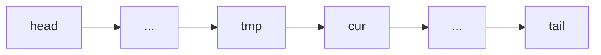
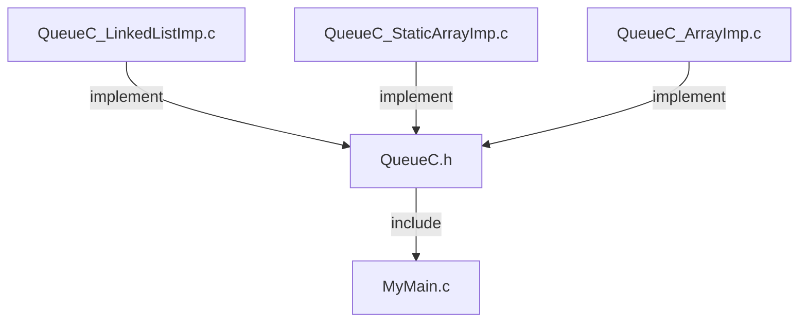
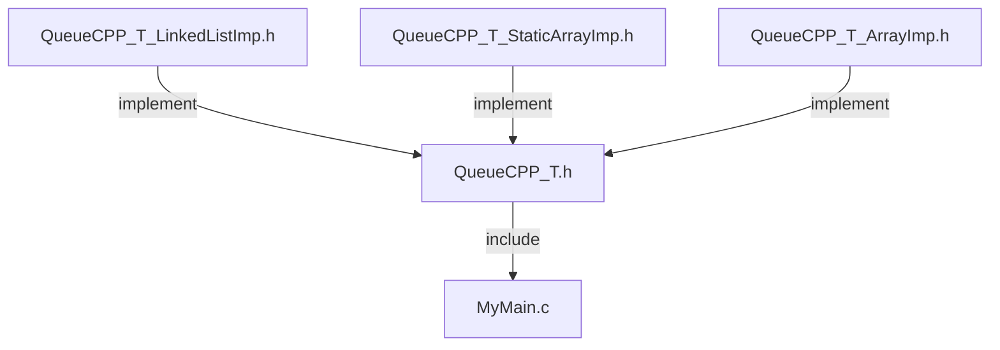
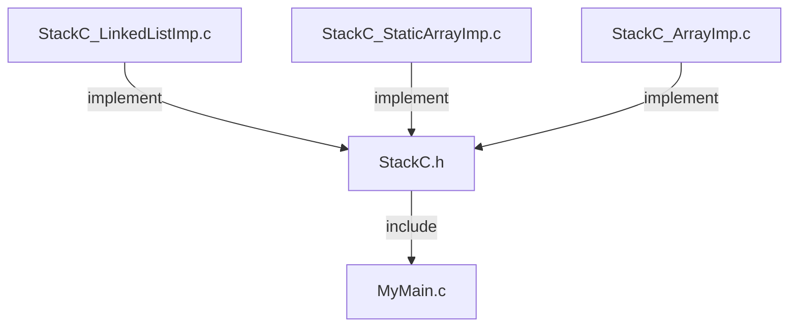

# Week 08: Linked List & Abstract Data Structure

> **Source**: CSLTr_week08.ppsx (125 slides)
> **Advisor**: Truong Toan Thinh
> **Note**: Extracted from PPSX XML. Images extracted to `week08_images/`. Diagrams are composed from individual icons -- described in text where possible.

---

## Slide 1 — Title

LINKED LIST & ABSTRACT DATA STRUCTURE
Fundamentals of programming -- Co so lap trinh
Advisor: Truong Toan Thinh

---

## Slide 2 — Contents

- Introduction
- Linked list & array of data
- Single linked list
- Some operations
- Stack & queue
- Abstract linked list
- Abstract queue
- Abstract stack
- Other data structure

---

## Slide 3 — Introduction

A structure containing data member and an address of the next node.

A node of a linked list includes 2 components:
- **Data**: contains information needed to store
- **Connection**: an address of the next node

```
[2] -> [7] -> [5] -> ... -> ...
```

---

## Slide 4 — Linked List & Array of Data

Example of 1D static array:

```c
int a[5] = {1, 5, 9}
```

| Index | 0 | 1 | 2 | 3 | 4 |
|-------|---|---|---|---|---|
| Value | 1 | 5 | 9 | 0 | 0 |

- **Drawbacks**: Need a prior size; Editing the array is complex
- **Advantage**: quickly random access

> *[Visual: shows inserting value 3 at index 1 requires shifting elements]*

---

## Slide 5 — Linked List & Array of Data (Dynamic Array)

Example of 1D dynamic array:

```c
char* a = (char*)malloc(sizeof(char) * n);
char* a = new char[n];
```

- **Advantage**: efficient memory
- **Drawback**: The fragmentation causes fake lacking of memory

```c
char* a = (char*)malloc(sizeof(char)*(m+n+t));
```

> *[Visual: shows fragmented memory blocks of sizes m, t, n]*

---

## Slide 6 — Linked List & Array of Data (Single Linked List)

Example of single linked list:
- Contain an address similar to dynamic array => efficient memory
- Easily editing this list
- Not affected by fragmentation due to the size of each node is small enough

```
[2] -> [7] -> [5] -> ... -> ...
```

> *[Visual: shows adding node 8 to the list]*

---

## Slide 7 — Linked List & Array of Data (Drawbacks)

Example of single linked list -- **Drawbacks**:
- Orderly access
- Easy-to-lost the first node's address
- Easy-to-leak memory

```
head <10>                                    tail <5>
  |                                            |
 [2]  ->  [7]  ->  [5]  ->  ...  -> ...      <74>
<50>     <52>     <58>     <72>
<54>     <50>     <60>     <74>    NULL
```

---

## Slide 8 — Single Linked List: Definition

Definition and Initialization:

```c
typedef struct node* ref;
struct node{
  int key;
  ref next;
};

ref head = NULL, tail = NULL;
```

```
head <10>: NULL
tail <5>:  NULL
```

---

## Slide 9 — Single Linked List: Building

Building single linked list:
1. Step 1: user inputs data needed to create node
2. Step 2: function `getNode()` creates node
3. Step 3: function `addFirst()` adds node at the start of the list
4. Step 4: go to step 1 or stop

---

## Slide 10 — Single Linked List: Building (Code)

```c
ref getNode(int k){
  ref p = (ref)malloc(sizeof(struct node));
  if(p == NULL) return NULL;
  p->key = k;
  p->next = NULL;
  return p;
}

void addFirst(ref& head, ref& tail, int k){
  ref p = getNode(k);
  if(head == NULL) head = tail = p;
  else { p->next = head; head = p; }
}
```

> *[Visual: step-by-step memory trace showing nodes 1, 2, 3 being added at the front]*

---

## Slide 11 — Single Linked List: Scanning

```c
void printList(ref head){
  ref p;
  if(head == NULL) return;
  else {
    for(p = head; p != NULL; p = p->next)
      printf("%d\n", p->key);
  }
}
```

> *[Visual: pointer p traverses from head through nodes 3, 2, 1]*

---

## Slide 12 — Single Linked List: Destroying

```c
void destroyList(ref& head){
  ref p;
  if(head == NULL) return;
  while(head){
    p = head;
    head = head->next;
    free(p);
  }
}
```

> *[Visual: step-by-step freeing nodes from head]*

---

## Slide 13 — Single Linked List: Adding at End

```c
ref getNode(int k){
  ref p = (ref)malloc(sizeof(struct node));
  if(p == NULL) return NULL;
  p->key = k;
  p->next = NULL;
  return p;
}

void addLast(ref& head, ref& tail, int k){
  ref p = getNode(k);
  if(head == NULL) head = tail = p;
  else { tail->next = p; tail = p; }
}
```

> *[Visual: nodes 3, 2, 1 added at the end of the list]*

---

## Slide 14 — Single Linked List: Insert After

```c
void insertAfter(ref q, int k){
  ref p = getNode(k);
  p->next = q->next;
  q->next = p;
}
```

> *[Visual: inserting node with value 4 after node q in list 3->2->1]*

---

## Slide 15 — Single Linked List: Insert Before

```c
void insertBefore(ref q, int k){ // k = 4
  ref p = (ref)malloc(sizeof(struct node));
  *p = *q;
  q->next = p;
  q->key = k;
}
```

> *[Visual: copying q's content into p, then updating q with new key]*

---

## Slide 16 — Single Linked List: Insert Before (Error Case)

Adding an item before another item (error when q points to the last item):

```c
void insertBefore(ref q, int k){ // k = 4
  ref p = (ref)malloc(sizeof(struct node));
  *p = *q;
  q->next = p;
  q->key = k;
}
```

> *[Visual: demonstrates the error when q is the last node -- tail pointer becomes invalid]*

---

## Slide 17 — Single Linked List: Delete First

```c
void deleteBegin(ref& head, ref& tail){
  if(head == tail) { free(head); head = tail = NULL; }
  else {
    ref q = head;
    head = head->next;
    free(q);
  }
}
```

> *[Visual: removing first node, updating head pointer]*

---

## Slide 18 — Single Linked List: Delete Last

```c
void deleteEnd(ref& head, ref& tail){
  if(head == tail) { free(head); head = tail = NULL; }
  else {
    for(ref q = head; q->next != tail; q = q->next);
    free(tail);
    tail = q;
    q->next = NULL;
  }
}
```

> *[Visual: traversing to penultimate node, freeing tail]*

---

## Slide 19 — Single Linked List: Delete Inner Node

```c
void deleteMid(ref& head, ref q){
  ref r;
  for(r = head; r->next != q; r = r->next);
  r->next = q->next;
  free(q);
}
```

> *[Visual: finding predecessor r, relinking, then freeing q]*

---

## Slide 20 — Single Linked List: Delete Inner Node (Error Case)

Deleting another inner item of the list (error when q points to the last item):

```c
void deleteMid(ref& head, ref q){
  ref r;
  for(r = head; r->next != q; r = r->next);
  r->next = q->next;
  free(q);
}
```

> *[Visual: when q is the last node, tail pointer becomes dangling]*

---

## Slide 21 — Single Linked List: Delete Inner Node (Improved)

```c
void delMid(ref q){
  ref r = q->next;
  *q = *r;
  free(r);
}
```

> *[Visual: copying next node's content into q, then freeing the next node]*

---

## Slide 22 — Single Linked List: Delete Inner (Error - Penultimate)

Deleting another inner item of the list (error when q points to the penultimate item):

```c
void delMid(ref q){
  ref r = q->next;
  *q = *r;
  free(r);
}
```

> *[Visual: when q is penultimate, after copy q becomes the old tail content, but tail pointer is now invalid]*

---

## Slide 23 — Some Operations: Count Nodes

```c
int length(ref head){
  ref p; int c = 0;
  for(p = head; p; p = p->next) c++;
  return c;
}
```

> *[Visual: pointer p traverses list, counter c increments: 0, 1, 2, 3]*

---

## Slide 24 — Some Operations: Insert at Position

- `pos = 0` => call `addFirst()`
- `pos = n` => call `addLast()`, with `n = length()`
- `0 < pos < n` => call `insertBefore()`

```c
void insertAt(ref& h, ref& t, int pos, int k){ // k = 7, pos = 2
  if(pos < 0 || pos > n) return; // n = length(h);
  if(pos == 0) addFirst(h, t, k);
  else if(pos == n) addLast(h, t, k);
  else { int i; ref q;
    for(i = 0, q = h; i < pos; i++, q = q->next);
    insertBefore(q, k);
    if(t->next) t = t->next;
  }
}
```

> *[Visual: inserting value 7 at position 2 in list 6->5->4]*

---

## Slide 25 — Some Operations: Delete at Position

- `pos = 0` => call `deleteBegin()`
- `pos = n - 1` => call `deleteEnd()`
- `0 < pos < n - 1` => call `delMid(ref)`

```c
void deleteAt(ref& h, ref& t, int pos){ // pos = 1
  if(pos < 0 || pos >= n) return; // n = length(h);
  if(pos == 0) deleteBegin(h, t);
  else if(pos == n - 1) deleteEnd(h, t);
  else { int i; ref q;
    for(i = 0, q = h; i < pos; i++, q = q->next);
    if(q->next == t) t = q;
    delMid(q);
  }
}
```

---

## Slide 26 — Some Operations: Building Ordered List

Building linked list with increasing order using the method of **dummy head**:

- Maintain 2 pointers p1 & p2 pointing to 2 adjacent nodes of the list
- At first, if the list is empty, there is no exist p2 => need a fake node head (dummy head)
- New node k always is between p1 & p2
- Demonstration with integers

---

## Slide 27 — Some Operations: Ordered List (Code)

```c
void makeOrderedList(ref h, int k){
  ref p1 = h, p2 = p1->next;
  while(p2 && p2->key < k){
    p1 = p2; p2 = p1->next;
  }
  ref p = getNode(k);
  p1->next = p; p->next = p2;
}

void main(){
  ref head = (ref)malloc(sizeof(struct node));
  if(head != NULL) head->next = NULL;
  makeOrderedList(head, 1);
  makeOrderedList(head, 5);
  makeOrderedList(head, 3);
  makeOrderedList(head, 4);
  printList(head->next);
  destroyList(head);
}
```

> *[Visual: step-by-step building ordered list: 1 -> 1,5 -> 1,3,5 -> 1,3,4,5]*

---

## Slide 28 — Stack & Queue

Stack and Queue are the collection of items.

Collection often has 3 basic operations:
- Add an item
- Delete an item
- Check if the collection is empty or not

- **Stack** has 3 operations: `push`, `pop`, and `isEmpty`
- **Queue** has 3 operations: `enQueue`, `deQueue`, and `isEmpty`

---

## Slide 29 — Stack

- Performed with **last-in-first-out -- LIFO**
- May use linked list or array to implement a stack

> Source: https://en.wikipedia.org/wiki/Stack_(abstract_data_type)

---

## Slide 30 — Stack (Code)

```c
int isEmpty(ref h){ return h == NULL; }

void push(ref& h, int k){
  ref q = getNode(k);
  q->next = h;
  h = q;
}

ref pop(ref& h){
  if(isEmpty(h)) return NULL;
  ref q = h;
  h = h->next;
  q->next = NULL;
  return q;
}

void main(){
  ref shead = NULL;
  push(shead, 1); push(shead, 2); push(shead, 3);
  ref p = pop(shead);
  free(p);
}
```

> *[Visual: stack grows as 1, then 2->1, then 3->2->1; pop removes 3]*

---

## Slide 31 — Queue

- Performed with **first-in-first-out -- FIFO**
- May use linked list or array to implement a queue

> Source: https://en.wikipedia.org/wiki/FIFO_(computing_and_electronics)

---

## Slide 32 — Queue (Code)

```c
void enQueue(ref& Q, ref& T, int k){
  ref q = getNode(k);
  if(isEmpty(Q)) Q = T = q;
  else T = T->next = q;
}

ref deQueue(ref& Q, ref& T){
  if(isEmpty(Q)) return NULL;
  ref q = Q;
  if(Q == T) Q = T = NULL;
  else Q = Q->next;
  q->next = NULL;
  return q;
}

void main(){
  ref qhead = NULL, qtail = NULL;
  enQueue(qhead, qtail, 1);
  enQueue(qhead, qtail, 2);
  enQueue(qhead, qtail, 3);
  ref p = deQueue(qhead, qtail);
  free(p);
}
```

> *[Visual: queue grows 1, then 1->2, then 1->2->3; deQueue removes 1]*

---

## Slide 33 — Abstract Linked List: Review

Review some knowledge:
- The static array's drawback is **fixed-length**
- The dynamic array's drawback is **lack of required memory**
- The array's advantage is **quickly random access**
- The linked list's advantage:
  - Need not a fixed length
  - Suitable for fragmented memory
- The linked list's disadvantage: **sequential access**

---

## Slide 34 — Abstract Linked List: Structure

Single linked list's structure:

```
head <100>                    tail <200>
  |                             |
 [data | pNext]  -->  [data | pNext]
 <100>  <100>+sizeof(data)    <200>  <200>+sizeof(data)
```

---

## Slide 35 — Abstract Linked List: Create First Node

```c
// C version                         // C++ version
struct Node{                         template <class T>
  void* data; Node* pNext;           struct Node{ T data; Node* pNext; };
};

void main(){                         void main(){
  Node* head = NULL;                   Node<int>* head = NULL;
  head = new Node;                     head = new Node<int>;
  head->data = new int;
  *(int*)(head->data) = 1;             head->data = 1;
  head->pNext = NULL;                  head->pNext = NULL;
}                                    }
```

---

## Slide 36 — Abstract Linked List: Create Next Node

Using temporary pointer `cur`:

```c
// C version                         // C++ version
void main(){                         void main(){
  Node* head = NULL;                   Node<int>* head = NULL;
  head = new Node;                     head = new Node<int>;
  head->data = new int;
  *(int*)(head->data) = 1;             head->data = 1;
  head->pNext = NULL;                  head->pNext = NULL;
  Node* cur = head;                    Node<int>* cur = head;
  cur->pNext = new Node;               cur->pNext = new Node<int>;
  cur = cur->pNext;                    cur = cur->pNext;
  cur->data = new int;
  *(int*)(cur->data) = 2;              cur->data = 2;
  cur->pNext = NULL;                   cur->pNext = NULL;
}                                    }
```

---

## Slide 37 — Abstract Linked List: Two Approaches

There are 2 ways to create a function of adding node at the start of the linked list:
- Using **template** of C++: simple, natural code
- Using **void\*** of C: complex code but quick speed

**Note**: free memory of data before deleting the node itself.

With `void*`, we need to build `struct List` to manage the information of `sizeof(<datatype>)`.

---

## Slide 38 — Abstract Linked List: insertFirst (void*) - Init

```cpp
struct Node { void* data; Node* pNext; };
struct List { Node* head; int datasize; };

void main(){
  double x = 0; List list;
  initList(list, sizeof(double));
  x = 1.5; insertFirst(list, &x);
  x = 2.6; insertFirst(list, &x);
  freeList(list);
}

void initList(List& lst, int size){
  lst.head = NULL; lst.datasize = size;
}
```

---

## Slide 39 — Abstract Linked List: insertFirst (void*) - Implementation

```cpp
void insertFirst(List& lst, void* dat){
  if(!dat) return;
  Node* tmp = lst.head, *newnode = new Node;
  if(newnode){
    lst.head = newnode; newnode->pNext = tmp;
    newnode->data = new char[lst.datasize];
    if(newnode->data) memmove(newnode->data, dat, lst.datasize);
  }
}
```

> *[Visual: x=1.5, newnode created with data copied via memmove]*

---

## Slide 40 — Abstract Linked List: insertFirst (void*) - Second Insert

> *[Visual: x=2.6, second node inserted at front, list is now 2.6 -> 1.5]*

---

## Slide 41 — Abstract Linked List: freeList (void*)

```cpp
void freeList(List& lst){
  Node* tmp = NULL;
  while(lst.head){
    tmp = lst.head->pNext;
    if(lst.head->data) delete[] (char*)(lst.head->data);
    delete lst.head;
    lst.head = tmp;
  }
}
```

> *[Visual: freeing data then node for each element in the list]*

---

## Slide 42 — Abstract Linked List: insertFirst (template)

```cpp
template <class T>
struct Node { T data; Node* pNext; };

void main(){
  double x = 0;
  Node<double>* head = NULL;
  x = 1.5; insertFirst(head, x);
  x = 2.6; insertFirst(head, x);
  freeList(head);
}

template <class T>
void insertFirst(Node<T>*& h, const T& dat){
  Node<T>* tmp = h, *newnod = new Node<T>;
  if(newnod){
    h = newnod;
    newnod->pNext = tmp;
    newnod->data = dat;
  }
}
```

---

## Slide 43 — Abstract Linked List: insertFirst (template) - Second Insert

> *[Visual: x=2.6 inserted at front, list is 2.6 -> 1.5]*

---

## Slide 44 — Abstract Linked List: freeList (template)

```cpp
template <class T>
void freeList(Node<T>*& h){
  Node<T>* tmp = NULL;
  while(h){
    tmp = h->pNext;
    delete h;
    h = tmp;
  }
}
```

---

## Slide 45 — Abstract Linked List: insertLast Overview

There are 2 ways to create a function of adding node at the end of the linked list:
- Using **template** of C++: simple, natural code
- Using **void\*** of C: complex code but quick speed

**Note**: free the memory of data before deleting the node itself.

With `void*`, we need to build `struct List` to manage the information of `sizeof(<datatype>)`.

---

## Slide 46 — Abstract Linked List: insertLast (void*)

```cpp
void main(){
  double x = 0; List list;
  initList(list, sizeof(double));
  x = 1.5; insertLast(list, &x);
  x = 2.6; insertLast(list, &x);
  freeList(list);
}

void insertLast(List& lst, void* dat){
  Node* nod = new Node;
  if(!nod) return;
  nod->pNext = NULL;
  nod->data = new char[lst.datasize];
  if(!nod->data){ delete nod; return; }
  memmove(nod->data, dat, lst.datasize);
  Node* pTail = getTail(lst);
  if(pTail == NULL) lst.head = nod;
  else pTail->pNext = nod;
}

Node* getTail(List& lst){
  Node *p = lst.head, *pTail = NULL;
  while(p != NULL){ pTail = p; p = p->pNext; }
  return pTail;
}
```

---

## Slide 47 — Abstract Linked List: insertLast (template)

```cpp
// void* version                      // template version
Node* getTail(List& lst){             template <class T>
  Node *p = lst.head,                 Node<T>* getTail(Node<T>* h){
       *pTail = NULL;                   Node<T> *p = h, *pTail = NULL;
  while(p != NULL){                     while(p != NULL){
    pTail = p; p = p->pNext; }           pTail = p; p = p->pNext; }
  return pTail; }                       return pTail; }

void insertLast(List& lst,            template <class T>
  void* dat){                         void insertLast(Node<T>*& h,
  Node* nod = new Node;                const T& dat) {
  if(!nod) return;                      Node<T>* nod = new Node<T>;
  nod->pNext = NULL;                    if(!nod) return;
  nod->data = new char[lst.datasize];   nod->pNext = NULL;
  if(!nod->data){delete nod;return;}
  memmove(nod->data,dat,lst.datasize);  nod->data = dat;
  Node* pTail = getTail(lst);           Node<T>* pTail = getTail(h);
  pTail == NULL? lst.head = nod         pTail == NULL? h = nod
    : pTail->pNext = nod; }              : pTail->pNext = nod; }
```

---

## Slide 48 — Abstract Linked List: Finding Overview

Finding the element satisfying the customized condition in linked list:
- Build the highly re-used code
- Handle the finding in ordered/unordered linked list
- Handle the problem of "equivalence" of two elements when comparing to finding value
- May use `void*` of C or `template` of C++

---

## Slide 49 — Abstract Linked List: findList (void*)

```cpp
void main(){
  double x; List list; Node* t;
  initList(list, sizeof(double));
  x = 1.5; insertLast(list, &x);
  x = 2.6; insertLast(list, &x);
  x = 1.49; t = findList(list, &x);
  x = 2.6;  t = findList(list, &x);
  freeList(lst);
}

bool Cmp(void* tx, void* ty, int size){
  return memcmp(tx, ty, size) == 0;
}

Node* findList(List& lst, void* dat){
  Node* p = lst.head;
  while(p){
    if(Cmp(p->data, dat, lst.datasize)) break;
    p = p->pNext;
  }
  return p;
}
```

---

## Slide 50 — Abstract Linked List: Finding Problem

Problem arose when linked list of fractions:
- Example: `4/5 = 8/10` mathematically, but `4/5 != 8/10` by bit-compare
- Function `memcmp` only compares two strings of bits

**Solution**:
- Reducing fraction (not general)
- Add a parameter of "function pointer" into function `findList()`

---

## Slide 51 — Abstract Linked List: findList with Function Pointer (void*)

```cpp
void main(){
  Fraction ps[] = {{1, 2}, {4, 5}};
  List list; Node* t;
  initList(list, sizeof(Fraction));
  for(int i = 0; i < 2; i++) insertLast(list, &ps[i]);
  Fraction r2 = {8, 10};
  t = findList(list, &r2, FracEqual);
  freeList(lst);
}

bool FracEqual(void* tx, void* ty){
  Fraction *r = (Fraction*)tx, *s = (Fraction*)ty;
  int num1 = r->tu * s->mau, num2 = r->mau * s->tu;
  return num1 == num2;
}

Node* findList(List& lst, void* dat, bool (*cmp)(void*, void*)){
  Node* p = lst.head;
  while(p){
    if(cmp(p->data, dat)) break;
    p = p->pNext;
  }
  return p;
}
```

---

## Slide 52 — Abstract Linked List: findList (template)

```cpp
void main(){
  Fraction ps[] = {{1, 2}, {-4, 5}}, r2 = {8, 10};
  Node<Fraction>* head = NULL;
  for(int i = 0; i < 2; i++) insertLast(head, ps[i]);
  Node<Fraction>* p = findList(head, r2, fracAbsEqual);
  p = findList(head, r2, fracEqual);
  freeList(head);
}

template <class T>
Node<T>* findList(Node<T>* head, const T& dat, bool (*cmp)(T*, T*)){
  Node<T>* p = head;
  while(p){
    if(cmp(&p->data, (T*)(&dat))) break;
    p = p->pNext;
  }
  return p;
}

bool FracAbsEqual(Fraction* r, Fraction* s){
  return abs(r->tu * s->mau) == abs(r->mau * s->tu);
}

bool FracEqual(Fraction* r, Fraction* s){
  return r->tu * s->mau == r->mau * s->tu;
}
```

---

## Slide 53 — Abstract Linked List: Default Comparison

- Build a default function `findList()`, always compares with "normal" sense
- When there is a need of context, we transmit that comparison function to `findList()`
- Example: `fracEqual` is a normal sense, and `fracAbsEqual` is a concrete sense

**Solution**:
- Using default parameter at the position of function pointer
- With new datatype, redefine operator `==`

---

## Slide 54 — Abstract Linked List: findList with Default Parameter

```cpp
void main(){
  Fraction ps[] = {{1, 2}, {-4, 5}}, r2 = {8, 10};
  Node<Fraction>* head = NULL;
  for(int i = 0; i < 2; i++) insertLast(head, ps[i]);
  Node<Fraction>* p = findList(head, r2, fracAbsEqual);
  p = findList(head, r2); // Call isEqual default
  freeList(head);
}

bool operator==(const Fraction& r, const Fraction& s){
  return r.tu * s.mau == r.mau * s.tu;
}

template <class T>
bool isEqual(T* r, T* s){ return *r == *s; }

template <class T>
Node<T>* findList(Node<T>* head, const T& dat, bool (*cmp)(T*, T*) = isEqual){
  Node<T>* p = head;
  while(p){
    if(cmp(&p->data, (T*)(&dat))) break;
    p = p->pNext;
  }
  return p;
}

bool fracAbsEqual(Fraction* r, Fraction* s){
  return abs(r->tu * s->mau) == abs(r->mau * s->tu);
}
```

---

## Slide 55 — Abstract Linked List: Insert After Overview

Problem: insert a node **after** another "given" node into linked list:
- "given" means giving data
- Need determining which node with data "equivalent to" data "given"
- Reuse the solution of problem of "equivalence" when comparing with the finding value
- May use `void*` of C or `template` of C++

---

## Slide 56 — Abstract Linked List: insertAfter (template)

```cpp
void main(){
  int a[] = {1, 2, 4}, b = 3;
  Node<int>* head = NULL;
  for(int i = 0; i < 3; i++) insertLast(head, a[i]);
  insertAfter(head, a[1], b);
  freeList(head);
}

template <class T>
Node<T>* insertAfter(Node<T>*& h, const T& X, const T& Val,
                     bool (*cmp)(T*, T*) = isEqual){
  Node<T>* cur = findList(h, X, cmp);
  if(cur == NULL) return NULL;
  Node<T>* newnod = new Node<T>;
  if(newnod){
    newnod->data = Val;
    newnod->pNext = cur->pNext;
    cur->pNext = newnod;
  }
  return newnod;
}
```

> *[Visual: list 1->2->4 becomes 1->2->3->4 after inserting 3 after 2]*

---

## Slide 57 — Abstract Linked List: insertAfter (void*)

```cpp
void main(){
  int a[] = {1, 2, 4}, b = 3; List list;
  initList(list, sizeof(int));
  for(int i = 0; i < 3; i++) insertLast(list, &a[i]);
  insertAfter(list, &a[1], &b, intComp);
  freeList(head);
}

bool intComp(void* a, void* b){ return *(int*)a == *(int*)b; }

Node* makeNode(List& l, void* d){
  Node* nod = new Node;
  if(!nod) return NULL;
  nod->pNext = NULL;
  nod->data = new char[l.datasize];
  if(!nod->data){ delete nod; return NULL; }
  memmove(nod->data, d, l.datasize);
  return nod;
}

Node* insertAfter(List& lst, void* X, void* Val, bool (*cmp)(void*, void*)){
  Node* cur = findList(lst, X, cmp);
  if(cur == NULL) return NULL;
  Node* newnod = makeNode(lst, Val);
  if(newnod){
    newnod->pNext = cur->pNext;
    cur->pNext = newnod;
  }
  return newnod;
}
```

---

## Slide 58 — Abstract Linked List: Insert Before Overview

Problem: insert a node **before** another "given" node into linked list:
- "given" means giving data
- Need determining which node with data "equivalent to" data "given"
- Reuse the solution of problem of "equivalence" when comparing with the finding value
- Should not use "data swap" in insert operation
- May use `void*` of C or `template` of C++

---

## Slide 59 — Abstract Linked List: insertBefore (template) - At Head

```cpp
void main(){
  int a[] = {1, 2, 4}, b = 3; Node<int>* head = NULL;
  for(int i = 0; i < 3; i++) insertLast(head, a[i]);
  insertBefore(head, a[0], b);
  freeList(head);
}

template <class T>
Node<T>* insertBefore(Node<T>*& h, const T& X, const T& Val,
                      bool (*cmp)(T*, T*) = isEqual){
  if(h == NULL) return NULL;
  Node<T>* newnod = NULL;
  if(cmp(&(h->data), (T*)&X)){
    Node<T>* oh = h; newnod = new Node<T>;
    if(newnod) { h = newnod; h->data = Val; h->pNext = oh; }
    return h;
  }
  Node<T>* cur = h, *pNext = cur->pNext;
  while(pNext){
    if(cmp(&(pNext->data), (T*)&X)) break;
    cur = cur->pNext; pNext = cur->pNext;
  }
  if(pNext){
    newnod = new Node<T>;
    if(newnod){
      newnod->data = Val;
      newnod->pNext = cur->pNext; cur->pNext = newnod;
    }
  }
  return newnod;
}
```

> *[Visual: Insert at the beginning of list]*

---

## Slide 60 — Abstract Linked List: insertBefore (template) - Mid

Same code as Slide 59 but with `insertBefore(head, a[2], b)` -- inserting before the last element.

> *[Visual: list 1->2->4 becomes 1->2->3->4, newnod inserted between cur(node 2) and pNext(node 4)]*

---

## Slide 61 — Abstract Linked List: Delete Overview

Problem: deleting a "given" node in linked list:
- "given" means that giving data
- Need determining which node with data "equivalent to" "given" data
- Reuse the solution of problem of "equivalence" when comparing with the finding value
- Need to find a node preceding a node needed to delete
- May use `void*` of C or `template` of C++



---

## Slide 62 — Abstract Linked List: Delete First Node (template)

```cpp
void main(){
  int a[] = {1, 2, 3, 4}, b = 1; Node<int>* head = NULL;
  for(int i = 0; i < 4; i++) insertLast(head, a[i]);
  deleteNode(head, b);
  freeList(head);
}

template <class T>
Node<T>* findBeforeX(Node<T>*& h, const T& X, bool& found,
                     bool (*cmp)(T*, T*) = isEqual){
  if(!h) return NULL;
  if(cmp(&(h->data), (T*)&X)){ found = true; return NULL; }
  Node<T>* cur = h, *pNext = cur->pNext;
  while(pNext){
    if(cmp(&(pNext->data), (T*)&X)) break;
    cur = cur->pNext; pNext = cur->pNext;
  }
  if(pNext) { found = true; return cur; }
  return NULL;
}

template <class T>
Node<T>* deleteNode(Node<T>*& h, const T& X,
                    bool (*cmp)(T*, T*) = isEqual){
  bool found = false;
  Node<T>* cur = findBeforeX(h, X, found, cmp), *tmp;
  if(found == false) return found;
  if(cur == NULL) { tmp = h; h = h->pNext; }
  else { tmp = cur->pNext; cur->pNext = tmp->pNext; }
  delete tmp;
  return found;
}
```

> *[Visual: deleting node with value 1 (first node), head moves to node 2]*

---

## Slide 63 — Abstract Linked List: Delete Inner Node (template)

Same `findBeforeX` and `deleteNode` code, but with `b = 3`:

> *[Visual: deleting node with value 3, cur points to node 2, tmp points to node 3, relinking 2->4]*

---

## Slide 64 — Abstract Linked List: Input/Output

Problem: input/output in abstract linked list:
- Input from input-device (keyboard, file, scanner...)
- Output data to output-device (screen, file, printer...)
- In C++, using stream for input/output
- Need the corresponding objects standing for input/output device, for example `cin` <-> keyboard or `cout` <-> screen

---

## Slide 65 — Abstract Linked List: I/O Reversed Order (template)

```cpp
void main(){
  ofstream outFile("InData.txt");
  Node<int>* head = NULL;
  readListFrom(cin, head);
  writeListTo(cout, head);    // print to screen
  writeListTo(outFile, head); // print to file
  freeList(head);
}

template <class T>
void writeListTo(ostream& oDev, Node<T>* h){
  Node<T>* p = h;
  while(p){
    oDev << p->data << " ";
    p = p->pNext;
  }
}

template <class T>
void readListFrom(istream& iDev, Node<T>*& h){
  T d;
  while(iDev){ // still remain data
    if(iDev >> d) insertFirst(h, d);
  }
}
```

> *[Visual: input 1, 2, 3 => list stored as 3->2->1 (reversed), output: 3 2 1]*

---

## Slide 66 — Abstract Linked List: I/O Normal Order (template)

```cpp
void main(){
  Node<int>* head = NULL;
  ReadListFrom(cin, head);
  writeListTo(cout, head); // print to screen
  freeList(head);
}

template <class T>
void ReadListFrom(istream& iDev, Node<T>*& h){
  T d;
  iDev >> d;
  h = new Node<T>; h->data = d;
  h->pNext = NULL;
  Node<T>* p = h;
  while(iDev){ // still remain data
    if(!(iDev >> d)) break;
    Node<T>* newnod = new Node<T>;
    if(newnod){
      newnod->data = d;
      newnod->pNext = NULL;
      p->pNext = newnod; p = newnod;
    }
  }
}
```

> *[Visual: input 1, 2, 3 => list stored as 1->2->3 (normal order)]*

---

## Slide 67 — Abstract Linked List: Ordered List Overview

Problem: input/output for ordered linked list:
- Need to find the right position to insert a new node
- Insert a new node into just found position
- Need to write code such that:
  - Generalize for all datatype
  - Generalize for all order-standard
- May use `void*` of C or `template` of C++ to generalize for datatype
- Use function-pointer to generalize order-standard

---

## Slide 68 — Abstract Linked List: insertOrderedList (template)

```cpp
void main(){
  int a[] = {4, 5, 1, 2}, b = 3; Node<int>* head = NULL;
  for(int i = 0; i < 4; i++) insertOrderedList(head, a[i], IntGreater);
  insertOrderedList(head, b, IntGreater);
  freeList(head);
}

bool IntGreater(int* x, int* y){ return *x < *y; }

template <class T>
Node<T>* makeNode(const T& dat){
  Node<T>* newnod = new Node<T>;
  if(newnod){ newnod->data = dat; newnod->pNext = NULL; }
  return newnod;
}

template <class T>
Node<T>* insertOrderedList(Node<T>*& h, const T& X, bool (*cmp)(T*, T*)){
  Node<T>* newnod = makeNode(X);
  if(!newnod) return NULL;
  if(!h || cmp((T*)&X, &(h->data))){ newnod->pNext = h; h = newnod; }
  else {
    Node<T>* cur = h;
    while(cur->pNext && !cmp((T*)&X, &(cur->pNext->data))) cur = cur->pNext;
    newnod->pNext = cur->pNext;
    cur->pNext = newnod;
  }
  return newnod;
}
```

> *[Visual: step-by-step building sorted list: 4 -> 4,5 -> 1,4,5 -> 1,2,4,5 -> 1,2,3,4,5]*

---

## Slide 69 — Abstract Linked List: Notes

Some notes of single linked list:
- Check if allocation is successful or not
- Stop before the target node to perform the operations
- Avoid moving the head pointer if not necessary
- Problem of organizing memory in each node: because data-field is `void*`, when freeing a linked list, a node needs to:
  1. Free the memory of data pointing to
  2. Free the memory of the node
  3. Free the linked list

---

## Slide 70 — Abstract Linked List: Memory Leak Example 1

```cpp
void main(){
  List list; initList(list, sizeof(int*));
  int* t = new int; *t = 5;
  insertFirst(list, &t);
  // *(int*)(list.head)->data equal to t
  cout << hex << *(int*)(*(int*)(list.head)->data) << endl; // print 5
  freeList(list);
  cout << *t << endl;
  delete t;
}
```

> *[Visual: freeList deletes the copy of pointer t inside the list, but the int pointed to by t is NOT freed -- memory leak]*

---

## Slide 71 — Abstract Linked List: Memory Leak Example 2

```cpp
void main(){
  List list; initList(list, sizeof(int*));
  int* t = new int; *t = 5;
  insertFirst(list, t); // passing t directly, not &t
  //...
}
```

> **Wrong** because linked list contains elements of `int*` (not `int`) -- the data stored is the value 5, not the pointer address.

---

## Slide 72 — Abstract Linked List: Avoiding Memory Leaks

Idea of avoiding leaking memory:
- **Delegate** a creation of `node->data` to an external function
- **Delegate** a deletion of `node->data` to an external function
- **Solution**: using function pointer

**Advantage**:
- Cut back on a number of functions linked list has
- Flexibly create/delete the memory of `node->data`

**Drawback**: need a countermeasure when external function performs unreasonably

---

## Slide 73 — Abstract Linked List: Re-declared Structure

```cpp
struct Node { void* data; Node* pNext; };
struct List {
  Node* head;
  void* (*make)(void*);
  void (*free)(void*);
};
```

> *[Visual: List struct contains head pointer plus make and free function pointers]*

---

## Slide 74 — Abstract Linked List: Default make & free

```cpp
void* defaultMake(void* dat) { return dat; }
// create data for node->data (just returns the pointer)

void defaultFree(void* dat) {}
// delete data of node->data (does nothing)

void initList(List& lst, void* (*mk)(void*), void (*fr)(void*)){
  lst.head = NULL;
  mk != NULL ? lst.make = mk : lst.make = defaultMake;
  fr != NULL ? lst.free = fr : lst.free = defaultFree;
}
```

---

## Slide 75 — Abstract Linked List: Static Array Connection

```cpp
void main(){
  List list; double a[] = {1.5, 2.6};
  initList(list, NULL, NULL);
  for(int i = 0; i < 2; i++) insertFirst(list, &a[i]);
  freeList(list);
}

void insertFirst(List& lst, void* data){
  Node* nod = makeNode(lst, data);
  if(!nod || !data) return;
  Node* tmp = lst.head; lst.head = nod; nod->pNext = tmp;
}

Node* makeNode(List& lst, void* dat){
  Node* n = new Node;
  if(n){ n->pNext = NULL; n->data = lst.make(dat); }
  return n;
}

void freeList(List& lst){
  while(lst.head){
    Node* tmp = lst.head->pNext;
    if(lst.head->data) lst.free(lst.head->data);
    delete lst.head;
    lst.head = tmp;
  }
}
```

> *[Visual: nodes point directly into static array a[] -- defaultMake returns pointer as-is, defaultFree does nothing]*

---

## Slide 76 — Abstract Linked List: Heap Connection (defaultMake)

```cpp
void main(){
  List list;
  double* p = new double, *q = new double;
  *p = 1.5; *q = 2.6;
  initList(list, NULL, freedouble);
  insertFirst(list, p);
  insertFirst(list, q);
  freeList(list);
}

void freedouble(void* x){ if(x) delete (double*)x; }
```

> *[Visual: nodes point to heap-allocated doubles. freedouble properly deletes them during freeList]*

---

## Slide 77 — Abstract Linked List: Heap Connection (makedouble)

```cpp
void main(){
  List list;
  double* p = new double, *q = new double;
  *p = 1.5; *q = 2.6;
  initList(list, makedouble, freedouble);
  insertFirst(list, p);
  insertFirst(list, q);
  freeList(list);
}

void freedouble(void* x){ if(x) delete (double*)x; }

void* makedouble(void* x){
  double* t = new double; *t = *((double*)x);
  return t;
}
```

> *[Visual: makedouble creates independent copies on heap. Each node owns its own copy of the data]*

---

## Slide 78 — Abstract Linked List: Polynomial Structure

```cpp
struct Polynomial { int n; double* a; };
```

Need overloading operator `<<` to print a variable with Polynomial type:

```cpp
ostream& operator<<(ostream& oDev, const Polynomial& P){
  for(int i = P.n; i > 0; i--){
    if(P.a[i] == 0) continue;
    if(i > 1) oDev << P.a[i] << "x^" << i << " + ";
    else oDev << P.a[i] << "x" << " + ";
  }
  oDev << P.a[0];
  return oDev;
}
```

---

## Slide 79 — Abstract Linked List: Polynomial List (Static Array)

```cpp
void main(){
  List list;
  double a[] = {1, 2, 3, 1.3, 7.2, 0, 3.6, 19.5, 23.1};
  Polynomial Poly[] = {{2, a}, {3, a + 3}, {1, a + 7}, {5, a + 1}};
  initList(list, NULL, NULL);
  for(int i = 0; i < 4; i++) insertFirst(list, &Poly[i]);
  freeList(list);
}
```

> *[Visual: 4 nodes, each pointing to a Polynomial struct in the Poly array, which in turn references segments of array a]*

---

## Slide 80 — Abstract Linked List: Polynomial List (Heap)

```cpp
void main(){
  List list;
  double a[] = {1, 2, 3, 1.3, 7.2, 0, 3.6, 19.5, 23.1};
  Polynomial Poly = {2, a};
  initList(list, makePoly, freePoly);
  insertFirst(list, &Poly);
  freeList(list);
}

void freePoly(void* P){ if(P) delete[] (char*)P; }

void* makePoly(void* d){
  if(!d) return NULL;
  Polynomial* src = (Polynomial*)d, *P = NULL;
  char* buf = new char[sizeof(Polynomial) + (src->n + 1) * sizeof(src->a[0])];
  if(!buf) return NULL;
  P = (Polynomial*)buf; P->n = src->n;
  P->a = (double*)(buf + sizeof(Polynomial));
  for(int i = 0; i <= P->n; i++) P->a[i] = src->a[i];
  return P;
}
```

> *[Visual: makePoly allocates a single buffer containing both the Polynomial struct and its coefficient array]*

---

## Slide 81 — Abstract Queue

Abstract Queue:
- Follow **first-in-first-out -- FIFO** paradigm
- Implement queue with array or linked list

> Source: https://en.wikipedia.org/wiki/FIFO_(computing_and_electronics)

---

## Slide 82 — Abstract Queue: Programming Interface (void*)

- `void* initQueue()`: initialize queue and return a pointer at the place of caller
- `void closeQueue(void* q)`: destroy queue at the address q pointing to
- `void enQueue(void* q, void* item)`: **add** item into queue q (only add to q what item contains)
- `void* deQueue(void* q)`: **take** the first item out of the queue q and return to the place of caller
- `void* firstQueue(void* q)`: **read** the first item of queue q and return the place of caller
- `int isEmpty(void* q)`: check if queue q is empty

---

## Slide 83 — Abstract Queue: Interface & Usage (void*)

```c
// QueueC.h
#ifndef _MY_QUEUE_H_
#define _MY_QUEUE_H_
void* initQueue();
void closeQueue(void* q);
void enQueue(void* q, void* item);
void* deQueue(void* q);
void* firstQueue(void* q);
int isEmpty(void* q);
#endif
```

```c
#include "QueueC.h"

void takeAllQueue(void* q){
  while(!isEmpty(Q)){
    int x = *(int*)deQueue(Q); cout << x << " ";
  }
}

void main(){
  int a[] = {1, 2, 3, 4, 5, 6, 7, 8}, i, x, y;
  void* q = initQueue(); i = -1;
  while(++i < 8) enQueue(q, &a[i]);
  x = *(int*)deQueue(q);
  takeAllQueue(q); i = 8;
  while(--i) enQueue(q, &a[i]);
  x = *(int*)deQueue(q);
  y = *(int*)deQueue(q);
  takeAllQueue(q); closeQueue(q);
}
```

---

## Slide 84 — Abstract Queue: Conventions (void*)

- `void* firstQueue(void* q)`: Take out the address the first item pointing to and don't do anything
- `void enQueue(void* q, void* item)`: Only add address which item pointing to and don't do anything

> *[Visual: memory layout showing head/tail pointers and tmp pointer operations]*

---

## Slide 85 — Abstract Queue: Programming Interface (template)

```cpp
struct Queue { void* data; };
```

- `void initQueue(Queue<T>& q)`: initialize queue using reference
- `void closeQueue(Queue<T>& q)`: destroy queue q
- `void enQueue(Queue<T>& q, const T& item)`: **add** item into queue q
- `T deQueue(Queue<T>& q)`: **take** the first item out of queue q
- `T firstQueue(Queue<T>& q)`: **read** the first item of queue q
- `bool isEmpty(Queue<T>& q)`: check if queue q is empty

---

## Slide 86 — Abstract Queue: Template Interface & Usage

```cpp
// QueueCPP_T.h
#ifndef _MY_QUEUE_CPPT_H_
#define _MY_QUEUE_CPPT_H_
template <class T> struct Queue { void* data; };
template <class T> void initQueue(Queue<T>&);
template <class T> void closeQueue(Queue<T>&);
template <class T> void enQueue(Queue<T>&, const T&);
template <class T> T deQueue(Queue<T>&);
template <class T> T firstQueue(Queue<T>&);
template <class T> bool isEmpty(Queue<T>&);
#endif
```

```cpp
#include "QueueCPP_T.h"
#include "QueueCPP_T_Imp.h" // talk later

template <class T>
void takeAllQueue(ostream& o, Queue<T>& q){
  while(!isEmpty(Q)) o << deQueue(Q) << " ";
}

void main(){
  int a[] = {1, 2, 3, 4, 5, 6, 7, 8}, i, x, y;
  Queue<int> q; initQueue(q); i = -1;
  while(++i < 8) enQueue(q, a[i]);
  x = deQueue(q);
  takeAllQueue(cout, q); i = 8;
  while(--i) enQueue(q, a[i]);
  x = deQueue(q); y = deQueue(q);
  takeAllQueue(cout, q); closeQueue(q);
}
```

---

## Slide 87 — Abstract Queue: Template Conventions

Some conventions of programming interface of abstract queue (using template):
- Two operations `firstQueue` & `enQueue` are similar to those of `void*`
- There are 2 cases of parameter T:
  - **T is pointer type**: similar to `void*`, only receive address passed and don't do anything
  - **T is normal type**: there are 2 small cases:
    - T is a base type (`int`, `float`) or `struct` without inner pointer (`struct FRACTION`, `COMPLEX`): need not redefine operator `=`
    - T is a `struct` with inner pointer (`struct POLYNOMIAL`): need redefine operator `=`

---

## Slide 88 — Abstract Queue: Implementation Options (void*)

There are 3 solutions of implementation of abstract queue with `void*`:
- Linked list: in `QueueC_LinkedListImp.c`
- Static array: in `QueueC_StaticArrayImp.c`
- Dynamic array: in `QueueC_ArrayImp.c`

Note: all files need to include `QueueC.h`



---

## Slide 89 — Abstract Queue: Linked List Structure (void*)

```c
struct tagNode{
  void* data; struct tagNode* pNext;
};
typedef struct tagNode Node;
typedef struct { Node *head, *tail; } ListImp;
```

---

## Slide 90 — Abstract Queue: Linked List - initQueue (void*)

```c
void main(){
  int a[] = {1, 2, 3}, i = -1;
  void* Q = initQueue();
  while(++i < 3) enQueue(Q, &a[i]);
  int x = *(int*)deQueue(Q), y = *(int*)deQueue(Q);
  cout << "x = " << x << ", y = " << y;
  closeQueue(Q);
}

void* initQueue(){
  ListImp* Lst = (ListImp*)calloc(1, sizeof(ListImp));
  if(!Lst) return NULL;
  Lst->head = Lst->tail = NULL;
  return Lst;
}
```

---

## Slide 91 — Abstract Queue: Linked List - enQueue (void*)

```c
Node* makeNode(void* dat){
  Node* nod = (Node*)malloc(sizeof(Node));
  if(nod == NULL) return NULL;
  nod->pNext = NULL;
  nod->data = dat;
  return nod;
}

void enQueue(void* q, void* dt){
  ListImp* Lst = (ListImp*)q;
  if(Lst == NULL) return;
  Node* n = makeNode(dt);
  if(n == NULL) return;
  if(Lst->head == NULL) Lst->head = Lst->tail = n;
  else {
    Lst->tail->pNext = n;
    Lst->tail = Lst->tail->pNext;
  }
}
```

> *[Visual: step-by-step enqueuing 1, 2, 3 into linked list]*

---

## Slide 92 — Abstract Queue: Linked List - deQueue (void*)

```c
void* deQueue(void* q){
  ListImp* Lst = (ListImp*)q;
  if(Lst == NULL || Lst->head == NULL) return NULL;
  Node* nod = Lst->head;
  void* dat = nod->data;
  Lst->head = Lst->head->pNext;
  if(Lst->head == NULL) Lst->tail = NULL;
  free(nod);
  return dat;
}
```

> *[Visual: dequeuing returns pointer to a[0]=1, head advances]*

---

## Slide 93 — Abstract Queue: Linked List - closeQueue, firstQueue, isEmpty (void*)

```c
void closeQueue(void* q){
  ListImp* Lst = (ListImp*)q;
  Node* tmp = NULL;
  if(Lst == NULL) return;
  while(Lst->head){
    tmp = Lst->head->pNext; free(Lst->head); Lst->head = tmp;
  }
}

void* firstQueue(void* q){
  ListImp* Lst = (ListImp*)q;
  if(Lst == NULL) return NULL;
  if(Lst->head) return Lst->head->data;
  return NULL;
}

int isEmpty(void* q){ return (firstQueue(q) == NULL); }
```

---

## Slide 94 — Abstract Queue: Static Array Structure (void*)

```c
#define MAXSZ 5 // maximum size of queue
typedef struct {
  void* array[MAXSZ];
  int nItem, firstIdx;
} ArrayImp;
```

- `nItem`: a number of items
- `firstIdx`: index of the first item

---

## Slide 95 — Abstract Queue: Static Array - initQueue (void*)

```c
void main(){
  int a[] = {1, 2, 3}, i = -1;
  void* Q = initQueue();
  while(++i < 3) enQueue(Q, &a[i]);
  int x = *(int*)deQueue(Q);
  int y = *(int*)deQueue(Q);
  int z = *(int*)deQueue(Q);
  cout << "x = " << x << ", y = " << y << ", z = " << z;
}

void* initQueue(){
  ArrayImp* q = (ArrayImp*)malloc(sizeof(ArrayImp));
  if(q){ q->nItem = 0; q->firstIdx = -1; }
  return q;
}
```

---

## Slide 96 — Abstract Queue: Static Array - enQueue (void*)

```c
void enQueue(void* q, void* dat){
  ArrayImp* qImp = (ArrayImp*)q;
  if(!qImp || qImp->nItem >= MAXSZ) return;
  qImp->array[qImp->nItem] = dat;
  (qImp->nItem)++;
  if(qImp->firstIdx == -1) qImp->firstIdx = 0;
}
```

> *[Visual: elements added at indices 0, 1, 2; nItem increments; firstIdx set to 0]*

---

## Slide 97 — Abstract Queue: Static Array - deQueue, firstQueue (void*)

```c
void* firstQueue(void* q){
  ArrayImp* qImp = (ArrayImp*)q;
  if(qImp == NULL || qImp->firstIdx == -1) return NULL;
  return qImp->array[qImp->firstIdx];
}

void* deQueue(void* q){
  ArrayImp* qImp = (ArrayImp*)q;
  if(!qImp || qImp->firstIdx == -1) return NULL;
  void* item = firstQueue(q);
  int nItem = qImp->nItem;
  if(qImp->firstIdx < nItem - 1) (qImp->firstIdx)++;
  else { qImp->firstIdx = -1; qImp->nItem = 0; }
  return item;
}
```

> *[Visual: x = deQueue => returns a[0]=1, firstIdx becomes 1]*

---

## Slide 98 — Abstract Queue: Static Array - deQueue (continued)

> *[Visual: y = deQueue => returns a[1]=2, firstIdx becomes 2]*

---

## Slide 99 — Abstract Queue: Static Array - deQueue (final)

> *[Visual: z = deQueue => returns a[2]=3, firstIdx reset to -1, nItem reset to 0]*

---

## Slide 100 — Abstract Queue: Static Array - Re-enqueue

```c
void main(){
  //...
  int b[] = {4, 5, 6}; i = -1;
  while(++i < 3) enQueue(Q, &b[i]);
  x = *(int*)deQueue(Q);
  y = *(int*)deQueue(Q);
  z = *(int*)deQueue(Q);
  closeQueue(Q);
}

int isEmpty(void* q){ return (firstQueue(q) == NULL); }
void closeQueue(void* q){ if(q) free((ArrayImp*)q); }
```

> *[Visual: new elements b[] added starting at index 0 (after reset), old a[] data still in array at indices 3-4]*

---

## Slide 101 — Abstract Queue: Static Array - Re-enqueue (continued)

> *[Visual: shows the static array after re-enqueuing b[] = {4, 5, 6} and dequeuing all three]*

---

## Slide 102 — Abstract Queue: Static Array Comment

Comment on using static array:
- **Advantage**: quick access and easy-to-manage
- **Drawbacks**:
  - Waste of memory
  - Due to managing the first item with `firstIdx`, variable `nItem` does not decrease when taking another item out => operation `enQueue()` may not be successful due to out of memory
- **Solution**: Using dynamic array

---

## Slide 103 — Abstract Queue: Implementation Options (template)

There are 3 solutions of implementation of abstract queue with template:
- Linked list: in `QueueCPP_T_LinkedListImp.h`
- Static array: in `QueueCPP_T_StaticArrayImp.h`
- Dynamic array: in `QueueCPP_T_ArrayImp.h`

All files need to include `QueueCPP_T.h`.



---

## Slide 104 — Abstract Queue: Linked List Structure (template)

```cpp
template <class T>
struct Queue{ void* data; };

template <class T>
struct Node { T data; Node<T>* pNext; };

template <class T>
struct ListImp { Node<T> *head, *tail; };
```

---

## Slide 105 — Abstract Queue: Linked List - initQueue (template)

```cpp
void main(){
  int a[] = {1, 2, 3}, i = -1;
  Queue<int> Q; initQueue(Q);
  while(++i < 3) enQueue(Q, a[i]);
  int x = deQueue(Q), y = deQueue(Q);
  cout << "x = " << x << ", y = " << y;
  closeQueue(Q);
}

template <class T>
void initQueue(Queue<T>& q){
  ListImp<T>* lst = new ListImp<T>;
  if(!lst) return;
  q.data = lst;
  if(lst) lst->head = lst->tail = NULL;
}
```

---

## Slide 106 — Abstract Queue: Linked List - enQueue (template)

```cpp
template <class T>
Node<T>* makeNode(T dat){
  Node<T>* nod = new Node<T>;
  if(nod){ nod->pNext = NULL; nod->data = dat; }
  return nod;
}

template <class T>
void enQueue(Queue<T>& q, const T& item){
  ListImp<T>* L = (ListImp<T>*)q.data;
  if(!L) return;
  Node<T>* tmp = makeNode(item);
  if(L->head == NULL) L->head = L->tail = tmp;
  else {
    L->tail->pNext = tmp;
    L->tail = L->tail->pNext;
  }
}
```

> *[Visual: step-by-step enqueuing 1, 2, 3]*

---

## Slide 107 — Abstract Queue: Linked List - deQueue (template)

```cpp
template <class T>
T deQueue(Queue<T>& q){
  ListImp<T>* L = (ListImp<T>*)q.data;
  static T dummy;
  if(!L || !(L->head)) return dummy;
  Node<T>* nod = L->head;
  T dat = nod->data;
  L->head = L->head->pNext;
  if(!L->head) L->tail = NULL;
  delete nod;
  return dat;
}
```

> *[Visual: x = deQueue => 1, y = deQueue => 2]*

---

## Slide 108 — Abstract Queue: Linked List - closeQueue (template)

```cpp
template <class T>
void closeQueue(Queue<T>& q){
  ListImp<T>* L = (ListImp<T>*)q.data;
  if(!L) return;
  while(L->head){
    Node<T>* tmp = L->head->pNext;
    delete L->head;
    L->head = tmp;
  }
  delete L;
}
```

---

## Slide 109 — Abstract Stack

Abstract Stack:
- Follow **last-in-first-out -- LIFO** paradigm
- Implement stack with array or linked list

> Source: https://en.wikipedia.org/wiki/Stack_(abstract_data_type)

---

## Slide 110 — Abstract Stack: Programming Interface (void*)

- `void* initStack()`: initialize stack and return a pointer to the place of caller
- `void closeStack(void* s)`: destroy stack s
- `void pushStack(void* s, void* item)`: **add** item into stack s (only add into s what item contains)
- `void* popStack(void* s)`: **take** the first item out of stack s and return to the place of caller
- `void* topStack(void* s)`: **read** the first item of stack s and return to the place of caller
- `int isEmpty(void* s)`: check if the stack s is empty

---

## Slide 111 — Abstract Stack: Interface & Usage (void*)

```c
// StackC.h
#ifndef _MY_STACK_H_
#define _MY_STACK_H_
void* initStack();
void closeStack(void*);
void pushStack(void*, void*);
void* popStack(void*);
void* topStack(void*);
bool isEmpty(void*);
#endif
```

```c
#include "StackC.h"

void takeAllStack(void* s){
  while(!isEmpty(s)){
    int x = *(int*)popStack(s); cout << x << " ";
  }
}

void main(){
  int a[] = {1, 2, 3, 4, 5, 6, 7, 8}, i, x, y;
  void* s = initStack(); i = -1;
  while(++i < 8) pushStack(s, &a[i]);
  x = *(int*)popStack(s);
  takeAllStack(s); i = 8;
  while(--i) pushStack(s, &a[i]);
  x = *(int*)popStack(q);
  y = *(int*)popStack(q);
  takeAllStack(s); closeStack(s);
}
```

---

## Slide 112 — Abstract Stack: Conventions (void*)

- `void* topStack(void* s)`: Take the address the first item pointing to and don't do anything
- `void pushStack(void* s, void* item)`: Only add the address which item pointing to and don't do anything

> *[Visual: memory layout showing head/tail pointers and tmp pointer operations]*

---

## Slide 113 — Abstract Stack: Implementation Options (void*)

There are 3 solutions of implementation of abstract stack with `void*`:
- Linked list: in `StackC_LinkedListImp.c`
- Static array: in `StackC_StaticArrayImp.c`
- Dynamic array: in `StackC_ArrayImp.c`

Note: all files need to include `StackC.h`



---

## Slide 114 — Abstract Stack: Linked List Structure (void*)

```c
struct tagNode{
  void* data; struct tagNode* pNext;
};
typedef struct tagNode Node;
typedef struct { Node *head; } ListImp;
```

---

## Slide 115 — Abstract Stack: Linked List - initStack (void*)

```c
void main(){
  int a[] = {1, 2, 3}, i = -1;
  void* S = initStack();
  while(++i < 3) pushStack(S, &a[i]);
  int x = *(int*)popStack(S), y = *(int*)popStack(S);
  cout << "x = " << x << ", y = " << y;
  closeStack(S);
}

void* initStack(){
  ListImp* Lst = (ListImp*)malloc(sizeof(ListImp));
  if(!Lst) return NULL;
  Lst->head = NULL;
  return Lst;
}
```

---

## Slide 116 — Abstract Stack: Linked List - pushStack (void*)

```c
Node* makeNode(void* dat){
  Node* nod = (Node*)malloc(sizeof(Node));
  if(nod == NULL) return NULL;
  nod->pNext = NULL; nod->data = dat;
  return nod;
}

void pushStack(void* s, void* dt){
  ListImp* Lst = (ListImp*)s;
  if(Lst == NULL) return;
  Node* n = makeNode(dt), *tmp = Lst->head;
  if(n == NULL) return;
  Lst->head = n;
  n->pNext = tmp;
}
```

> *[Visual: step-by-step pushing 1, 2, 3 -- stack grows at head: 3->2->1]*

---

## Slide 117 — Abstract Stack: Linked List - popStack (void*)

```c
void* popStack(void* s){
  ListImp* Lst = (ListImp*)s;
  if(!Lst || !(Lst->head)) return NULL;
  Node* nod = Lst->head;
  void* dat = nod->data;
  Lst->head = Lst->head->pNext;
  free(nod);
  return dat;
}
```

> *[Visual: x = popStack => 3, y = popStack => 2]*

---

## Slide 118 — Abstract Stack: Linked List - closeStack (void*)

```c
void closeStack(void* s){
  ListImp* Lst = (ListImp*)s;
  if(!Lst) return;
  while(Lst->head){
    Node* tmp = Lst->head->pNext;
    free(Lst->head);
    Lst->head = tmp;
  }
}
```

---

## Slide 119 — Abstract Stack: Static Array Structure (void*)

```c
#define MAXSZ 5 // maximum size of stack
typedef struct {
  void* Arr[MAXSZ];
  int nItem;
} ArrayImp;
```

- `nItem`: a number of items

---

## Slide 120 — Abstract Stack: Static Array - initStack (void*)

```c
void main(){
  int a[] = {1, 2, 3}, i = -1;
  void* S = initStack();
  while(++i < 3) pushStack(S, &a[i]);
  int x = *(int*)popStack(S), y = *(int*)popStack(S);
  cout << "x = " << x << ", y = " << y;
  closeStack(S);
}

void* initStack(){
  ArrayImp* imp = (ArrayImp*)malloc(sizeof(ArrayImp));
  if(!imp) return NULL;
  imp->nItem = 0;
  return imp;
}
```

---

## Slide 121 — Abstract Stack: Static Array - pushStack (void*)

```c
void pushStack(void* s, void* item){
  ArrayImp* imp = (ArrayImp*)s;
  if(!imp) return;
  if(imp->nItem < MAXSZ){
    imp->Arr[imp->nItem] = item;
    (imp->nItem)++;
  }
}
```

> *[Visual: elements pushed at indices 0, 1, 2; nItem increments to 3]*

---

## Slide 122 — Abstract Stack: Static Array - popStack (void*)

```c
void* popStack(void* s){
  ArrayImp* imp = (ArrayImp*)s;
  if(!imp || imp->nItem <= 0) return NULL;
  void* item = imp->Arr[imp->nItem - 1];
  (imp->nItem)--;
  return item;
}
```

> *[Visual: x = popStack => a[2]=3 (nItem: 3->2), y = popStack => a[1]=2 (nItem: 2->1)]*

---

## Slide 123 — Abstract Stack: Static Array - closeStack, topStack, isEmpty (void*)

```c
void closeStack(void* s){
  ArrayImp* imp = (ArrayImp*)s;
  if(!imp) return;
  free(imp);
}

void* topStack(void* s){
  ArrayImp* imp = (ArrayImp*)s;
  if(!imp || imp->nItem <= 0) return NULL;
  return imp->Arr[imp->nItem - 1];
}

int isEmpty(void* s){ return (topStack(s) == NULL); }
```

---

## Slide 124 — Other Data Structures

- Circular linked list
- Doubly linked list
- Circular doubly linked list

---

## Slide 125 — Other Data Structures (continued)

- Binary tree
- Graph

> *[Visual: tree and graph diagrams with data nodes]*
