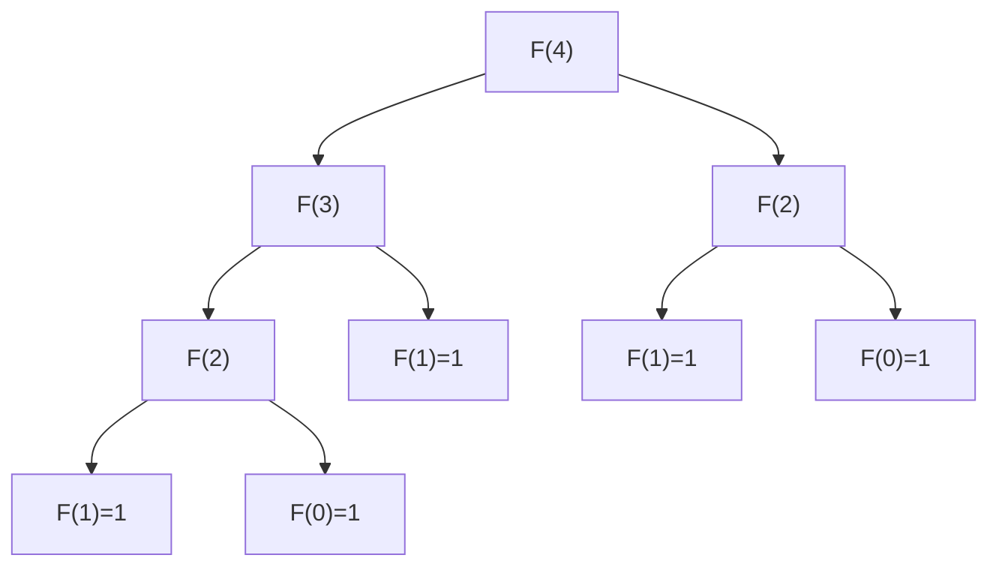
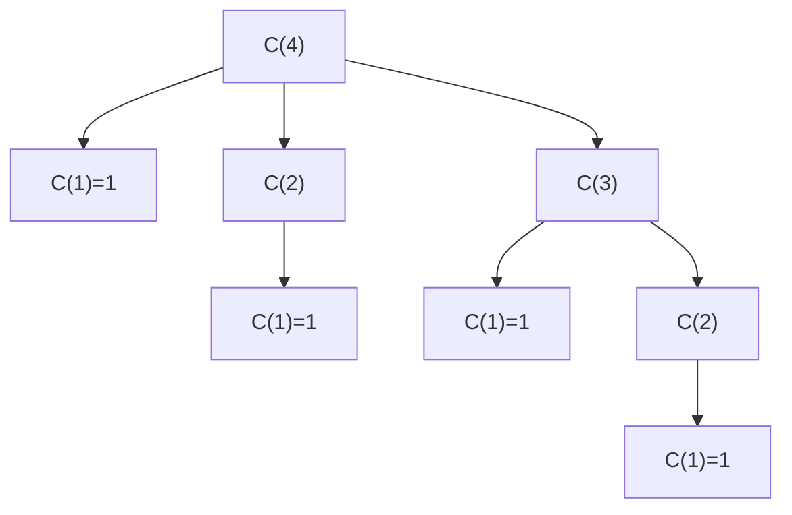
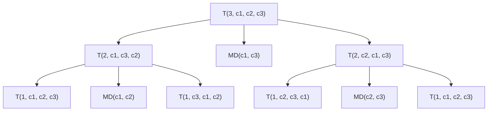
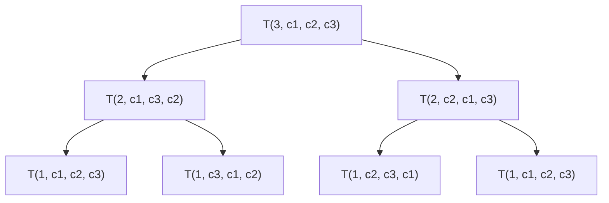

# Week 09: String & Recursion

> **Source**: CSLTr_week09.ppsx (87 slides)
> **Advisor**: Truong Toan Thinh
> **Note**: Extracted from PPSX XML. Images extracted to `week09_images/`. Diagrams are composed from individual icons — described in text where possible.

---

## Slide 1 — Title

STRING & RECURSION
Fundamentals of programming – Co so lap trinh
Advisor: Truong Toan Thinh

---

## Slide 2 — Contents

**String**
- Simple operation
- Token processing
- Search in string
- String manipulation
- Some characters/extended string

**Recursion**
- Introduction
- Categories
- Some applications
- Alternative method
- Extended problems

---

## Slide 3 — String

- A basic datatype. For example: email or sms contains the strings
- C/C++ does not have string datatype
- There are 2 ways:
  1. **Implement by using C language**
     - Can be used in C++ environment with C-implementation
     - `#include <string.h>` if using more support string functions
     - Array of characters must include `'\0'` at the end (end-of-string mark)
     - Cannot use operators `+`, `==`, ... with character array datatype
  2. **Using `string` in STL library of C++**
     - Only used in C++
     - Can use operators `[]`, `>`, `<` ...
     - `#include <string>` and `using namespace std;`

---

## Slide 4 — Simple Operation: Length of a String

Example:

```cpp
char s[] = "Ky thuat lap trinh";
```

```
s: [K][y][ ][t][h][u][a][t][ ][l][a][p][ ][t][r][i][n][h]['\0']
```

Example:

```cpp
char s[20];  s[19] = 'z';
gets(s); // input "Ky thuat lap trinh"
```

```
s: [K][y][ ][t][h][u][a][t][ ][l][a][p][ ][t][r][i][n][h]['\0'][z]
```

---

## Slide 5 — Simple Operation: StringLength Function

```cpp
int StringLength(char str[]) {
    int i = 0;
    while (*(str + i) != '\0') i++;
    return i;
}

void main() {
    char s[] = "Ky thuat lap trinh";
    cout << StringLength(s);
}
```

> Variable `i` iterates from 0 to 18 (length of the string).

---

## Slide 6 — Simple Operation: Alphabetical Order

**String comparison algorithm** for s0 & s1:

- **Step 0**: n0 = |s0| & n1 = |s1|
- **Step 1**: n = min{n0, n1}
- **Step 2**: For i in {0, 1, ..., n - 1}:
  - If s0[i] > s1[i] then s0 > s1 & stop
  - If s0[i] < s1[i] then s0 < s1 & stop
- **Step 3**:
  - If n0 > n then s0 > s1 & stop
  - If n1 > n then s0 < s1 & stop

| Examples | Explanation |
|----------|-------------|
| s0 = "abc" & s1 = "abd" → s0 < s1 | 3rd character of s1 > 3rd character of s0 |
| s0 = "abc" & s1 = "abcd" → s0 < s1 | Same first 3 characters, s1 > s0 due to longer |
| s0 = "abc" & s1 = "d" → s0 < s1 | 1st character of s1 > 1st character of s0, so s1 > s0 although shorter |

---

## Slide 7 — Simple Operation: CompareString Example

```cpp
int CompareString(char* s0, char* s1) {
    int n0 = strlen(s0), n1 = strlen(s1);
    int n = (n0 < n1) ? n0 : n1;
    for (int i = 0; i < n; i++) {
        if (s0[i] > s1[i]) return 1;
        else if (s0[i] < s1[i]) return -1;
    }
    if (n0 > n) return 1;
    if (n1 > n) return -1;
    return 0;
}

void main() {
    char s[] = "abcd", t[] = "abce";
    cout << CompareString(s, t) << endl;
}
```

---

## Slide 8 — Simple Operation: Const String

- Const string is a string with fixed value, unchangeable value
- Example: `"abcd"` is a const string
- Const pointer contains an address of const string (const pointer != pointer const)
- Const pointer is used to const a data or point to a data with constant nature

```cpp
const char* s = "abcd"; // Right
char* s = "abcd";       // Wrong
```

- Changing a const string with const pointer is illegal:

```cpp
s[0] = 'A'; // Wrong
```

---

## Slide 9 — Simple Operation: Sort an Array of Strings (C-style)

```cpp
void SortStringArray(char** b, int n) {
    char buffer[10]; int len1, len2;
    for (int i = 0; i < n - 1; i++) {
        for (int j = i + 1; j < n; j++) {
            if (strcmp(b[i], b[j]) > 0) {
                len1 = strlen(b[i]); len2 = strlen(b[j]);
                strcpy(buffer, b[j]);
                if (len2 < len1) {
                    char* buf = new char[len1 + 1]; strcpy(buf, b[i]);
                    delete[] b[j]; b[j] = buf;
                }
                else strcpy(b[j], b[i]);
                if (len1 < len2) {
                    char* buf = new char[len2 + 1]; strcpy(buf, buffer);
                    delete[] b[i]; b[i] = buf;
                }
                else strcpy(b[i], buffer);
            }
        }
    }
}

void main() {
    char** a = new char*[3];
    a[0] = new char[9]; a[1] = new char[6]; a[2] = new char[8];
    strcpy(a[0], "Xin chao");
    strcpy(a[1], "Hello");
    strcpy(a[2], "Bonjour");
    SortStringArray(a, 3);
    for (int i = 0; i < 3; i++) delete[] a[i];
    delete[] a;
}
```

---

## Slide 10 — Simple Operation: Sort an Array of Strings (C++ string)

```cpp
void SortStringArray(string strArr[], int n) {
    for (int i = 0; i < n - 1; i++) {
        for (int j = i + 1; j < n; j++) {
            if (strArr[i] > strArr[j]) {
                string tmp = strArr[i];
                strArr[i] = strArr[j];
                strArr[j] = tmp;
            }
        }
    }
}

void main() {
    string a[] = {"Xin chao", "Hello", "Bonjour"};
    SortStringArray(a, 3);
    for (int i = 0; i < 3; i++) cout << a[i] << endl;
}
```

---

## Slide 11 — Simple Operation: Sort Structural Array with Static String

```cpp
#define MAX_LENGTH 8
typedef struct {
    int MaSo;
    char HoTen[MAX_LENGTH + 1];
    float DTB;
} SINHVIEN;

void copySinhVien(SINHVIEN& dest, SINHVIEN& src) {
    dest.MaSo = src.MaSo; dest.DTB = src.DTB;
    strcpy(dest.HoTen, src.HoTen);
}

void swapSinhVien(SINHVIEN& sv1, SINHVIEN& sv2) {
    SINHVIEN tmp;
    copySinhVien(tmp, sv1); copySinhVien(sv1, sv2); copySinhVien(sv2, tmp);
}

void sortSinhVien(SINHVIEN sv[], int n) {
    for (int i = 0; i < n - 1; i++)
        for (int j = i + 1; j < n; j++)
            if (strcmp(sv[i].HoTen, sv[j].HoTen) < 0)
                swapSinhVien(sv[i], sv[j]);
}

void main() {
    SINHVIEN a[3] = {{1, "Le Thi A", 8},
                      {2, "Le Thi B", 7},
                      {3, "Le Thi C", 9}};
    sortSinhVien(a, 3);
}
```

---

## Slide 12 — Simple Operation: Sort Structural Array — C vs C++

| C | C++ |
|---|-----|
| `#define MAX_LENGTH 10` | |
| `typedef struct {` | `typedef struct {` |
| `int MaSo; char HoTen[MAX_LENGTH + 1];` | `int MaSo; string HoTen;` |
| `double DTB; } SVIEN;` | `double DTB; } SVIEN;` |
| `void copySinhVien(SVIEN& d, SVIEN& s) {` | |
| `d.MaSo = s.MaSo; d.DTB = s.DTB;` | |
| `strcpy(d.HoTen, s.HoTen); }` | |
| `void swapSinhVien(SVIEN& sv1, SVIEN& sv2) {` | `void swapSinhVien(SVIEN& sv1, SVIEN& sv2) {` |
| `SVIEN tmp; copySinhVien(tmp, sv1);` | `SVIEN tmp = sv1;` |
| `copySinhVien(sv1, sv2); copySinhVien(sv2, tmp); }` | `sv1 = sv2; sv2 = tmp; }` |
| `if (strcmp(sv[i].HoTen, sv[j].HoTen) < 0)` | `if (sv[i].HoTen < sv[j].HoTen)` |

---

## Slide 13 — Simple Operation: String Copy

String copy: there are many cases of extracting sub-string from main-string.

- Example: Registration number `XXXYZZZZZ` (school-code, ordinal numbers)
- Telephone number `098XXXXXXX` (the first three numbers indicate operator)

```
SRC:  [0][1][2]...[7][8][9][10][11]
DEST: [0]...
      |--- startPos ---|--- numChars ---|
```

---

## Slide 14 — Simple Operation: String Copy Parameters

The parameters `length`, `numChars` and `startPos` must satisfy the condition:
- The length of main-string does not include `'\0'`
- Length of string `dest` = `numChars` + 1

---

## Slide 15 — Simple Operation: CopySubStr

```cpp
void CopySubStr(char* d, char* s, int sp, int nc) {
    strncpy(d, s + sp, nc);
    d[nc] = '\0';
}

void main() {
    char src[] = "Hello world";
    int numChars = 5, startPos = 2;
    char* dest = new char[numChars + 1];
    CopySubStr(dest, src, startPos, numChars);
    cout << dest << endl;  // "llo w"
    delete[] dest;
}
```

---

## Slide 16 — Simple Operation: GetLeftSubStr

Copy substring with `startPos = 0`:

```cpp
void GetLeftSubStr(char* d, char* s, int numChars) {
    int len = strlen(s);
    if (numChars > len) numChars = len;
    CopySubStr(d, s, 0, numChars);
}
```

---

## Slide 17 — Simple Operation: GetRightSubStr

Copy substring with `startPos = length - numChars`:

```cpp
void GetRightSubStr(char* d, char* s, int numChars) {
    int len = strlen(s);
    if (numChars > len) numChars = len;
    CopySubStr(d, s, len - numChars, numChars);
}
```

---

## Slide 18 — Simple Operation: GetSubStr

Copy any substring:

```cpp
void GetSubStr(char* d, char* s, int startPos, int numChars) {
    int len = strlen(s);
    if (startPos < len) {
        if (startPos + numChars > len) numChars = len - startPos;
        CopySubStr(d, s, startPos, numChars);
    }
    else strcpy(d, "");
}
```

---

## Slide 19 — Simple Operation: Insert External String

Insert a substring into main-string at another position.

Example: insert `"abcde"` into `"01234567891"` at the position of character '2'. Result: `"01abcde234567891"`.

```
Main: [0][1][2][3][4][5][6][7][8][9][1][0]
Sub:  [a][b][c][d][e][0]
Result: [0][1][a][b][c][d][e][2][3][4][5][6][7][8][9][1][0]
```

---

## Slide 20 — Simple Operation: insertSubString

```cpp
void insertSubString(char* str, char* sub, int startPos) {
    int length = strlen(str), sublength = strlen(sub);
    if (startPos > length) startPos = length;
    if (startPos < length) {
        memmove(str + startPos + sublength, str + startPos, length - startPos + 1);
        strncpy(str + startPos, sub, sublength);
    }
    else strcpy(str + startPos, sub);
}

void main() {
    char src[] = "01234567891", dest[] = "abcde";
    int startPos = 2;
    insertSubString(src, dest, startPos);
}
```

---

## Slide 21 — Simple Operation: Delete a Substring

Delete a substring at a position in a main-string.

Example: main-string `"abcdefghijk"` is deleted at index = 2 and the amount of characters deleted is 6. Result: `"abijk"`.

```cpp
void deleteSubString(char* str, int startPos, int numChars) {
    int length = strlen(str);
    if (startPos >= length) return;
    if (startPos + numChars > length) numChars = length - startPos;
    strcpy(str + startPos, str + startPos + numChars);
}

void main() {
    char src[] = "abcdefghijk";
    deleteSubString(src, 2, 6);
}
```

---

## Slide 22 — Simple Operation: Delete Substring Note

Note with `strcpy(char* dest, char* src)`:
- This function is valid with a back-off operation (similar to demonstration of `deleteSubString`)
- This function isn't valid with a forward operation

Example: `strcpy(str+startPos, str+startPos+numChars)` converts to `strcpy(str+startPos+numChars, str+startPos)` — this would be **incorrect** for forward copy.

---

## Slide 23 — Token Processing

What token is depends on separation-character.

Example: `"Ky thuat lap trinh, nhap mon lap trinh."`

| Separation characters | Token |
|----------------------|-------|
| `' '` (space), `','` (comma), `'.'` (period) | 8 tokens: "Ky", "thuat", "lap", "trinh", "nhap", "mon", "lap", "trinh" |
| `','` (comma), `'.'` (period) | 2 tokens: "Ky thuat lap trinh" and "nhap mon lap trinh" |
| `'.'` (period) | 1 token: "Ky thuat lap trinh, nhap mon lap trinh" |

---

## Slide 24 — Token Processing: Count Words

Count a number of words in text file:

- 1st case: the first character is normal one — increase counter var by 1, then finding other words
- 2nd case: the first character is separation character — scan until finding the first character, then increase the counter by 1

```cpp
int countWords(char* s) {
    int n = 0, len = strlen(s), i = 0;
    if (s[0] != ' ') { n++; i++; }
    for (; i < len - 1; i++)
        if (s[i] == ' ')
            if (s[i + 1] != ' ')
                n++;
    return n;
}

void main() {
    char a[] = "  hi Tom";
    cout << countWords(a) << endl;
}
```

---

## Slide 25 — Token Processing: Count Words (Idea)

Use some convenient function of C++ to implement this counting function.

**Idea**:
- **Step 1**: Ignore all the separation-characters at the start of a string to come to the position of the first word. If it cannot find this position, stop. Otherwise go to step 2.
- **Step 2**: Ignore all the characters of the word just found at step 1 to come to the position of the next separation-character. If it cannot find this position, stop. Otherwise, return to step 1.

---

## Slide 26 — Token Processing: C++ String Methods

- `string.find_first_not_of(sepString, startPos)`: return the position of the first character not in `sepString` from `startPos`
  - Example: `"12345".find_first_not_of("345", 0)` -> 0 because '1' is not in "345"

- `string.find_first_of(sepString, startPos)`: return the position of the first character in `sepString` from `startPos`
  - Example: `"12345".find_first_of("345", 0)` -> 2 because '3' is in "345"

---

## Slide 27 — Token Processing: countWords (C++ version)

```cpp
int countWords(string s) {
    string sep = " ;:,.\n\t";
    int nWords = 0;
    string::size_type lastPos = s.find_first_not_of(sep, 0);
    string::size_type pos = s.find_first_of(sep, lastPos);
    while (string::npos != pos || string::npos != lastPos) {
        nWords++;
        lastPos = s.find_first_not_of(sep, pos);
        pos = s.find_first_of(sep, lastPos);
    }
    return nWords;
}

void main() {
    string s = " hi Tom ";
    cout << countWords(s) << endl;
}
```

---

## Slide 28 — Token Processing: getToken

Take a token from a string. Reuse the idea of `countWords` function. Return the length just extracted from a main-string, and record the position of newest separation-character for the next extraction.

```cpp
int getToken(char* tok, char* s, int& sP) {
    int from = sP, to, len = strlen(s), nTokLen = 0;
    strcpy(tok, "");
    while ((from < len) && (s[from] == ' ')) from++;
    if (from == len) return nTokLen;
    to = from + 1;
    while ((to < len) && (s[to] != ' ')) to++;
    nTokLen = to - from;
    strncpy(tok, s + from, nTokLen);
    tok[nTokLen] = '\0';
    sP = to;
    return nTokLen;
}

void main() {
    char s[] = "  Hello world", t[6]; int sp = 0;
    getToken(t, s, sp);
}
```

---

## Slide 29 — Token Processing: parseString

Separate a string into an array of tokens. Reuse the idea of `getToken` function.

```cpp
int parseString(char*** aTok, char* str) {
    char tok[6];
    int i = 0, nTok = countWords(str), sP = 0;
    *aTok = new char*[nTok];
    while (getToken(tok, str, sP) > 0) {
        (*aTok)[i] = new char[strlen(tok) + 1];
        strcpy((*aTok)[i], tok);
        i++;
    }
    return nTok;
}

void main() {
    char s[] = "Ky thuat lap trinh", **a = NULL;
    cout << parseString(&a, s);
    for (int i = 0; i < 4; i++) delete[] a[i];
    delete[] a;
}
```

---

## Slide 30 — Token Processing: mergeTokens

```cpp
void mergeTokens(char* s, char** aTok, int iStart, int nTok) {
    if (nTok == 0) strcpy(s, "");
    else {
        strcpy(s, aTok[iStart]);
        for (int i = iStart + 1; i < nTok; i++) {
            strcat(s, " "); strcat(s, aTok[i]);
        }
    }
}

void main() {
    char s[] = "Ky thuat lap trinh", **a = NULL;
    int n = parseString(&a, s);
    char buf[19]; mergeTokens(buf, a, 0, n);
    for (int i = 0; i < 4; i++) delete[] a[i];
    delete[] a;
}
```

---

## Slide 31 — Token Processing: Different Applications

**Normalize separations**: `"  hello  world  "` -> `"hello world"`

```cpp
void normalizeString(char* dest, char* src) {
    char** aTok = NULL;
    int nTok = parseString(aTok, src);
    mergeToken(aTok, 0, nTok, dest);
}
```

**Separate surname, name and middle-name**: `"Nguyen Thi Be Ba"` -> `"Nguyen"`, `"Thi Be"`, `"Ba"`

```cpp
void parseName(string sHoTen, string& h, string& cl, string& t) {
    vector<string> aTok;
    int n = parseString(aTok, sHoTen);
    h = aTok[0]; t = aTok[n - 1];
    mergeToken(cl, aTok, 1, n - 2);
}
```

**Separate day, month, year**: `"20/10/2100"` -> 20, 10, 2100

```cpp
void parseDate(int& dd, int& mm, int& yyyy, char* strNgay) {
    char** aTok = NULL;
    int n = parseString(aTok, strNgay);
    dd = atoi(aTok[0]); mm = atoi(aTok[1]); yyyy = atoi(aTok[2]);
}
```

---

## Slide 32 — Search in String: Brute-Force Matching

Input: string needed to check (pat), main-string (s) and the position where starting to match (startPos). Output: index if found and -1 if not.

```cpp
int isMatch(char* pat, char* s, int startPos) {
    int pLen = strlen(pat), sLen = strlen(s), i, j;
    for (i = startPos; i <= (sLen - pLen); i++) {
        for (j = 0; j < pLen && s[i + j] == pat[j]; j++);
        if (j == pLen) return i;
    }
    return -1;
}
```

---

## Slide 33 — Search in String: isMatch + FindSubString

Can break previous function into two simpler sub-functions:

```cpp
bool isMatch(char* pat, char* s, int startPos) {
    int pLen = strlen(pat), sLen = strlen(s), i;
    if (startPos + pLen > sLen) return false;
    for (i = 0; i < pLen; i++)
        if (pat[i] != s[startPos + i])
            return false;
    return true;
}

int FindSubString(char* pat, char* s, int startPos = 0) {
    int pLen = strlen(pat), sLen = strlen(s), i, maxStartPos = sLen - pLen;
    if (startPos > maxStartPos) return -1;
    for (i = startPos; i <= maxStartPos; i++)
        if (isMatch(pat, s, i) == true)
            return i;
    return -1;
}
```

---

## Slide 34 — Search in String: isSubString & CountMatches

**Substring checking**:

```cpp
bool isSubString(char* pat, char* s) {
    if (findSubString(pat, s, 0) >= 0) return true;
    return false;
}
```

**Counting number of appearances of substring**:

```cpp
int CountMatches(char* pat, char* s) {
    int pLen = strlen(pat), sLen = strlen(s);
    int maxStartPos = sLen - pLen, count = 0;
    for (i = 0; i <= maxStartPos; i++)
        if (isMatch(pat, s, i) == true) count++;
    return count;
}
```

- Ex 1: pat = "abc" and s = "abcdabce" => count = 2
- Ex 2: pat = "aa" and s = "aaaa" => count = 3

---

## Slide 35 — Search in String: CountDisjointMatches

Counting a number of appearances of **disjoint** substring:

- Ex 1: pat = "abc", s = "abcdabce" -> count = 2
- Ex 2: pat = "aa", s = "aaaa" -> count = 2

```cpp
int CountDisjointMatches(char* pat, char* s) {
    int pLen = strlen(pat), sLen = strlen(s);
    int maxStartPos = sLen - pLen, count = 0;
    for (i = 0; i <= maxStartPos; i++)
        if (isMatch(pat, s, i) == true) {
            count++;
            i += (pLen - 1);
        }
    return count;
}
```

---

## Slide 36 — Search in String: replaceSubString

Replace a substring in a main-string.

Ex: s = `"Hello world"`, so = `"ll"`, sn = `"abc"` -> s = `"Heabco world"`

```cpp
int replaceSubString(char* so, char* sn, char* s) {
    int olen = strlen(so), nlen = strlen(sn), slen = strlen(s), count = 0, i = 0;
    while (i <= (slen - olen)) {
        if (isMatch(so, s, i)) {
            deleteSubString(s, i, olen);
            insertSubString(s, sn, i);
            slen = slen + (nlen - olen);
            i += nlen;
            count++;
        }
        else i++;
    }
    return count;
}
```

---

## Slide 37 — String Manipulation: Normalization Helpers

Need to normalize each token in string: capitalize the first character of the token, uncapitalize the remaining characters.

```cpp
int isCapitalLet(char c) {
    if (c >= 'A' && c <= 'Z') return 1;
    return 0;
}

int isLowercaseLet(char c) {
    if (c >= 'a' && c <= 'z') return 1;
    return 0;
}

void normalizeWord(char* w) {
    if (isLowercaseLet(w[0])) w[0] -= 32;
    for (int i = 1; i < strlen(w); i++)
        if (isCapitalLet(w[i])) w[i] += 32;
}
```

---

## Slide 38 — String Manipulation: normalizeString

Some steps to normalize:
1. Parse a string into a list of tokens
2. Normalize each token in the list
3. Merge all tokens into a string

```cpp
void normalizeString(char* des, char* src) {
    char** aTok = NULL;
    int nTok = parseString(aTok, src);
    for (int i = 0; i < nTok; i++)
        normalizeWord(aTok[i]);
    mergeTokens(des, aTok, 0, nTok);
}
```

---

## Slide 39 — String Manipulation: Reverse String

Reverse the order of the characters of a string.

Ex: `"Hello world"` -> `"dlrow olleH"`

```cpp
void reverseString(char* s) {
    for (int i = 0; i < strlen(s) / 2; i++) {
        char t = s[i];
        s[i] = s[strlen(s) - 1 - i];
        s[strlen(s) - 1 - i] = t;
    }
}
```

---

## Slide 40 — Character/Extended String: Multi-byte Characters

- **One-byte character**: 1 byte = 1 character
  - Example: 97 -> 'a' (97₁₀ = 01100001₂)
- **Multi-byte**: 1 character = multi bytes
  - Example: codepage VNI

| Characters (1 byte) | Dec | Hex | Characters (2 byte) | Dec | Hex |
|---------------------|-----|-----|---------------------|-----|-----|
| 'a' | 94 | 0x61 | 'a' | 63841 | 0xF961 |
| 'B' | 66 | 0x42 | 'ậ' | 58465 | 0xE461 |
| '0' | 48 | 0x30 | 'ỹ' | 62841 | 0xF579 |
| 'i' | 236 | 0xEC | 'ỏ' | 64367 | 0xFB6F |
| '@' | 64 | 0x40 | 'e' | 57957 | 0xE265 |

---

## Slide 41 — Character/Extended String: Unicode (2-byte)

Extended character: all characters of a string must be the same bytes.

Example: codepage built-in Unicode (2-byte characters):

```cpp
wchar_t s[] = L"Hello";
```

| Characters (1 byte) | Dec | Hex | Characters (2 byte) | Dec | Hex |
|---------------------|-----|-----|---------------------|-----|-----|
| 'a' | 94 | 0x61 | 'a' | 225 | 0x00E1 |
| 'B' | 66 | 0x42 | 'ậ' | 7853 | 0x1EAD |
| '0' | 48 | 0x30 | 'ỹ' | 7929 | 0x1EF9 |
| '9' | 57 | 0x39 | 'i' | 236 | 0x00EC |
| '@' | 64 | 0x40 | 'e' | 7887 | 0x1ECF |

---

## Slide 42 — Character/Extended String: Codepage Unicode

- A numbering system of all characters of all nations
- Contains 1,114,112 different characters
- 96,000 characters are used
- There are many methods of presenting a character with Unicode:
  - **UTF-32**: one character with 4 bytes
  - **UTF-16**: one character with 2 or 4 bytes
  - **UTF-8**: one character with 1 to 4 bytes
- Some text files with strings of UTF-8 characters need special processing functions

---

## Slide 43 — Character/Extended String: Processing

- A string of multi-byte characters: build functions to recognize the boundary of characters of string
- Extended string: characters with the same bytes
- **C language** supports 16-bit string in `<string.h>`:
  - Replace `char` with `wchar_t`
  - Replace `strlen` (8-bit string) with `wcslen` (16-bit string)
  - Replace `printf` with `wprintf` ...
- **C++ language** supports 16-bit string in `<string>`:
  - Replace `string` with `wstring`
  - Replace `cout` with `wcout` ...

---

## Slide 44 — Recursion: Introduction

- Has a big significance in computer science
- Suitable for problems with recursive nature
- Limitations:
  - Low speed
  - Needs a large amount of memory
- For example: recursively defining a natural number:
  - Zero (0) is a natural number
  - n is a natural number if n - 1 is a natural number

---

## Slide 45 — Recursion: Factorial Example

Recursively defining the factorial:
- 0! = 1
- n! = n * (n - 1)!

```cpp
long GT(int n) {
    long ret;
    if (n == 0) ret = 1;
    else ret = n * GT(n - 1);
    return ret;
}
```

---

## Slide 46 — Recursion: Cube Root Example

Compute cube root recursively:
- If x = 0 -> result = 0
- If x < 0 -> result = -cbrt(-x)
- If x > 0 -> result = x^(1/3)

```cpp
double SQRT3(double x) {
    double ret;
    if (x == 0) ret = 0;
    else {
        if (x < 0) ret = SQRT3(-x);
        else ret = pow(x, 1.0 / 3);
    }
    return ret;
}
```

---

## Slide 47 — Recursion: Recursive Error Report

- If len(string-to-print) > 50 -> print error-string
- Else print string-to-print

```cpp
void printString(char* s) {
    if (strlen(s) <= 50) cout << s << endl;
    else printError();
}

void printError() {
    printString("String exceeding limited length");
}
```

---

## Slide 48 — Recursion: Stop Condition

- At ex1: at base step n = 0 -> result is 1
- At ex2:
  - At base step x = 0 -> result is 0
  - At recursive step x > 0 -> compute normally
- At ex3: Error-string obeys the limited length
- **What if stop condition is wrong?**
  - Loop forever
  - Stack overflow

---

## Slide 49 — Categories: Linear Recursion

In the function's body, there is only one function-call to itself directly.

General form:

```
<Function-name & parameters list> {
    if (<stop-condition>)
        /*Return a value or stop working*/
    else {
        /*Do something*/
        /*Call recursively*/
    }
}
```

---

## Slide 50 — Categories: Linear Recursion Example

Consider {a_n}, n >= 0 with following rule:
- If n = 0 then a₀ = 1
- If n even then a_n = (n/2) * a_(n/2)
- If n odd then a_n = (3n + 1) * a_(n-1)

```cpp
int A(int n) {
    if (n <= 0) return 1;
    else if (n % 2 == 0) return (n / 2) * A(n / 2);
    else return (3 * n + 1) * A(n - 1);
}

void main() {
    cout << A(4) << endl;
}
```

> Call trace: A(4) -> (4/2)*A(2) -> A(2)=(2/2)*A(1) -> A(1)=(3+1)*A(0)=4*1=4 -> A(2)=1*4=4 -> A(4)=2*4=8

---

## Slide 51 — Categories: Tail Call

The last call (tail call): When function g() calls function f(), we say f() is a tail-call if the f()'s termination is the termination of g().

Tail-call does not mean it is at the last-line of the function's body.

```cpp
float CalcAB(float t) {              float Calc(float t) {
    float y = FuncA(t);                  float y = FuncA(t);
    float x = FuncB(t);                  float x = FuncB(t);
    return Max(t*x, t*y);               if (x > y) return FuncA(x - y);
}                                        return (y - x) * Max(t*x, t*y);
                                     }
```

> In `CalcAB`, `Max` is a tail-call. In `Calc`, `FuncA` is a tail-call (when `x > y`), but `Max` is NOT a tail-call (result is multiplied).

---

## Slide 52 — Categories: NOT Tail-Recursion

Tail recursion is linear recursion, and has a recursive call which is a tail-call.

Example: **NOT** tail-recursion program:

```cpp
long GT(int n) {
    if (n == 0) return 1;
    return n * GT(n - 1);  // NOT a tail-call: result is multiplied by n
}

void main() {
    cout << GT(3) << endl;
}
```

> Call trace: GT(3) -> 3*GT(2) -> 2*GT(1) -> 1*GT(0) -> 1 -> 1 -> 2 -> 6

---

## Slide 53 — Categories: Tail-Recursion

Example: tail-recursion program:

```cpp
long GT(int n, long ret = 1) {
    if (n == 0) return ret;
    return GT(n - 1, ret * n);  // Tail-call
}

void main() {
    cout << GT(3) << endl;
}
```

> Call trace: GT(3, 1) -> GT(2, 3) -> GT(1, 6) -> GT(0, 6) -> 6

---

## Slide 54 — Categories: Binary Recursion

In the function's body, there are exactly 2 recursive calls directly.

General form:

```
<Function name and parameters list> {
    if (<stop condition>)
        /*Return value or stop working*/
    else {
        /*Do something*/
        /*Recursively call (1) to solve the smaller problems*/
        /*Recursively call (2) to solve the remaining problems*/
    }
}
```

---

## Slide 55 — Categories: Fibonacci (Binary Recursion)

Consider Fibonacci {F_n}, n >= 2:
- If n = 0 or n = 1 then F₀ = F₁ = 1
- If n >= 2 then F_n = F_(n-1) + F_(n-2)

```cpp
long F(int n) {
    long ret, fn_1, fn_2;
    if (n <= 1) ret = 1;
    else {
        fn_1 = F(n - 1);
        fn_2 = F(n - 2);
        ret = fn_1 + fn_2;
    }
    return ret;
}

void main() {
    cout << F(4) << endl;
}
```



> F(4) = 5

---

## Slide 56 — Categories: Fibonacci (Improved)

Program improved with pointer parameters:

```cpp
void F(int n, long* fn_1, long* fn) {
    long fn_2;
    if (n <= 1) *fn_1 = *fn = 1;
    else {
        F(n - 1, &fn_2, &(*fn_1));
        *fn = *fn_1 + fn_2;
    }
}

void main() {
    long F, Fnext;
    F(4, &F, &Fnext);
    cout << Fnext << endl;
}
```

> Linear call chain: F(4) -> F(3) -> F(2) -> F(1)

---

## Slide 57 — Categories: Fibonacci (Tail-Recursion)

```cpp
long F(int n, long fn_1 = 1, long fn = 1) {
    if (n <= 1) return fn;
    else return F(n - 1, fn, fn_1 + fn);
}

void main() {
    cout << F(4) << endl;
}
```

> Call trace: F(4, 1, 1) -> F(3, 1, 2) -> F(2, 2, 3) -> F(1, 3, 5) -> 5

---

## Slide 58 — Categories: Non-Linear Recursion

Recursively call is in a loop. It can be said that non-linear recursion is a general form of binary recursion.

General form:

```
<Function name and parameters list> {
    if (<stop-condition>)
        /*Return a value or stop working*/
    else {
        loop {
            /*Do something*/
            /*Recursively call to solve the smaller problems*/
        }
    }
}
```

---

## Slide 59 — Categories: Non-Linear Recursion (Nesting)

Example:
- C₁ = 1 when n = 1
- C_n = C₁ + C₂ + ... + C_(n-1) when n > 1

```cpp
unsigned long C(int n) {
    unsigned long ret;
    if (n == 1) ret = 1;
    else {
        ret = 0;
        for (int i = 1; i < n; i++)
            ret += C(i);
    }
    return ret;
}

void main() {
    cout << C(4) << endl;
}
```



> C(4) = 1 + 1 + 2 = 4

---

## Slide 60 — Categories: Mutual Recursion

Indirectly recursive call is through another different function. May change to different form of recursion.

General form:

```
<1st function name and parameters list> {
    if (<stop-condition>)
        /*Return a value or stop working*/
    else {
        /*Do something*/
        /*Call to 2nd function*/
    }
}

<2nd function name and parameters list> {
    if (<stop-condition>)
        /*Return a value or stop working*/
    else {
        /*Do something*/
        /*Call to 1st function*/
    }
}
```

---

## Slide 61 — Categories: Mutual Recursion Example

X₀ = Y₀ = 0; X_n = X_(n-1) + Y_(n-1); Y_n = n² * X_(n-1) + Y_(n-1)

```cpp
long X(int n) {
    long ret;
    if (n <= 0) ret = 1;
    else ret = X(n - 1) + Y(n - 1);
    return ret;
}

long Y(int n) {
    long ret;
    if (n <= 0) ret = 1;
    else ret = n * n * X(n - 1) + Y(n - 1);
    return ret;
}

void main() {
    cout << X(4) << endl;
}
```

---

## Slide 62 — Some Applications

- Can use recursion to solve some problems
- In some cases, recursion is a simple and easy-to-understand method
- This method consumes time and memory very much
- Carefully pay attention to stop-condition
- Some problems: Ha Noi tower, recurrence formula, combination, permutation, find the biggest/smallest, sort

---

## Slide 63 — Some Applications: Ha Noi Tower (n=3 discs)

**Description**:
- Have three columns (1, 2, 3)
- At first, 1st column has 3 discs
- Move discs from 1st column to 3rd column (2nd column is intermediate), such that **bigger disc is under smaller one** and **move only one disc at one time**

**Recursive method**:
1. Move upper n - 1 discs from 1st column to 2nd column
2. Move the last disc from 1st column to 3rd column
3. Move n - 1 discs from 2nd column to 3rd column

---

## Slide 64 — Some Applications: Ha Noi Tower Pseudo-code

```
// Using Tower to move n disc from col1 to col3 (mid col2)
Tower(n, col1, col2, col3) {
    If (n = 1) Then MoveDisc(col1, col3);
    Else {
        // Move n-1 disc from col1 to col2 (mid col3)
        Tower(n - 1, col1, col3, col2)
        // Move disc nth from col1 to col3
        MoveDisc(col1, col3);
        // Move n-1 disc from col2 to col3 (mid col1)
        Tower(n - 1, col2, col1, col3)
    }
}
```



---

## Slide 65 — Some Applications: Recurrence Formula

**Example 1**: Virus doubles the amount after one hour. How many viruses are there after h hours?
- V₀ = 2 (at first there are 2 viruses)
- V_h = 2 * V_(h-1)

```cpp
long ComputeVirus(int h) {
    if (h == 0) return 2;
    return 2 * ComputeVirus(h - 1);
}
```

**Example 2**: Bank rate is 14%/year. At first, a sender sends 1,000,000. How much money is there after n years?
- T₀ = 1,000,000
- T_n = 1.14 * T_(n-1)

```cpp
double ComputeMoney(int n) {
    if (n == 0) return 1000000;
    return 1.14 * ComputeMoney(n - 1);
}
```

---

## Slide 66 — Some Applications: Permutation

Example: we have S = {1, 2, 3}
- There are six permutations: 123, 132, 213, 231, 312, 321
- There are six 2-permutations of 3: 12, 13, 21, 31, 23, 32
- Formula: nPn = n! and nPk = n!/(n - k)!

```cpp
long P(char* a, int n, int k, int m = 0) {
    long c = 0;
    for (int i = m; i <= (n - 1); i++) {
        swap(a[m], a[i]);
        if (m < k - 1) c += P(a, n, k, m + 1);
        else {
            for (int t = 0; t < k; t++) cout << a[t];
            cout << endl;
            c++;
        }
        swap(a[m], a[i]);
    }
    return c;
}

void main() {
    cout << P("123", 3, 2);
}
```

---

## Slide 67 — Some Applications: Combination

Consider S = {1, 2, 3}, there are three 2-combinations of 3: 12, 13, 23.

Formula: nCn = 1 and nCk = n! / (k! * (n - k)!)

```cpp
long C(char* a, char* kq, int n, int k, int m = 0, int idx = 0) {
    long c = 0;
    for (int i = m; i < n; i++) {
        kq[idx] = a[i];
        if (idx < k - 1)
            c += C(a, kq, n, k, i + 1, idx + 1);
        else {
            cout << kq << endl;
            c++;
        }
    }
    return c;
}

void main() {
    cout << C("1234", "xxx", 4, 3);
}
```

---

## Slide 68 — Some Applications: Combination Trace

> *[Visual content: detailed recursive call trace for C("1234", "xxx", 4, 3) showing all combinations: 123, 124, 134, 234. Total c = 4]*

---

## Slide 69 — Some Applications: Find Max Element

Ex: a = {-1, 4, 2, 7, 9, -9, 3}. Find the position of the max number.

**Idea**:
- If the array is empty then return -1
- If the array has one element, then return 0
- Else: find the position of the biggest element among n - 2 members, compare that position with n - 1

```cpp
int csmax(int a[], int n) {
    if (n <= 0) return -1;
    else if (n == 1) return 0;
    else {
        int i = csmax(a, n - 1);
        if (a[i] < a[n - 1]) return n - 1;
        return i;
    }
}

void main() {
    int a[] = {-1, 4, 2, 7, 9, -9, 3};
    cout << csmax(a, 7) << endl;  // Output: 4
}
```

---

## Slide 70 — Some Applications: Recursive Sort (Brute-Force)

Sort a = {-1, 4, 2, 7, 9, -9, 3} with increasing order.

**Idea**: If length > 1, sort n-1 members, then compare last member with penultimate. If last < penultimate, swap them and re-sort.

```cpp
void sxTang(int a[], int n) {
    if (n > 1) {
        sxTang(a, n - 1);
        if (a[n - 1] < a[n - 2]) {
            swap(a[n - 1], a[n - 2]);
            sxTang(a, n - 1);
        }
    }
}

void main() {
    int a[] = {-1, 4, 2, 7, 9, -9, 3};
    sxTang(a, 7);
}
```

---

## Slide 71 — Some Applications: Recursive Sort with csmax

Sort a = {-1, 4, 2, 7, 9, -9, 3} with increasing order.

**Idea**: If length > 1, find max position of n-1 members, compare a[n-1] with a[csmax] to swap if necessary, re-sort n-1 members.

```cpp
void sxTang(int a[], int n) {
    if (n > 1) {
        int cs = csmax(a, n - 1);
        if (a[n - 1] < a[cs]) swap(a[n - 1], a[cs]);
        sxTang(a, n - 1);
    }
}

void main() {
    int a[] = {-1, 4, 2, 7, 9, -9, 3};
    sxTang(a, 7);
}
```

---

## Slide 72 — Some Applications: Quick Sort

Sort a = {-1, 4, 2, 7, 9, -9, 3} with increasing order.

**Idea**:
1. Choose the pivot (any position)
2. Process such that the left elements of pivot are smaller than pivot
3. Process such that the right elements of pivot are greater than pivot
4. Recursively process for 2 sub-arrays (exclude pivot)

```cpp
void QSort(int a[], int le, int ri) {
    if (le >= ri) return;
    int k = le;
    for (int i = le; i < ri; i++) {
        if (a[i] <= a[ri]) {
            swap(a[i], a[k]); k++;
        }
    }
    swap(a[k], a[ri]);
    QSort(a, le, k - 1);
    QSort(a, k + 1, ri);
}

void main() {
    int a[] = {-1, 4, 2, 7, 9, -9, 3};
    QSort(a, 0, 6);
}
```

---

## Slide 73 — Some Applications: Knight's Tour (6x6)

**Description**: Starting from cell (2, 2), find the path (follow knight's rule) to pass all the cells in the board.

- There are 2 kinds of solutions: closed path and normal path
- Board size and starting cell affect the amount of solutions (paths)

> *[Visual content: two 6x6 boards showing example solutions with numbered cells]*

---

## Slide 74 — Some Applications: Knight's Tour Program

```cpp
#define SIZE 5
int dd[] = {-2, -1, 1, 2, 2, 1, -1, -2};
int dc[] = {1, 2, 2, 1, -1, -2, -2, -1};
int Bc[SIZE][SIZE] = {0};

void NuocDi(int n, int d, int c) {
    Bc[d][c] = n;
    if (n == MAX * MAX) xuatBc();
    for (int i = 0; i < 8; i++) {
        int dmoi = d + dd[i], cmoi = c + dc[i];
        if (dmoi >= 0 && dmoi < MAX && cmoi >= 0 && cmoi < MAX && Bc[dmoi][cmoi] == 0)
            NuocDi(n + 1, dmoi, cmoi);
    }
    Bc[d][c] = 0;
}

void main() {
    NuocDi(1, 0, 0);
}
```

> Knight moves: 8 possible directions represented by dd[] and dc[] arrays.

---

## Slide 75 — Some Applications: Eight Queens Puzzle

**Description**: Need to put 8 queens into 8x8 board such that no queen can capture the others (follow Chess's rule).

**Note**:
- Name 8 queens as follows: 0, 1, 2, 3, 4, 5, 6, 7
- Surely 8 queens are in 8 different rows -> putting 0th queen in the 0th row
- Need to find column indexes corresponding to each row
- Pay attention to main/sub diagonal after choosing row and column

---

## Slide 76 — Some Applications: Eight Queens — Example Solution

> *[Visual content: an 8x8 chessboard showing one valid solution for the eight queens puzzle]*

---

## Slide 77 — Some Applications: Eight Queens — Data Structures

Create array of columns, main/sub diagonal:

```cpp
int ct[8]  = {1, 1, 1, 1, 1, 1, 1, 1};              // columns available
int cxt[15] = {1, 1, 1, 1, 1, 1, 1, 1, 1, 1, 1, 1, 1, 1, 1}; // sub-diagonals
int cnt[15] = {1, 1, 1, 1, 1, 1, 1, 1, 1, 1, 1, 1, 1, 1, 1}; // main-diagonals
```

Create array of solutions: `int lg[8]`. It means that the ith queen is at ith row and `lg[i]`th column.

---

## Slide 78 — Some Applications: Eight Queens — Diagonal Indexes

Need to determine the indexes of main/sub diagonals corresponding to row/col (i, j):
- Example: i = 3 & j = 1
  - Main diagonal index: 9 = 3 - 1 + 8 - 1 -> formula: `dcx = d - c + SIZE - 1`
  - Sub diagonal index: 4 = 3 + 1 -> formula: `dcn = d + c`

---

## Slide 79 — Some Applications: Eight Queens — Program

```cpp
void QH(int i) {  // Put ith queen into ith row
    for (int j = 0; j < 8; j++) {
        if (ct[j] && cxt[j - i + 8 - 1] && cnt[i + j]) {
            lg[i] = j;
            ct[j] = cxt[j - i + 8 - 1] = cnt[i + j] = FALSE;
            if (i == 8 - 1)
                // print array lg
            else
                QH(i + 1);
            ct[j] = TRUE;
            cxt[j - i + 8 - 1] = TRUE;
            cnt[i + j] = TRUE;
        }
    }
}

void main() {
    QH(0);
}
```

---

## Slide 80 — Some Applications: Sum & Power

**Sum of all members in array**:

```cpp
long sum(int a[], int n) {
    if (n < 1) return 0;
    return sum(a, n - 1) + a[n - 1];
}
```

**Power** (optimized):

Note: x⁷ = x³ * x³ * x, x⁶ = x³ * x³, x⁻³ = 1/x³

```cpp
float LT(float x, int n) {
    float ret, xlast;
    if (n < 0) ret = 1 / LT(x, -n);
    else if (n == 0) ret = 1;
    else if (n == 1) ret = x;
    else {
        if (n % 2 == 0) { xlast = LT(x, n / 2); ret = xlast * xlast; }
        else { xlast = LT(x, (n - 1) / 2); ret = xlast * xlast * x; }
    }
    return ret;
}
```

---

## Slide 81 — Some Applications: Combination Value & Directory Size

**Value of combination**:
- C(k, n) = 1 when k = 0 or k = n
- C(k, n) = C(k, n-1) + C(k-1, n-1) when 0 < k < n

```cpp
long C(int k, int n) {
    if (k == 0 || k == n) return 1;
    return C(k, n - 1) + C(k - 1, n - 1);
}
```

**Size of directory tree**:

```cpp
typedef struct tagFileSystem {
    char* szName; bool isFile;
    long nSize; int nSub;
    tagFileSystem** paSub;
} FileSystem;

long getSize(FileSystem* f) {
    long nTotal = 0;
    if (f->isFile) return f->nSize;
    for (int i = 0; i < f->nSub; i++)
        nTotal += getSize(f->paSub[i]);
    return nTotal;
}
```

---

## Slide 82 — Alternative Method: QuickSort with Stack

There are 2 ways of replacing recursion: **loop** and **(stack + loop)**.

Example: QuickSort with (stack + loop):

```cpp
typedef struct { int L, R; } Pair;

void QSort(int a[], int le, int ri) {
    stack<Pair> s;
    Pair p = {le, ri};
    s.push(p);
    while (!s.empty()) {
        p = s.top(); s.pop();
        int k = p.L;
        for (int i = p.L; i < p.R; i++) {
            if (a[i] <= a[p.R]) {
                swap(a[i], a[k]); k++;
            }
        }
        swap(a[k], a[p.R]);
        if (p.L < k - 1) s.push({p.L, k - 1});
        if (p.R > k + 1) s.push({k + 1, p.R});
    }
}

void main() {
    int a[] = {-1, 4, 2, 7, 9, -9, 3};
    QSort(a, 0, 6);
}
```

---

## Slide 83 — Extended Problems: Algorithm Complexity

- **Space**: memory is computed with the depth of the recursive tree (exclude nodes with the same level)
- **Time**: count the operations in the recursive tree

Example: Ha Noi tower:



- Depth = 3 (storage units)
- 2³ - 1 = 7 times of disc moving

---

## Slide 84 — Extended Problems: Replacing Recursion

- Recursion algorithm consumes memory and time very much
- In some cases, recursion algorithm is simple and easy-to-understand
- Completely convert a recursive algorithm to non-recursive one with loop and stack
- Using stack is more efficient (time and space) than recursive algorithm

---

## Slide 85 — Extended Problems: Non-Recursive Ha Noi Tower

```
Tower(n, col1, col2, col3) {
    Stack s;
    Push(s, kq = {n, col1, col2, col3});
    Do {
        kq = pop(s);
        If (kq.n = 1) MoveDisc(kq.col1, kq.col3);
        Else {
            Push(s, kq = {n - 1, col2, col1, col3});
            Push(s, kq = {1, col1, col2, col3});
            Push(s, kq = {n - 1, col1, col3, col2});
        }
    } Until (!empty(s));
}
```

> *[Visual content: step-by-step stack trace showing how the non-recursive version simulates the recursive calls]*

---

## Slide 86 — Extended Problems: Correctness of Recursive Algorithm

Prove the output of recursive program is right. Use **induction** to prove.

**Example**: n! = 1 (n = 0) and n! = n * (n-1)! (n > 0)

```
GT(n) {
    if n = 0 then kq = 1
    else kq = n * GT(n - 1)
}
```

**Proof**: GT(n) = n!
1. If n = 0 then kq = 1 (Definition) -- base case holds
2. Assume the program is right with n = k, so GT(k) = k!
3. Need to prove GT(k + 1) = (k + 1)!
   - GT(k + 1) = (k + 1) * GT(k) = (k + 1) * k! = (k + 1)! (complete)

---

## Slide 87 — Extended Problems: Correctness — GCD Example

**Example**: GCD(a, b) (a, b > 0)

```
GCD(a, b) {
    if a = b then d = a
    else if a > b then d = GCD(a - b, b)
         else d = GCD(a, b - a)
}
```

**Proof**: GCD(a, b) = d (d|a and d|b and there is no c: c|a, c|b, d < c)

1. If a = b then d = a (Right)
2. If a != b:
   - If a > b: because d|a & d|b so (a/d) - (b/d) = (a-b)/d is in N, so d|(a-b). So d is the common divisor of a-b and b
   - If b > a: because d|a & d|b so (b/d) - (a/d) = (b-a)/d is in N, so d|(b-a). So d is the common divisor of b-a and a
3. So the process continues: the bigger subtracts the smaller until a - b = 0 or b - a = 0. When a = b then the algorithm stops.
