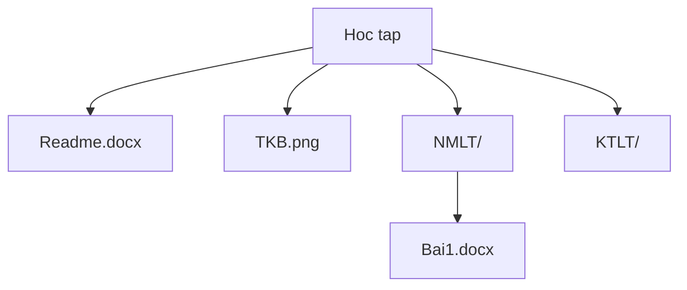

# Week 10: Search Problem

> **Source**: CSLTr_week10.ppsx (26 slides)
> **Advisor**: Truong Toan Thinh
> **Note**: Extracted from PPSX XML. Images extracted to `week10_images/`. Diagrams are composed from individual icons — described in text where possible.

---

## Slide 1 — Title

SEARCH PROBLEM
Fundamentals of programming – Co so lap trinh
Advisor: Truong Toan Thinh

---

## Slide 2 — Contents

- Introduction
- Linear search
- Binary search

---

## Slide 3 — Introduction

- This problem is very popular
- Inputs of the problem are the information needed and output is **optimized solution** satisfying **constraint condition**
- Two methods of searching are linear and binary
- Search problem includes:
  - Search space / solution space
  - Constraint condition
- Solution space may include:
  - **Explicit**: only choose and check
  - **Implicit**: must create to continue processing

---

## Slide 4 — Introduction (cont.)

The process of choosing solutions includes following steps:

- **Step 0**: create candidate solution (if not)
- **Step 1**: check if candidate solution satisfies constraint condition or not
- **Step 2**: Among the candidate solutions satisfying constraint condition, there are some standards to choose the best one

**Example**: Find the even biggest number in array `a` with `n` whole distinct numbers (`n` > 0)

- Search space: `n` elements
- Constraint condition: even number
- Standard: biggest

---

## Slide 5 — Linear Search (in 1D Array)

**Problem 1**: Let `a` be an array of `n` integers. Write a function finding a value of the biggest element.

- Cost: Loop array `a` → O(`n`)
- Search space: `n` elements
- Standard: biggest

```c
int FindMaxValue(int a[], int n){
  int res = a[0];
  for(int i = 1; i < n; i++){
    if(a[i] > res) res = a[i];
  }
  return res;
}
```

---

## Slide 6 — Linear Search (in 1D Array)

**Problem 2**: Let `a` be an array of `n` integers and number `x`. Write a function finding the first position of appearance of `x`.

- Cost: the luckiest is loop 1 time-looping. The average is `n`/2-looping and the worst is `n`-looping → O(n)
- Search space: {0, `n` – 1}
- Constraint condition: value equal to `x`
- Standard: the element with the smallest index

```c
// Version 1
int Find(int a[], int n, int x){
  int i = 0;
  while((i < n) && (a[i] != x))
    i++;
  if(i < n) return i;
  return -1;
}

// Version 2 (sentinel)
int Find(int a[], int n, int x){
  int i = 0;
  a[n] = x;
  while(a[i] != x) i++;
  if(i < n) return i;
  return -1;
}
```

---

## Slide 7 — Linear Search (in 1D Array)

**Problem 3**: Let `a` be an array of `n` integers. Write a function finding the position of the smallest square number.

- Cost: loop `n` elements → O(`n`)
- Search space: {0, `n` – 1}
- Constraint condition: square number
- Standard: the smallest element

```c
bool iSquare(int number){
  int i = (int)sqrt((float)number);
  return (i*i == number);
}

int IdxOfMinSquareNumber(int a[], int n){
  int idx = -1, lc = 0;
  for(int i = 0; i < n; i++){
    if(iSquare(a[i]) && (idx == -1 || a[i] < lc)){
      lc = a[i];
      idx = i;
    }
  }
  return idx;
}
```

---

## Slide 8 — Linear Search (in 1D Array)

**Problem 4**: Let `a` be an array of `n` positive integers. Write a function finding the position of the biggest prime number.

- Cost: loop `n` elements → O(`n`)
- Search space: {0, `n` – 1}
- Constraint condition: prime number
- Standard: the biggest

```c
bool iSPrime(int number){
  if(number < 2) return false;
  int n = (int)sqrt(number);
  for(int i = 2; i <= n; i++)
    if(number % i == 0) return false;
  return true;
}

int idxOfMaxPrime(int a[], int n){
  int idx = -1, lc = 0;
  for(int i = 0; i < n; i++){
    if(iSPrime(a[i]) && a[i] > lc){
      lc = a[i]; idx = i;
    }
  }
  return idx;
}
```

---

## Slide 9 — Linear Search (in 1D Structural Array)

**Problem 5**: Let `sp` be an array of `n` products. Each product has: Code, product name and price. Write a function finding the highest price in the list.

- Cost: loop `n` elements → O(`n`)
- Search space: {0, `n` – 1}
- Standard: the highest price

```cpp
#define MAX 100
struct PRODUCT
{
   int id;
   char name[MAX + 1];
   float price;
};

float findMaxPrice(PRODUCT sp[], int n){
  float maxPrice = 0;
  for(int i = 0; i < n; i++)
    if(maxPrice < sp[i].Price)
      maxPrice = sp[i].Price;
  return maxPrice;
}
```

---

## Slide 10 — Linear Search (in 1D Structural Array)

**Problem 6**: Let `sp` be an array of `n` products. Each product has: Code, product name and price. Write a function finding the product name with lowest price in the list.

- Cost: loop `n` elements → O(`n`)
- Search space: {0, `n` – 1}
- Constraint condition: exist product name needed
- Standard: the lowest price

```cpp
float findProduct(PRODUCT sp[], int n, char* strQuery, char* strProductName){
  strcpy(strProductName, "");
  int idx = -1; float minP = 0;
  for(int i = 0; i < n; i++)
    if(strstr(sp[i].Name, strQuery) != NULL && (idx == -1 || minP > sp[i].Price)){
      idx = i; minP = sp[i].Price;
    }
  if(idx != -1) strcpy(strProductName, sp[idx].Name);
}
```

---

## Slide 11 — Linear Search (in Structural Vector)

**Problem 7**: Let `plist` be an array of `n` songs. Each song includes: name, singer, genre and points. Write a function choosing the songs with the highest point.

- Cost: loop `n` elements → O(`n`)
- Search space: {0, `n` – 1}
- Standard: the highest point

```cpp
struct SONG
{
  string name;
  string Artist;
  string Genre;
  float Rating;
};

vector<SONG> FindBestSong(vector<SONG>& pList){
  vector<SONG> res; float bestR = 0;
  for(int i = 0; i < pList.size(); i++)
    if(bestR < pList[i].Rating)
      bestR = pList[i].Rating;
  for(i = 0; i < pList.size(); i++)
    if(bestR == pList[i].Rating)
      res.push_back(pList[i]);
  return res;
}
```

> **Note**: `string` in `struct` — following declarations are valid:
> `SONG s;` or `SONG* s = new SONG();`

---

## Slide 12 — Linear Search (in Linked List)

**Problem 8**: Let a linked list of products. Each product includes: code, name and price. Write a function finding the highest price in the linked list.

- Cost: loop `n` elements → O(`n`)
- Search space: {0, `n` – 1}
- Standard: the highest price

```cpp
struct PRODUCT
{
  int id;
  char name[4];
  float price;
  PRODUCT* next;
};

float findMaxPrice(PRODUCT* sp){
  PRODUCT* p = sp; float maxPrice = 0;
  while(p){
    if(maxPrice < sp->price)
      maxPrice = sp->price;
    p = p->next;
  }
  return maxPrice;
}
```

---

## Slide 13 — Linear Search (in Linked List) — Memory Layout

**Problem 8** (continued): Review the structure PRODUCT

```cpp
struct PRODUCT
{
  int id;
  char name[4];
  float price;
  PRODUCT* next;
};
```

Memory layout of a linked list with 2 nodes:

| Field | Node 1 (address) | Node 2 (address) |
|-------|-------------------|-------------------|
| `id` | `<2750f38>` | `<2750f50>` |
| `name` | `<2750f3c>` | `<2750f54>` |
| `price` | `<2750f40>` | `<2750f58>` |
| `next` | `<2750f44>` → `2750f50` | `NULL` |

`h <61ff1c>` → `2750f38`

```cpp
void main()
{
  PRODUCT* h = new PRODUCT;
  h->next = new PRODUCT;
  h->next->next = NULL;
  //cout<<...
};
```

---

## Slide 14 — Linear Search (in Linked List)

**Problem 9**: Let a linked list of students. Each student includes: code, name, faculty and GPA. Write a function counting a number of students with GPA in [min, max].

- Cost: loop `n` elements → O(`n`)
- Constraint condition: exist the faculty name needed
- Search space: {0, `n` – 1}
- Standard: in [min, max]

```cpp
#define DEPT 50
#define NAME 100
struct STUDENT{
  int ID;
  char strDept[DEPT+1];
  char strName[NAME+1];
  float GPA;
  STUDENT* next;
};

float count(STUDENT* s, char* strDept, float min, float max){
  STUDENT* t = s; int c = 0;
  while(t){
    if(strcmp(t->strDept, strDept) == 0)
      if(t->GPA >= min && t->GPA <= max) c++;
    t = t->next;
  }
  return c;
}
```

---

## Slide 15 — Linear Search (in Hierarchical Structure)

**Problem 10**: Counting a number of files with the size bigger or equal to `minSize` in the given directory.

- Cost: loop `n` files → O(`n`)
- Search space: multi-branch tree
- Standard: bigger or equal to `minSize`

```cpp
struct File{
  string Name;
  int Size;
};

struct Folder{
  string Name;
  vector<Folder> Folders;
  vector<File> Files;
};

int count(const Folder& f, int minSize){
  int i, c = 0, nFiles = f.Files.size(), nFolders = f.Folders.size();
  for(i = 0; i < nFiles; i++)
    if(f.Files[i].Size >= minSize)
      c++;
  for(i = 0; i < nFolders; i++)
    c += count(f.Folders[i], minSize);
  return c;
}
```

---

## Slide 16 — Linear Search (in Hierarchical Structure) — Diagram

**Problem 11**: Search all the files with the name containing a given string `strPat`. Result is a list of names (including file paths) of the files just found.

- Cost: loop `n` files → O(n)
- Search space: multi-branch tree
- Standard: file with the name needed



Example call: `Main(){ find(..., "HocTap", "docx", ...); }`

Result: `res = ["HocTap\\Readme.docx", "HocTap\\NMLT\\Bai1.docx"]`

---

## Slide 17 — Linear Search (in Hierarchical Structure) — Code

**Problem 11** (continued):

```cpp
void find(const Folder& f, string strCurrentPath, string strPat, vector<string>& res){
  int i, nFiles = f.Files.size(), nFolders = f.Folders.size();
  string strFilePathName, strNewPath;
  for(i = 0; i < nFiles; i++)
    if(f.Files[i].Name.find(strPat, 0) != string::npos){
      strFilePathName = strCurrentPath + "\\" + f.Files[i].Name;
      res.push_back(strFilePathName);
    }
  for(i = 0; i < nFolders; i++)
    find(f.Folders[i], strCurrentPath + "\\" + f.Folders[i].Name, strPat, res);
}
```

---

## Slide 18 — Binary Search (in 1D Array)

**Problem 12**: Let `a` be an array of `n` increasing integers. Write a function determining the position of the element having `x` value.

- If `x` > `a[i]` → `x` in [`i` + 1, `n` – 1]
- If `x` < `a[i]` → `x` in [0, `i` – 1]

```c
int BinarySearch(int a[], int x, int n){
  int from = 0, to = n - 1, mid;
  while(from <= to){
    mid = (from + to)/2;
    if(a[mid] == x) return mid;
    else{
      if(a[mid] > x) to = mid - 1;
      else from = mid + 1;
    }
  }
  return -1;
}
```

Example array:

| Index | 0 | 1 | 2 | 3 | 4 | 5 | 6 | 7 | 8 |
|-------|---|---|---|---|---|---|---|---|---|
| Value | 1 | 3 | 5 | 10 | 15 | 21 | 24 | 95 | 99 |

---

## Slide 19 — Binary Search (in 1D Array)

**Problem 13**: Let `a` be an array of `n` decreasing positive integers. Write a function determining the position of the biggest element smaller than `x` (for example `x` = 20).

```c
int findMaxValue(int a[], int x, int n){
  if(n == 0) return 0;
  int from = 0, to = n - 1, mid;
  while(from < to){
    mid = (from + to)/2;
    if(a[mid] > x) from = mid + 1;
    else to = mid;
  }
  if(a[from] <= x) return a[from];
  return 0;
}
```

Example array (decreasing):

| Index | 0 | 1 | 2 | 3 | 4 | 5 | 6 | 7 |
|-------|---|---|---|---|---|---|---|---|
| Value | 80 | 55 | 46 | 24 | 21 | 15 | 10 | 9 |

Comparison: elements > 20, elements < 20

---

## Slide 20 — Binary Search (in 1D Array)

**Problem 14**: Let `a` be an array of `n` increasing integers. Write a function inserting `x` into array, such that maintaining the increasing order.

```cpp
void BinaryInsert(vector<int>& a, int x){
  int from = 0, to = a.size() - 1, mid;
  while(from <= to){
    mid = (from + to)/2;
    if(a[mid] < x) from = mid + 1;
    else to = mid - 1;
  }
  a.insert(a.begin() + from, x);
}
```

Example trace with `x = 5`, array = {1, 3, 5, 11, 99}:

| Step | from | to | mid |
|------|------|----|-----|
| 1 | 0 | 3 | 1 |
| 2 | 2 | 3 | 2 |
| 3 | 3 | 2 | — |

Insert at position `from = 3`.

---

## Slide 21 — Binary Search (in 1D Array)

**Problem 15**: Let `a` be a **unimodal** array with `n` integer elements. Write a function finding the biggest element.

```c
int BinarySearchMax(int a[], int n){
  int from = 0, to = n - 1, mid;
  while(from < to){
    mid = (from + to)/2;
    if(a[mid] < a[mid + 1]) from = mid + 1;
    else to = mid;
  }
  return a[from];
}
```

Example unimodal array:

| Index | 0 | 1 | 2 | 3 | 4 | 5 | 6 |
|-------|---|---|---|---|---|---|---|
| Value | 1 | 4 | 8 | 9 | 7 | 3 | 2 |

---

## Slide 22 — Binary Search (in 1D Structural Array)

**Problem 16**: Any library has the books with the names following the alphabetically increasing order. Write a function determining the position of the book needed.

```cpp
struct POSITION{
  int BookShelf, Level;
};

struct BOOK{
  string Title;
  string Authors;
  string Publisher;
  POSITION Position;
};

POSITION BinarySearch(vector<BOOK>& Lst, string strTitle){
  POSITION res; res.BookShelf = res.Level = -1; int n = Lst.size();
  if(n == 0) return res;
  int from = 0, to = n - 1, mid;
  while(from <= to){
    mid = (from + to)/2;
    if(Lst[mid].Title == strTitle) return Lst[mid].Position;
    else{
      if(Lst[mid].Title > strTitle) to = mid - 1;
      else from = mid + 1;
    }
  }
  return res;
}
```

---

## Slide 23 — Binary Search (in 1D Structural Array)

**Problem 17**: Write a function determining the camera's name with the highest price not exceeding `maxPrice`. The camera's information includes name, manufacturer and price.

```cpp
struct CAMERA{
  char ProductName[50];
  char Manufacturer[50];
  float Price;
};

void findCam(CAMERA lst[], int n, float maxPrice, char* strName){
  strcpy(strName, "");
  if(n == 0) return;
  int from = 0, to = n - 1, mid;
  while(from < to){
    mid = (from + to)/2;
    if(lst[mid].Price > maxPrice) to = mid - 1;
    else from = mid;
  }
  if(lst[from].Price <= maxPrice)
    strcpy(strName, lst[from].ProductName);
}
```

---

## Slide 24 — Binary Search (in 1D Structural Array)

**Problem 18**: Write a function adding a record into the contact, such that all records follow the rule of Name alphabetically increasing.

```cpp
struct CONTACT{
  string Name;
  string PhoneNumber;
  string EmailAddress;
};

void binaryInsert(vector<CONTACT>& lst, CONTACT newContact){
  int from = 0, to = lst.size() - 1, mid;
  while(from <= to){
    mid = (from + to)/2;
    if(lst[mid].Name < newContact.Name) from = mid + 1;
    else to = mid - 1;
  }
  lst.insert(lst.begin() + from, newContact);
}
```

---

## Slide 25 — Binary Search (in 2D Array)

**Problem 19**: Let `a` be integer array (`m` x `n`). Array `a` has the numbers left-to-right increasing in each row. Write a function checking if array `a` contains the element with `x` value or not (for example `x` = 14).

```c
bool search2D(int** a, int m, int n, int x){
  int from, to, mid;
  for(int i = 0; i < m; i++){
    from = 0; to = n - 1;
    while(from <= to){
      mid = (from + to)/2;
      if(a[i][mid] == x) return true;
      else{
        if(a[i][mid] < x) from = mid + 1;
        else to = mid - 1;
      }
    }
  }
  return false;
}
```

Example 2D array:

|   | 0 | 1 | 2 | 3 |
|---|---|---|---|---|
| 0 | 1 | 3 | 4 | 6 |
| 1 | 2 | 4 | 6 | 7 |
| 2 | 4 | 7 | 9 | 21 |
| 3 | 7 | 9 | 11 | 43 |
| 4 | 8 | 9 | 44 | 67 |
| 5 | 1 | 1 | 6 | 7 |

Cost per row: O(log2 n) — Total: O(m * log2 n)

---

## Slide 26 — Binary Search (in 2D Array)

**Problem 20**: Let `a` be integer array (`m` x `n`). Array `a` has the numbers left-to-right increasing in each row, and numbers bottom-to-up increasing in each column. Write a function checking if array `a` contains the element with `x` value or not (for example `x` = 14).

```c
bool search2D(int** a, int m, int n, int x){
  int i = 0, j = 0;
  while(i < m && j < n){
    if(a[i][j] == x) return true;
    else{
      if(a[i][j] < x) j++;
      else i++;
    }
  }
  return false;
}
```

Example 2D array (rows increasing left-to-right, columns increasing bottom-to-up):

|   | 0 | 1 | 2 | 3 | 4 |
|---|---|---|---|---|---|
| 0 | 1 | 2 | 3 | 4 | 5 |
| 1 | 3 | 5 | 7 | 9 | 11 |
| 2 | 5 | 9 | 14 | 15 | 19 |
| 3 | 7 | 12 | 16 | 20 | 95 |

Loop cost: **O(m + n)**
