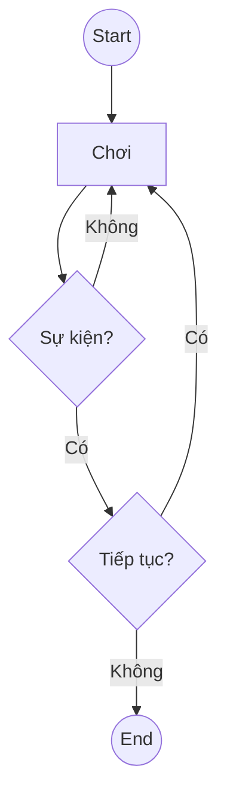
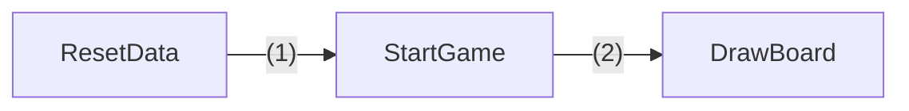
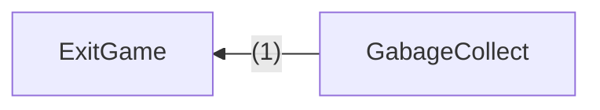
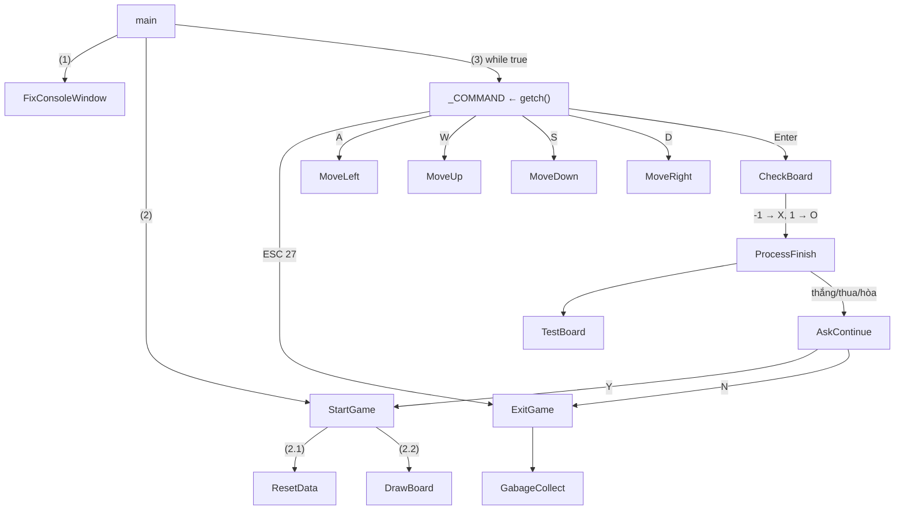

# Hướng Dẫn Đồ Án Caro

> **Source**: DoAnCaro.pdf (11 pages)
> **Trường**: Đại học Khoa học Tự nhiên TP.HCM — Khoa Công nghệ Thông tin
> **Môn**: Cơ Sở Lập Trình
> **Ngày**: 09/09/2024

---

## Mục lục

1. [Giới thiệu](#1-giới-thiệu)
2. [Kịch bản trò chơi](#2-kịch-bản-trò-chơi)
3. [Các bước xây dựng trò chơi](#3-các-bước-xây-dựng-trò-chơi)
4. [Yêu cầu đồ án](#4-yêu-cầu-đồ-án)

---

## 1. Giới thiệu

Trong phần đồ án này ta sẽ phối hợp các kĩ thuật và cấu trúc dữ liệu cơ bản để xây dựng một trò chơi đơn giản, cờ caro.

Để thực hiện được đồ án này ta cần các kiến thức cơ bản như: xử lý tập tin, handle, cấu trúc dữ liệu mảng một/hai chiều…

Phần hướng dẫn giúp sinh viên xây dựng trò chơi ở mức độ cơ bản, các em tự nghiên cứu để hoàn thiện một cách tốt nhất có thể.

---

## 2. Kịch bản trò chơi

- Lúc đầu khi vào game sẽ xuất hiện bàng cờ caro, người chơi sẽ dùng các phím **W**, **A**, **S**, **D** để điều chỉnh hướng di chuyển.
- Khi người chơi nhấn phím **Enter** thì sẽ xuất hiện dấu **X** hoặc **O** tùy vào lượt.
- Khi một trong hai người chiến thắng theo luật caro thì màn hình xuất hiện dòng chữ chúc mừng người chiến thắng. Sau đó sẽ hỏi người dùng muốn tiếp tục chơi hay không, nếu chọn phím "y" thì chương trình khởi động lại dữ liệu từ đầu, còn nhấn phím bất kì thì thoát chương trình.
- Trường hợp khi vị trí bàn cờ đã kín chỗ thì màn hình xuất hiện dòng chữ 'Hai ben hoa nhau'. Sau đó hỏi người dùng có muốn thoát hay chơi tiếp tương tự như trên.


> Hình 1: Sơ đồ kịch bản trò chơi

---

## 3. Các bước xây dựng trò chơi

> Lưu ý: Đây chỉ là một gợi ý lập trình, sinh viên có thể tự thiết kế mẫu phù hợp trong quá trình làm đồ án.

### Bước 1: Cố định màn hình console (Hàm nhóm View)

```c
void FixConsoleWindow() {
    HWND consoleWindow = GetConsoleWindow();
    LONG style = GetWindowLong(consoleWindow, GWL_STYLE);
    style = style & ~(WS_MAXIMIZEBOX) & ~(WS_THICKFRAME);
    SetWindowLong(consoleWindow, GWL_STYLE, style);
}
```

Kiểu HWND là một con trỏ trỏ tới chính cửa sổ Console. Cờ GWL_STYLE được xem là dấu hiệu để hàm GetWindowLong lấy các đặc tính mà cửa sổ Console đang có. Dòng số 4 làm mờ đi nút maximize và không cho người dùng thay đổi kích thước cửa sổ hiện hành. Sau khi hiệu chỉnh xong, dùng SetWindowLong để gán kết quả lại.

### Bước 2: Di chuyển con trỏ trên console (Hàm nhóm View)

```c
void GotoXY(int x, int y) {
    COORD coord;
    coord.X = x;
    coord.Y = y;
    SetConsoleCursorPosition(GetStdHandle(STD_OUTPUT_HANDLE), coord);
}
```

Sử dụng struct `_COORD` (COORD), cấu trúc dành xử lý cho tọa độ trên màn hình console. Gán hoành độ và tung độ cho biến coord, sau đó thiết lập vị trí lên màn hình bằng hàm SetConsoleCursorPosition. Lưu ý: hàm này cần một đối tượng chính là màn hình console (màn hình đen), vì vậy cần có một con trỏ trỏ tới đối tượng này (HANDLE thực chất là `void*`). Ta có được bằng cách gọi hàm GetStdHandle với tham số là một cờ STD_OUTPUT_HANDLE.

### Bước 3: Khai báo dữ liệu (Biến toàn cục)

```c
// Hằng số
#define BOARD_SIZE 12  // Kích thước ma trận bàn cờ
#define LEFT 3         // Tọa độ trái màn hình bàn cờ
#define TOP 1          // Tọa độ trên màn hình bàn cờ

// Khai báo kiểu dữ liệu
struct _POINT {int x, y, c;};  // x: tọa độ dòng, y: tọa độ cột, c: đánh dấu

_POINT _A[BOARD_SIZE][BOARD_SIZE];  // Ma trận bàn cờ
bool _TURN;      // true là lượt người thứ nhất, false là lượt người thứ hai
int _COMMAND;    // Biến nhận giá trị phím người dùng nhập
int _X, _Y;      // Tọa độ hiện hành trên màn hình bàn cờ
```

### Bước 4: Khởi tạo dữ liệu ban đầu (Hàm nhóm Model)

```c
void ResetData() {
    for(int i = 0; i < BOARD_SIZE; i++){
        for(int j = 0; j < BOARD_SIZE; j++){
            _A[i][j].x = 4 * j + LEFT + 2;  // Trùng với hoành độ màn hình bàn cờ
            _A[i][j].y = 2 * i + TOP + 1;    // Trùng với tung độ màn hình bàn cờ
            _A[i][j].c = 0;  // 0: chưa ai đánh dấu
            // Quy định: -1 là lượt true đánh, 1 là lượt false đánh
        }
    }
    _TURN = true; _COMMAND = -1;  // Gán lượt và phím mặc định
    _X = _A[0][0].x; _Y = _A[0][0].y;  // Thiết lập tọa độ hiện hành ban đầu
}
```

### Bước 5: Vẽ bàn cờ (Hàm nhóm View)

```c
void DrawBoard(int pSize){
    for(int i = 0; i <= pSize; i++){
        for(int j = 0; j <= pSize; j++){
            GotoXY(LEFT + 4 * i, TOP + 2 * j);
            printf(".");
        }
    }
}
```

### Bước 6: Hàm StartGame (Hàm nhóm Control)

```c
void StartGame() {
    system("cls");
    ResetData();              // Khởi tạo dữ liệu gốc
    DrawBoard(BOARD_SIZE);    // Vẽ màn hình game
}
```


> Hình 2: Sơ đồ gọi hàm từ StartGame()

### Bước 7: Hàm ExitGame và GabageCollect (Hàm nhóm Control/Model)

```c
// Hàm dọn dẹp tài nguyên (hàm nhóm Model)
void GabageCollect()
{
    // Dọn dẹp tài nguyên nếu có khai báo con trỏ
}

// Hàm thoát game (hàm nhóm Control)
void ExitGame() {
    system("cls");
    GabageCollect();
    // Có thể lưu game trước khi exit
}
```

> Lưu ý: Nếu ứng dụng không sử dụng biến con trỏ thì hàm GabageCollect() để trống.


> Hình 3: Sơ đồ gọi hàm từ ExitGame()

### Bước 8: Xử lý thắng/thua (Hàm nhóm View)

```c
// Hàm xử lý khi người chơi thua
int ProcessFinish(int pWhoWin) {
    GotoXY(0, _A[BOARD_SIZE - 1][BOARD_SIZE - 1].y + 2);
    switch(pWhoWin){
        case -1:
            printf("Nguoi choi %d da thang va nguoi choi %d da thua\n", true, false);
            break;
        case 1:
            printf("Nguoi choi %d da thang va nguoi choi %d da thua\n", false, true);
            break;
        case 0:
            printf("Nguoi choi %d da hoa nguoi choi %d\n", false, true);
            break;
        case 2:
            _TURN = !_TURN;  // Đổi lượt nếu không có gì xảy ra
    }
    GotoXY(_X, _Y);  // Trả về vị trí hiện hành của con trỏ màn hình bàn cờ
    return pWhoWin;
}

int AskContinue()
{
    GotoXY(0, _A[BOARD_SIZE - 1][BOARD_SIZE - 1].y + 4);
    printf("Nhan 'y/n' de tiep tuc/dung: ");
    return toupper(getch());
}
```

### Bước 9: Kiểm tra thắng/thua/hòa (Hàm nhóm Model)

Quy định đầu ra hàm này:
- `0`: hòa
- `-1`: lượt 'true' thắng
- `1`: lượt 'false' thắng
- `2`: chưa ai thắng

```c
int TestBoard()
{
    if(<Ma trận đầy>) return 0;  // Hòa
    else {
        if (<tồn tại điều kiện thắng theo luật caro>)
            return (_TURN == true ? -1 : 1);  // -1: lượt 'true' thắng
        Else
            return 2;  // Chưa ai thắng
    }
}
```

### Bước 10: Đánh dấu trên bàn cờ (Hàm nhóm Model)

```c
int CheckBoard(int pX, int pY){
    for(int i = 0; i < BOARD_SIZE; i++){
        for(int j = 0; j < BOARD_SIZE; j++){
            if(_A[i][j].x == pX && _A[i][j].y == pY && _A[i][j].c == 0){
                if(_TURN == true) _A[i][j].c = -1;   // Lượt true thì c = -1
                else _A[i][j].c = 1;                   // Lượt false thì c = 1
                return _A[i][j].c;
            }
        }
    }
    return 0;
}
```

### Bước 11: Di chuyển trên bàn cờ (Hàm nhóm Control)

```c
void MoveRight() {
    if (_X < _A[BOARD_SIZE - 1][BOARD_SIZE - 1].x) {
        _X += 4;
        GotoXY(_X, _Y);
    }
}

void MoveLeft() {
    if (_X > _A[0][0].x) {
        _X -= 4;
        GotoXY(_X, _Y);
    }
}

void MoveDown() {
    if (_Y < _A[BOARD_SIZE - 1][BOARD_SIZE - 1].y) {
        _Y += 2;
        GotoXY(_X, _Y);
    }
}

void MoveUp() {
    if (_Y > _A[0][0].y) {
        _Y -= 2;
        GotoXY(_X, _Y);
    }
}
```

> Trong quá trình di chuyển trên màn hình bàn cờ, nếu vượt quá phạm vi thì ta không xử lý, ngược lại ta thực hiện cập nhật tọa độ vị trí mới trên màn hình bàn cờ.

### Bước 12: Hàm main (Hàm nhóm Control)

```c
void main()
{
    FixConsoleWindow();
    StartGame();
    bool validEnter = true;
    while (1)
    {
        _COMMAND = toupper(getch());
        if (_COMMAND == 27)  // ESC key
        {
            ExitGame();
            return;
        }
        else {
            if (_COMMAND == 'A') MoveLeft();
            else if (_COMMAND == 'W') MoveUp();
            else if (_COMMAND == 'S') MoveDown();
            else if (_COMMAND == 'D') MoveRight();
            else if (_COMMAND == 13){  // Enter key
                switch(CheckBoard(_X, _Y)){
                    case -1:
                        printf("X"); break;
                    case 1:
                        printf("O"); break;
                    case 0: validEnter = false;  // Ô đã đánh rồi
                }
                // Tiếp theo là kiểm tra và xử lý thắng/thua/hòa/tiếp tục
                if(validEnter == true){
                    switch(ProcessFinish(TestBoard())){
                        case -1: case 1: case 0:
                            if(AskContinue() != 'Y'){
                                ExitGame(); return 0;
                            }
                            else StartGame();
                    }
                }
                validEnter = true;  // Mở khóa
            }
        }
    }
}
```

### Sơ đồ gọi hàm từ main()


> Hình 4: Sơ đồ gọi hàm từ hàm main()

---

## 4. Yêu cầu đồ án

Trong phần hướng dẫn trên ta còn thiếu một vài chức năng cơ bản:

### 4.1 Xử lý lưu/tải trò chơi (save/load)

Trong hướng dẫn chưa xử lý việc lưu/tải trò chơi. Ta cần cài đặt thêm tính năng này. Khi người dùng nhấn phím **L** thì sẽ hiện dòng chữ yêu cầu người dùng nhập tên tập tin muốn lưu trạng thái hiện hành của trò chơi. Khi người dùng nhấn phím **T** thì sẽ hiện dòng chữ yêu cầu người dùng nhập tên tập tin muốn tải lại.

### 4.2 Nhận biết thắng/thua/hòa

Ta cần bổ sung tính năng kiểm tra quy luật thắng/thua/hòa trong caro. Từ đó sẽ kiểm tra sau mỗi bước đi của người chơi.

### 4.3 Xử lý hiệu ứng thắng/thua/hòa

Trong hướng dẫn, khi thắng/thua/hòa chỉ hiển thị dòng chữ báo hiệu đơn giản. Ta hãy cài đặt hiệu ứng giúp sinh động hơn.

### 4.4 Xử lý giao diện màn hình khi chơi

Trong quá trình chơi, cho hiển thị các thông số của hai người chơi, ví dụ người chơi thứ nhất đã đánh bao nhiêu bước, người chơi thứ hai đã thua mấy ván… Sinh viên tự tổ chức giao diện màn hình sao cho rõ ràng, sinh động.

### 4.5 Xử lý màn hình chính

Trước khi vào trò chơi, hiển thị danh sách menu, ví dụ như "New Game", "Load Game", "Settings", … Như vậy sẽ giúp chương trình caro hoàn thiện và giống thực tế một trò chơi hơn.
