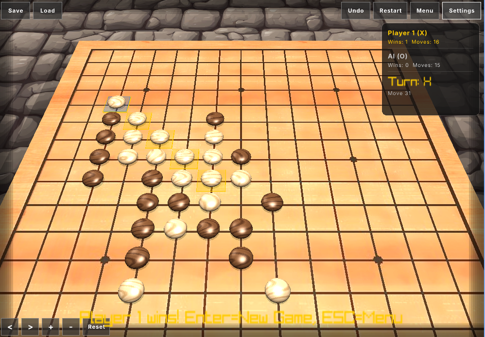

# Caro Game — OOP1 Project Demo

**Group:** Nguyen Huu Thien Nhan (25310023), Bui Thi Minh Hang (25310057), Pham Ngoc Tram (25310043)



## Quick Start (Windows)

1. Extract the ZIP
2. Run `CaroGame.exe`

## Controls

- **Mouse**: Click to place pieces, right-drag to rotate camera, scroll to zoom
- **Keyboard**: WASD/Arrow keys to move cursor, Enter to place
- **ESC**: Return to menu (from game) / Exit (from menu)
- **Ctrl+S / Ctrl+L**: Quick save/load
- **F3**: Toggle AI debug panel

## Build from Source

Requirements: CMake 3.16+, C++14 compiler (GCC, MSVC, Clang). No other dependencies — raylib is downloaded automatically.

```bash
mkdir build && cd build
cmake .. -DCMAKE_BUILD_TYPE=Release
cmake --build .
```

### Visual Studio (Windows)

```bash
mkdir build && cd build
cmake .. -G "Visual Studio 15 2017" -A x64
```
Then open `CaroGame.sln` and build (Release, x64).

## Features

- 15x15 board with 3D Go-stone pieces and unique wood grain per piece
- Orbital camera (rotate, zoom, reset)
- Three AI difficulty levels:
  - **Easy** — Minimax depth 2
  - **Medium** — Minimax depth 4, iterative deepening (1s time limit)
  - **Hard (Rapfi)** — [Rapfi](https://github.com/dhbloo/rapfi) NNUE engine (GomoCup 2024 champion), 10s max/move
- Cinematic piece drop animations with squash/stretch and shadows
- Save/Load game (3 slots + autosave)
- Undo support
- Settings persist between sessions
- Fallback to minimax if Rapfi engine unavailable
