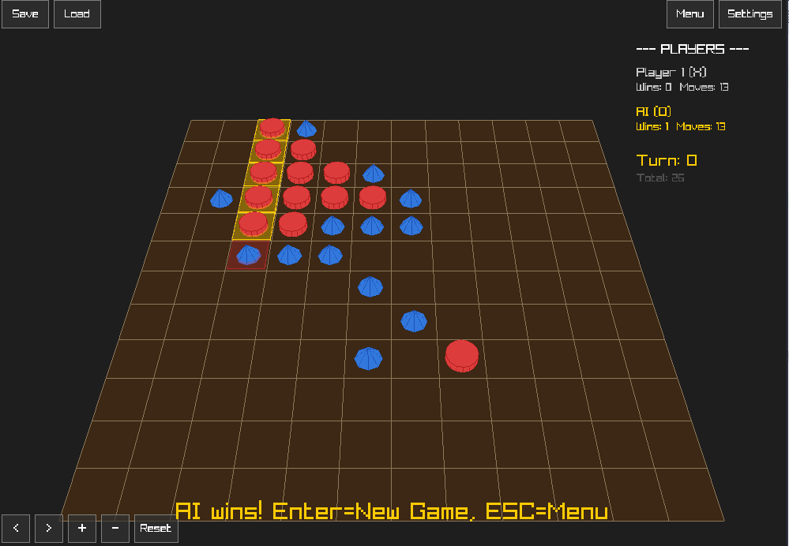

# Caro Game - OOP1 Final Project

**Group:** Nguyen Huu Thien Nhan (25310023), Bui Thi Minh Hang (25310057), Pham Ngoc Tram (25310043)



## Overview

This project is a 15x15 Caro/Gomoku game built in C++14 with `raylib`. It includes PvP, PvAI, Story Mode, binary save/load with autosave, animated 3D rendering, audio, and a small Catch2 test suite for the core game logic.

## Controls

- `Mouse`: place pieces, right-drag camera, wheel zoom
- `WASD` / arrow keys: move board cursor
- `Enter`: place piece / confirm menu choice
- `ESC`: back / exit current screen
- `Ctrl+S` / `Ctrl+L`: open save/load slots during gameplay
- `F3`: toggle AI debug panel
- `1` / `2`: Story Mode linh vat powers when unlocked

## Multiplayer

- `Multiplayer` in the main menu now exposes two paths:
  - `Host LAN Game` / `Join LAN by IP` for same-network play
  - `Create Online Room` / `Join Online Room` for room-based Internet play
- LAN is host-authoritative and connects directly by local IP + port.
- Online play uses the Go room server in [`server/`](server).
- Normal online UI does not expose the server address. The client resolves it
  internally to the production endpoint by default.
- Dev builds expose an `Advanced` endpoint selector with:
  - `Production` -> configured at build/deploy time
  - `Localhost` -> `127.0.0.1:34567`
- Runtime overrides for testing:
  - `CARO_SERVER_ENV=local`
  - `CARO_SERVER_HOST=...`
  - `CARO_SERVER_PORT=...`
  - `CARO_ENABLE_ENDPOINT_OVERRIDE=1`
- Build-time production defaults:
  - `-DCARO_PRODUCTION_SERVER_HOST=<hostname>`
  - `-DCARO_PRODUCTION_SERVER_PORT=34567`
- Network matches deliberately disable save/load and undo in the first version.

## Build From Source

Requirements: CMake 3.16+, a C++14 compiler, and standard desktop OpenGL support. `raylib` and `Catch2` are fetched automatically by CMake.

```bash
cmake -S . -B build -DCMAKE_BUILD_TYPE=Release
cmake --build build --target CaroGame
```

Run:

```bash
./build/CaroGame
```

Build and run tests:

```bash
cmake --build build --target CaroTests
./build/CaroTests
```

### Windows / Visual Studio

```bash
cmake -S . -B build -G "Visual Studio 17 2022" -A x64 \
  -DCARO_PRODUCTION_SERVER_HOST=<hostname>
cmake --build build --config Release --target CaroGame
```

### Online Room Server

Run the Internet room server from `doancaro/server`:

```bash
go run . --addr :34567
```

For local testing, point both clients to `127.0.0.1:34567`. For LAN, skip the
server and use the direct `Host LAN Game` / `Join LAN by IP` flow instead.

## Main Features

- 15x15 board with 3D camera, lighting, and per-piece texture variation
- PvP and PvAI modes with Easy / Normal / Hard AI
- LAN direct multiplayer and room-based online multiplayer
- Story Mode campaign with set progression and special powers
- Save/load slots plus autosave, backed by a versioned binary format
- Undo, settings persistence, menu flow, and in-game HUD
- Particle effects, sound effects, and rotating background music
- Catch2 tests for `Board` and `AIPlayer`
