# Báo cáo đồ án cuối kỳ - Trò chơi Caro (Gomoku)

_Môn Nhập môn Lập trình Hướng đối tượng_


# TRƯỜNG ĐẠI HỌC KHOA HỌC TỰ NHIÊN - ĐHQG TP.HCM

## KHOA CÔNG NGHỆ THÔNG TIN

-----

# BÁO CÁO ĐỒ ÁN CUỐI KỲ

## Đề tài: Xây dựng trò chơi *Caro (Gomoku)* 15×15 với đồ họa 3D và trí tuệ nhân tạo

- **Môn học:** Nhập môn Lập trình Hướng đối tượng
- **Lớp:** Công nghệ giáo dục - Khoa Khoa học liên ngành
- **Giảng viên hướng dẫn:** ThS. Trương Toàn Thịnh
- **Học kỳ:** II - Năm học 2025–2026
- **Ngày báo cáo:** _____

-----

### Nhóm thực hiện - Nhóm 13

| MSSV     | Họ và tên             | Vai trò chính |
|----------|-----------------------|---------------|
| 25310023 | Nguyễn Hữu Thiện Nhân | Nhóm trưởng, phát triển phần mềm |
| 25310057 | Bùi Thị Minh Hằng     | Biên tập báo cáo, thiết kế slide |
| 25310043 | Phạm Ngọc Trâm        | Hình ảnh minh họa, thiết kế slide |

-----

## Lời cảm ơn

Nhóm chúng em xin chân thành cảm ơn *ThS. Trương Toàn Thịnh* đã hướng dẫn trong suốt học kỳ và tạo điều kiện để nhóm thử sức với một đề tài vừa mang tính học thuật, vừa có nhiều không gian để mở rộng. Trong quá trình thực hiện đồ án, nhóm không chỉ ôn lại các khái niệm nền tảng của lập trình hướng đối tượng mà còn học thêm nhiều vấn đề thực tế hơn như tổ chức mã nguồn lớn hơn bài tập trên lớp, kiểm soát lỗi khi lưu file, giữ giao diện không bị treo khi AI đang tính, và cân bằng giữa yêu cầu kỹ thuật với thời gian hoàn thành. Nhóm cũng cảm ơn các thành viên đã phối hợp trong giai đoạn hoàn thiện báo cáo, hình ảnh, slide và phần trình bày. Mọi nhận xét của Thầy/Cô sẽ là cơ sở quan trọng để nhóm cải thiện sản phẩm và cách làm việc ở các đồ án sau.

-----

# Chương 1 - Mở đầu

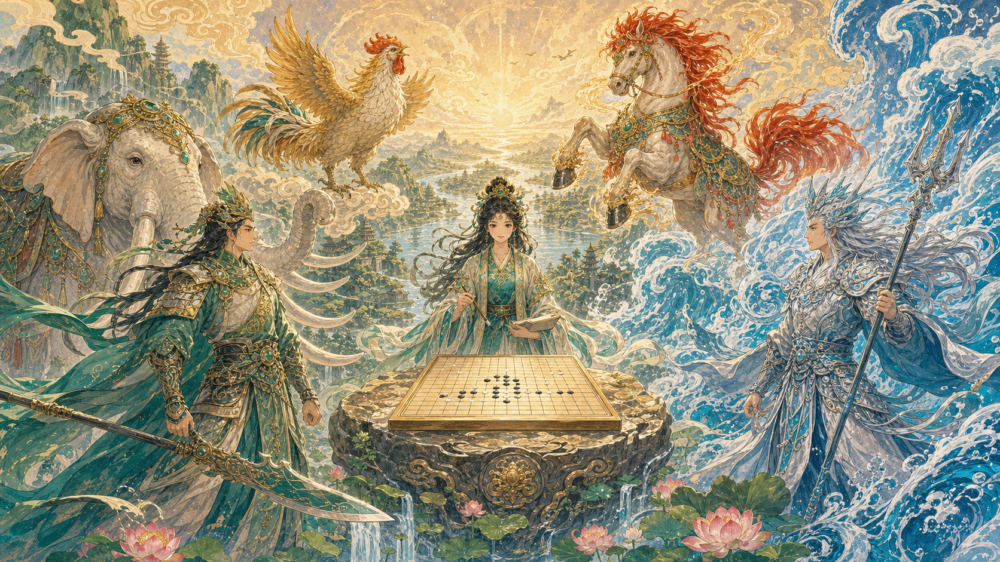
*Hình 1.1. Tranh chủ đề mở đầu của đồ án, quy tụ bàn cờ Caro, Cô Sử Tiên, Sơn Tinh, Thủy Tinh và ba linh-vật Voi chín ngà, Gà chín cựa, Ngựa chín hồng mao. Hình này đại diện cho tham vọng kết nối gameplay với một cách kể mới của thần thoại Việt trong không gian trò chơi số.*

## 1.1 Lý do chọn đề tài

Nhóm chọn đề tài *Caro* vì đây là trò chơi quen thuộc, luật chơi dễ hiểu nhưng vẫn đủ chiều sâu để triển khai thành một sản phẩm phần mềm hoàn chỉnh. Nếu chỉ dừng ở mức "đặt quân và kiểm tra thắng", bài toán khá đơn giản. Tuy nhiên, khi mở rộng thành một trò chơi có 3D UI, có đối thủ máy với nhiều mức độ khó, có khả năng lưu progression, có chế độ cốt truyện và kết nối mạng, phạm vi kỹ thuật tăng lên rõ rệt. Điều này khiến đề tài phù hợp với mục tiêu của môn *Nhập môn Lập trình Hướng đối tượng*: không chỉ viết được chương trình chạy đúng, mà còn phải tổ chức mã nguồn sao cho có thể mở rộng mà không đổ vỡ toàn bộ hệ thống.

Một lý do khác khiến nhóm chọn Caro là trò chơi này cho phép kết hợp tốt giữa phần "logic thuần" và phần "trải nghiệm người dùng". Ở tầng logic, nhóm có cơ hội làm việc với cấu trúc dữ liệu, thuật toán tìm kiếm cây trò chơi, heuristic, hashing và unit test. Ở tầng UI, nhóm có thể khai thác raylib để xây dựng camera 3D, hiệu ứng đặt quân, âm thanh, menu screen, launch screen và các nền minh họa cho Story Mode. Nhờ đó, đồ án không bị nghiêng hẳn về một phía, mà buộc nhóm phải xử lý cả software architecture lẫn cảm giác sử dụng thực tế.

Ngoài lý do kỹ thuật, nhóm cũng có một chủ đích nội dung rõ ràng: không muốn Story Mode chỉ là một lớp "fantasy cho có", mà phải mang được tinh thần Việt Nam. Vì vậy, khi phát triển phần cốt truyện, nhóm chọn hướng tái diễn giải truyền thuyết *Sơn Tinh - Thủy Tinh* cùng ba lễ vật *voi chín ngà, gà chín cựa, ngựa chín hồng mao* trong một hình thức gần với trò chơi hiện đại. Tham vọng của nhóm không phải tuyên bố rằng mình "đại diện" cho văn hóa Việt, mà là góp một nỗ lực nhỏ để hình ảnh, cảm hứng và nhịp kể của văn hóa Việt có thể tiếp tục nở rộ trong không gian số, thay vì luôn phải mượn chất liệu ngoại lai.

## 1.2 Mục tiêu của đồ án

Từ đầu học kỳ, nhóm đặt ra bốn mục tiêu chính cho sản phẩm:

1. Xây dựng được một trò chơi Caro 15×15 có thể chơi ổn định ở hai chế độ cơ bản: người với người và người với máy.
2. Thể hiện rõ tư duy lập trình hướng đối tượng qua cách chia lớp, tách trách nhiệm, kế thừa và đa hình.
3. Phát triển thêm các tính năng mở rộng đủ khác biệt để sản phẩm không chỉ là "bài tập lớn", mà là một trò chơi có bản sắc riêng.
4. Đưa được một lớp cảm hứng văn hóa Việt vào sản phẩm, đặc biệt qua Story Mode, theo hướng tái kể và làm mới chất liệu thần thoại quen thuộc.

Từ bốn mục tiêu này, nhóm xác định rõ rằng đồ án phải giải quyết đồng thời nhiều bài toán: luật chơi, AI, save/load, UI state management, hiển thị 3D, và về sau là Story Mode cùng Multiplayer. Vì vậy, ngay từ giai đoạn thiết kế, nhóm ưu tiên một cấu trúc có thể phát triển dần thay vì dồn toàn bộ logic vào một file điều phối duy nhất.

## 1.3 Phạm vi và kết quả đạt được

Bảng dưới đây tổng hợp các chức năng quan trọng của phiên bản hoàn thiện:

| Nhóm chức năng | Nội dung đã thực hiện | Ghi chú |
|----------------|-----------------------|---------|
| Luật chơi cốt lõi | Bàn cờ 15×15, kiểm tra thắng/hòa, reset ván | Hoàn thành |
| PvP | Hai người chơi trên cùng máy | Hoàn thành |
| PvE | Ba mức độ khó Easy / Normal / Hard | Hoàn thành |
| Lưu và tải | 4 slot, autosave, checksum CRC32 | Hoàn thành |
| Giao diện | Menu, HUD, Settings, Save/Load, Game Over | Hoàn thành |
| Đồ họa 3D | Camera quỹ đạo, raycast picking, shader, particle | Hoàn thành |
| Âm thanh | Nhạc nền và hiệu ứng thao tác | Hoàn thành |
| Story Mode | 4 chặng, campaign progression theo best-of-3, linh-vật, trận trùm, tái diễn giải *Sơn Tinh - Thủy Tinh* | Hoàn thành |
| Multiplayer | Chơi qua LAN và online qua relay TCP | Hoàn thành |
| Unit test | Catch2 cho các lớp logic chính | Hoàn thành |
| Khởi động sản phẩm | Launch screen, preload tài nguyên | Hoàn thành |
| Release packaging | Build portable cho Linux và Windows | Hoàn thành |

Ở mức mã nguồn, đồ án hiện có khoảng *10 000 dòng C++*, được chia thành hơn *20 module nguồn* cùng với phần unit test và tài nguyên UI. Đây không còn là quy mô của một bài tập ngắn trên lớp; vì vậy chất lượng tổ chức mã và cách viết báo cáo cũng cần được tiếp cận như một dự án nhỏ hoàn chỉnh.

## 1.4 Công cụ và môi trường phát triển

| Thành phần | Lựa chọn của nhóm | Vai trò |
|------------|-------------------|---------|
| Ngôn ngữ | C++14 | Ngôn ngữ chính của đồ án |
| Thư viện đồ họa | raylib 5.5 | Cửa sổ, input, render 3D, audio |
| Build system | CMake | Quản lý build và dependency |
| Unit test | Catch2 v3 | Kiểm thử logic `Board` và `AIPlayer` |
| IDE | CLion, Visual Studio 2022 | Phát triển và kiểm tra đa nền tảng |
| Hệ điều hành phát triển | Linux và Windows | Kiểm tra tính tương thích đa nền tảng |

Nhóm chọn *raylib* vì thư viện này đủ gọn để tiếp cận nhanh, nhưng vẫn có sẵn các thành phần cần cho một trò chơi hoàn chỉnh: camera 3D, model, texture, audio, input và shader. So với việc dùng một game engine lớn, raylib giúp nhóm kiểm soát trực tiếp hơn luồng cập nhật và vẽ, đồng thời phù hợp với mục tiêu học kiến trúc phần mềm thay vì phụ thuộc nặng vào công cụ có sẵn.

Việc sử dụng *CMake* cũng mang ý nghĩa thực tế. Khi số module tăng lên, việc build thủ công trở nên khó duy trì. CMake cho phép nhóm tách target, tích hợp raylib bằng `FetchContent`, thêm test bằng Catch2, và giữ quy trình build đủ rõ ràng để có thể dựng trên cả Linux lẫn Windows.

## 1.5 Cách đọc báo cáo

Báo cáo được tổ chức theo trình tự gần với quá trình phát triển thực tế của nhóm. Chương 2 trình bày kiến trúc và cách tổ chức hệ thống. Chương 3 đi sâu vào phần thuật toán và AI - phần quyết định độ khó của trò chơi. Chương 4 tập trung vào UI và trải nghiệm người chơi. Chương 5 nói về hai tính năng mở rộng lớn nhất là Story Mode và Multiplayer. Chương 6 tổng hợp kết quả, hình ảnh sản phẩm, các hạn chế còn tồn tại và những bài học mà nhóm rút ra sau khi hoàn thành đồ án.

-----

# Chương 2 - Thiết kế hệ thống

## 2.1 Định hướng thiết kế hướng đối tượng

Một lỗi rất dễ gặp khi làm game ở quy mô sinh viên là để mọi thứ đổ dồn vào một lớp điều phối lớn: input, vẽ, luật chơi, AI, lưu file, âm thanh, thậm chí cả giao diện menu. Cách làm đó có thể giúp chương trình chạy nhanh trong giai đoạn đầu, nhưng khi bắt đầu thêm Story Mode hay Multiplayer thì gần như chắc chắn sẽ phát sinh lỗi chồng chéo và rất khó bảo trì. Vì vậy, từ sớm nhóm xác định rằng phần cốt lõi phải được chia thành các lớp có trách nhiệm rõ ràng.

Ý tưởng chung là tách hệ thống thành ba tầng. Tầng thứ nhất là *logic trò chơi*, gồm các thành phần không phụ thuộc raylib như `Board`, `Player`, `AIPlayer`, cấu trúc `Move` và lịch sử nước đi. Tầng thứ hai là *orchestration layer*, chủ yếu nằm ở `Game`, nơi quản lý trạng thái tổng thể, chuyển màn hình, xử lý input và gọi các module khác theo đúng thời điểm. Tầng thứ ba là *infrastructure và UX layer*, bao gồm renderer, âm thanh, lưu file, mạng và các UI screens. Nhờ cách chia này, nhóm có thể kiểm thử logic mà không cần mở cửa sổ đồ họa, đồng thời thêm tính năng mới mà không phải đập bỏ phần lõi.

## 2.2 Kiến trúc tổng thể

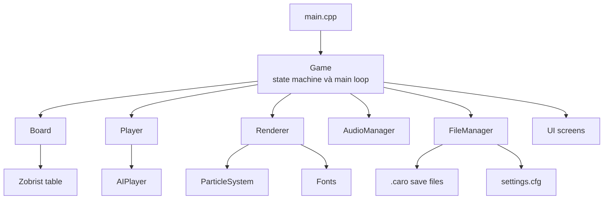
```mermaid
flowchart TD
    main["main.cpp"] --> game["Game<br/>state machine và main loop"]
    game --> board["Board"]
    game --> player["Player"]
    player --> ai["AIPlayer"]
    game --> renderer["Renderer"]
    game --> audio["AudioManager"]
    game --> filemgr["FileManager"]
    game --> screens["UI screens"]
    board --> zobrist["Zobrist table"]
    renderer --> particles["ParticleSystem"]
    renderer --> fonts["Fonts"]
    filemgr --> caro[".caro save files"]
    filemgr --> settings["settings.cfg"]
```

Trong kiến trúc trên, `Game` không làm thay tất cả mọi việc; nó chỉ đóng vai trò orchestration. Khi đang ở trạng thái chơi, `Game` hỏi người chơi hiện tại lấy nước đi, chuyển nước đi hợp lệ cho `Board`, yêu cầu `Renderer` cập nhật phần hiển thị và gọi `AudioManager` phát âm thanh nếu cần. Khi chuyển sang trạng thái lưu hoặc tải, `Game` lại làm việc với `FileManager`. Với cách orchestration này, control flow của chương trình vẫn tập trung ở một nơi, nhưng trách nhiệm cụ thể được đẩy về đúng module của nó.

Điểm quan trọng nhất của cấu trúc này là tính mở rộng. Sau khi phần cốt lõi ổn định, nhóm vẫn có thể thêm Multiplayer, Story Mode, launch screen và các màn hình phụ mà không phải viết lại `Board` hay phần AI. Đây là chỗ mà tư duy hướng đối tượng phát huy tác dụng rõ nhất: hệ thống ban đầu có thể chưa hoàn hảo, nhưng nếu mô hình trách nhiệm được đặt đúng, các phần mở rộng sau đó sẽ ít gây phá vỡ hơn.

## 2.3 State Machine và Main Loop

Trò chơi không chỉ có một màn hình chơi cờ. Nó còn có menu, settings, save/load, game over, story intro, sảnh multiplayer và màn khởi động. Nếu xử lý mọi thứ bằng một chuỗi `if` lớn theo kiểu "nếu đang ở đây thì vẽ cái này, nếu đang ở kia thì kiểm tra cái kia", code sẽ rất nhanh rối. Vì vậy, nhóm mô hình hóa luồng hoạt động bằng một *state machine (FSM)*.

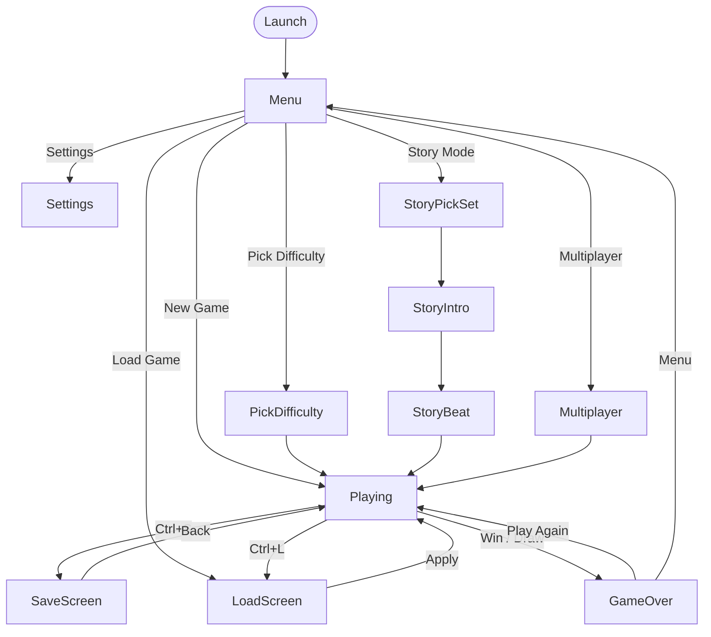
```mermaid
flowchart TD
    launch([Launch]) --> menu[Menu]
    menu -->|New Game| playing[Playing]
    menu -->|Load Game| load[LoadScreen]
    menu -->|Settings| settings[Settings]
    menu -->|Story Mode| storypick[StoryPickSet]
    menu -->|Multiplayer| multi[Multiplayer]
    menu -->|Pick Difficulty| pickdiff[PickDifficulty]
    pickdiff --> playing
    playing -->|Ctrl+S| save[SaveScreen]
    save -->|Back| playing
    playing -->|Ctrl+L| load
    load -->|Apply| playing
    playing -->|Win / Draw| gameover[GameOver]
    gameover -->|Play Again| playing
    gameover -->|Menu| menu
    storypick --> storyintro[StoryIntro]
    storyintro --> storybeat[StoryBeat]
    storybeat --> playing
    multi --> playing
```

Nhóm cũng tách rõ hai pha *update* và *draw* trong mỗi frame. Pha update xử lý input, suy nghĩ của AI, sự kiện mạng, đồng hồ đếm và chuyển state. Pha draw chỉ làm nhiệm vụ render. Việc tách như vậy giúp hạn chế các lỗi kiểu "đang vẽ thì state đổi giữa chừng" và khiến control flow của chương trình dễ đọc hơn khi số lượng screen tăng lên.

## 2.4 Các lớp và module chính

Để người đọc dễ hình dung hơn, bảng sau tóm tắt các thành phần quan trọng của hệ thống:

| Thành phần | Vai trò chính |
|------------|---------------|
| `Game` | Điều phối state, main loop và chuyển màn hình |
| `Board` | Lưu trạng thái bàn cờ, đặt/undo nước đi, kiểm tra thắng |
| `Player` | Giao diện chung cho mọi kiểu người chơi |
| `AIPlayer` | Tính toán nước đi của máy bằng heuristic và minimax |
| `Renderer` | Vẽ bàn cờ, quân cờ, hiệu ứng và HUD |
| `AudioManager` | Nhạc nền, hiệu ứng click, đặt quân, chiến thắng |
| `FileManager` | Lưu và đọc file save, settings, autosave |
| `NetworkSession` | Giao tiếp socket và hàng đợi sự kiện mạng |
| `StoryMode` và các lớp liên quan | Quản lý campaign progression, linh-vật, lời dẫn |

Từ góc nhìn OOP, hai điểm thể hiện rõ nhất là *đóng gói* và *đa hình*. `Board` tự bảo vệ trạng thái của bàn cờ, còn `Player` cho phép nhiều kiểu người chơi cùng tham gia vào cùng một *game loop* mà `Game` không cần biết chi tiết từng kiểu. Đó là lý do sau này nhóm có thể dùng cùng một pipeline cho người chơi thật, AI, và dữ liệu đến từ mạng.

## 2.5 Mô hình dữ liệu của ván cờ

Lõi của mỗi ván cờ nằm ở lớp `Board`. Dù phần trình bày dùng 3D, bản thân `Board` vẫn được giữ ở dạng dữ liệu thuần:

```cpp
enum class CellState { Empty = 0, PlayerX = 1, PlayerO = 2 };
struct Move { int row; int col; };

class Board {
    static const int SIZE = 15;
    CellState cells[SIZE][SIZE];
    Move lastMove;
    uint64_t zobristHash;
};
```

Việc giữ `Board` không phụ thuộc raylib mang lại ba lợi ích rõ ràng. Thứ nhất, lớp này có thể được unit test riêng bằng Catch2. Thứ hai, cùng một `Board` có thể phục vụ nhiều chế độ chơi khác nhau mà không cần phân nhánh theo kiểu UI. Thứ ba, trạng thái bàn cờ dễ ghi ra file hơn vì dữ liệu tương đối gọn và có cấu trúc cố định.

Ngoài mảng `cells`, nhóm lưu thêm `lastMove` để phục vụ việc kiểm tra thắng theo nước cuối, và `zobristHash` để tăng tốc cho Transposition Table trong AI. Đây là hai trường không bắt buộc nếu chỉ muốn chương trình "chạy được", nhưng lại rất quan trọng nếu muốn phần AI có hiệu năng đủ tốt mà không phải quét toàn bộ bàn cờ sau mỗi nước.

## 2.6 Lưu và khôi phục ván cờ

Một yêu cầu thực tế của trò chơi là người dùng phải có thể lưu ván cờ dở dang và mở lại sau đó. Nếu chỉ viết ra file text đơn giản, việc kiểm tra lỗi và bảo toàn tính nhất quán sẽ khá lỏng lẻo. Vì vậy, nhóm chọn định dạng nhị phân có header rõ ràng, kèm cơ chế kiểm tra CRC32.

| Trường | Mục đích |
|--------|----------|
| `magic` | Nhận dạng đúng định dạng file |
| `version` | Hỗ trợ nâng cấp định dạng save |
| `checksum` | Phát hiện file lỗi hoặc bị sửa hỏng |
| `moveCount`, `currentTurn`, `gameMode`, `aiDepth` | Khôi phục đúng ngữ cảnh của ván |
| `cells[15][15]` | Trạng thái bàn cờ |
| `lastMove` | Hỗ trợ kiểm tra thắng sau khi đọc lại |
| Dữ liệu Story | Lưu set hiện tại, tỉ số best-of-3, số lượt linh-vật |

Ngoài save tay, hệ thống còn có *autosave* để ghi lại trạng thái sau mỗi nước đi. Điều này giúp giảm rủi ro mất tiến trình nếu người chơi thoát đột ngột. Nhóm cũng giữ cơ chế *version migration* để những file save cũ vẫn có thể được đọc lại sau khi cấu trúc dữ liệu được mở rộng thêm cho Story Mode.

## 2.7 Runtime Responsiveness

Một vấn đề nhóm gặp khá sớm là: khi AI suy nghĩ ở mức khó cao, cửa sổ dễ bị khựng; khi tài nguyên đồ họa nặng được tải đồng loạt lúc khởi động, trải nghiệm ban đầu không mượt. Nếu bỏ mặc vấn đề này, sản phẩm sẽ cho cảm giác "đúng chức năng nhưng khó dùng". Vì vậy, nhóm xử lý hai việc nặng theo hướng asynchronous.

Thứ nhất, phần AI được chạy trên một `std::thread` riêng. Main loop chỉ hiển thị trạng thái "AI đang suy nghĩ…" và kiểm tra kết quả khi background thread tính toán kết thúc. Thứ hai, việc tải texture và tài nguyên nền được chia thành nhiều bước nhỏ để không khóa khung hình trong giai đoạn đầu. Cách làm này không khiến trò chơi phức tạp hơn về mặt UI, nhưng lại cải thiện đáng kể cảm giác sử dụng.

Điểm quan trọng là các background thread không được chạm trực tiếp vào phần render hay thay đổi trạng thái bàn cờ tùy ý. Kết quả từ AI hoặc từ mạng đều được bàn giao về main thread trước khi áp dụng. Đây là nguyên tắc giúp chương trình vẫn ổn định khi số tính năng tăng lên.

-----

# Chương 3 - Thuật toán và trí tuệ nhân tạo

## 3.1 Bài toán AI trong trò chơi Caro

Nếu chỉ xét một nước đi trước mắt, AI rất dễ bỏ lỡ những thế cờ mà đối thủ sẽ tạo ra sau một hoặc hai lượt nữa. Nhưng nếu xét quá sâu trên toàn bộ bàn 15×15, số nhánh tăng quá nhanh và thời gian chờ sẽ không phù hợp với trải nghiệm chơi game. Vì vậy, mục tiêu của nhóm không phải là xây dựng một AI "mạnh nhất có thể", mà là một AI có độ khó phân tầng rõ ràng, phản hồi đủ nhanh, và vẫn cho cảm giác hợp lý khi chơi thật.

Từ mục tiêu đó, nhóm chia AI thành ba mức. Easy dùng chiến lược ngắn hạn để giữ thời gian phản hồi rất thấp. Normal và Hard dùng minimax với alpha-beta pruning, heuristic và Transposition Table để nhìn sâu hơn. Cách chia này giúp người chơi phổ thông vẫn tiếp cận được, trong khi người muốn thử thách vẫn thấy có sự khác biệt rõ ràng giữa các cấp độ.

## 3.2 Kiểm tra thắng theo nước cuối

Một tối ưu nhỏ nhưng rất hiệu quả là không quét toàn bộ bàn cờ sau mỗi lượt. Trên thực tế, sau khi một quân mới được đặt xuống, chỉ các chuỗi đi qua ô đó mới có khả năng tạo thành chiến thắng. Vì vậy, `Board::checkWinner` chỉ cần xét bốn hướng cơ bản xuất phát từ `lastMove`:

- ngang
- dọc
- chéo chính
- chéo phụ

Ở mỗi hướng, chương trình đếm số quân liên tiếp theo hai chiều rồi cộng lại với ô hiện tại. Nếu tổng đạt từ 5 trở lên thì xác định thắng. Cách làm này rẻ hơn rất nhiều so với việc quét cả 225 ô ở mỗi lượt, đồng thời đơn giản để kiểm thử.

## 3.3 Thu hẹp không gian tìm kiếm

Vấn đề lớn nhất của minimax trên bàn 15×15 là *branching factor*. Nếu coi mọi ô trống đều là ứng viên hợp lệ, số nước có thể đi ở giữa ván là quá lớn. Nhóm khắc phục bằng cách chỉ sinh ứng viên trong vùng lân cận các quân đã tồn tại.

Hàm `getCandidateMoves(radius = 2)` trả về các ô trống nằm trong bán kính Chebyshev 2 quanh ít nhất một quân đã đánh. Trực giác của cách làm này khá tự nhiên: phần lớn các nước đi hợp lý đều nằm gần giao tranh hiện tại trên bàn. Nếu mở vùng quá hẹp, AI có thể bỏ qua các nước chặn quan trọng ở xa hơn một ô. Nếu mở quá rộng, số nhánh tăng nhanh và thời gian suy nghĩ kéo dài. Sau khi thử nghiệm, bán kính 2 cho kết quả cân bằng giữa chất lượng và tốc độ.

Khi bàn còn trống hoàn toàn, chương trình trả về ô trung tâm làm nước đầu tiên. Đây là một lựa chọn đơn giản nhưng hợp lý về mặt đối xứng và cũng đủ tốt cho giai đoạn mở đầu.

## 3.4 Heuristic Evaluation

Sau khi đã thu hẹp tập ứng viên, AI vẫn cần một cách để đánh giá "thế cờ nào tốt hơn". Nhóm dùng *heuristic evaluation* dựa trên các mẫu 5 ô liên tiếp. Mỗi cửa sổ gồm 5 vị trí có thể được chấm điểm tùy theo số quân của mình, số ô trống, và việc cửa sổ đó có bị đối thủ chặn hay không.

| Mẫu tiêu biểu | Ý nghĩa | Điểm gợi ý |
|---------------|---------|------------|
| `SSSSS` | 5 quân liên tiếp | 100 000 |
| `SSSS.` / `.SSSS` | Sắp thắng ngay | 15 000 |
| `.SSS.` | 3 mở hai đầu | 1 500 |
| `SSS..` | 3 nhưng hẹp hơn | 1 000 |
| `SS...` | 2 quân liền nhau | 100 |
| có quân đối thủ | Cửa sổ bị phá | 0 |

Điểm toàn bàn được tính theo hướng so sánh giữa hai bên:

$$
\text{score} = \sum \text{score}_{self}(w) - 1.5 \cdot \sum \text{score}_{opp}(w)
$$

Hệ số `1.5` dành cho đối thủ là một chủ đích thiết kế. Trong thực tế chơi Caro, nếu người chơi không chặn đúng lúc thì đối thủ sẽ thắng ở lượt kế tiếp. Vì vậy, AI cần ưu tiên phòng thủ mạnh hơn so với việc chỉ cộng trừ đối xứng tuyệt đối. Đây là điểm khiến AI ở mức Normal và Hard có cảm giác "biết chặn" chứ không chỉ biết đuổi theo thế tấn công của riêng mình.

## 3.5 Minimax, alpha-beta pruning và Transposition Table

Phần AI khó hơn của trò chơi dựa trên minimax. Về ý tưởng, AI xem mình là bên *MAX* muốn tối đa hóa điểm heuristic, còn đối thủ là bên *MIN* muốn làm điều ngược lại.

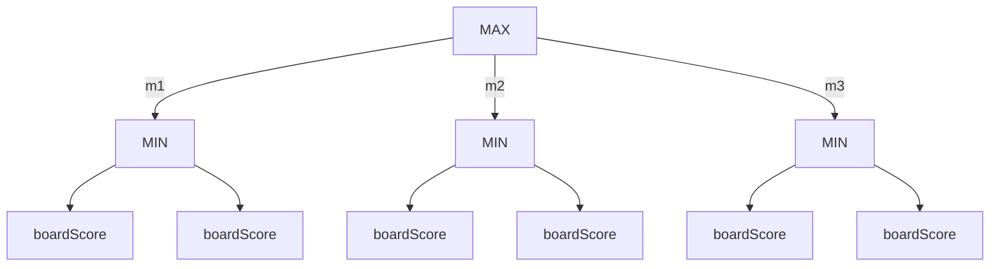
```mermaid
flowchart TD
    max["MAX"]
    max -->|m1| min1["MIN"]
    max -->|m2| min2["MIN"]
    max -->|m3| min3["MIN"]
    min1 --> leaf1["boardScore"]
    min1 --> leaf2["boardScore"]
    min2 --> leaf3["boardScore"]
    min2 --> leaf4["boardScore"]
    min3 --> leaf5["boardScore"]
    min3 --> leaf6["boardScore"]
```

Nếu chạy minimax thuần, số nhánh vẫn còn khá lớn. Vì vậy, nhóm dùng thêm *alpha-beta pruning* để bỏ qua các nhánh chắc chắn không thể cải thiện kết quả cuối cùng. Khi move ordering đủ tốt, lượng node cần duyệt giảm đáng kể, giúp giữ thời gian phản hồi ở mức chấp nhận được cho một game tương tác.

Nhóm cũng bổ sung *Transposition Table* để ghi nhớ những trạng thái bàn cờ đã từng tính. Caro có nhiều tình huống hai dãy nước khác nhau dẫn đến cùng một cấu hình bàn. Nếu không cache lại, AI sẽ lặp lại phần tính toán cũ một cách lãng phí. `board.getHash()` dùng Zobrist hash 64-bit làm khóa, còn giá trị lưu lại gồm depth, score, flag và bestMove đã biết. Đây là tối ưu có tác dụng rõ khi độ sâu tăng lên.

## 3.6 Phân tầng độ khó

Ba mức AI hiện tại được thiết kế theo hướng thực dụng, không cố làm "đủ bộ thuật toán" cho đẹp:

| Mức | Cách hoạt động | Cảm giác khi chơi |
|-----|----------------|-------------------|
| Easy | Greedy một lớp với delta heuristic | Phản hồi rất nhanh, dễ tiếp cận |
| Normal | Minimax depth 2 + alpha-beta + TT | Biết chặn và phản đòn tương đối |
| Hard | Minimax depth 3 + alpha-beta + TT | Áp lực hơn, ít nước ngây thơ hơn |

Nhóm chủ động dừng depth thông thường ở 3 vì mục tiêu của trò chơi là chơi được mượt, chứ không phải tối đa hóa sức mạnh AI bằng mọi giá. Trong quá trình thử nghiệm, độ sâu cao hơn làm thời gian suy nghĩ tăng mạnh ở một số thế cờ giữa ván, và điều đó ảnh hưởng trực tiếp đến trải nghiệm người dùng.

## 3.7 Undo và debug panel

Hai công cụ hỗ trợ trải nghiệm và phát triển được nhóm giữ lại đến phiên bản cuối là *undo* và *debug panel*. Undo giúp người chơi sửa sai trong PvP hoặc PvE mà không phải khởi động lại cả ván. Ở PvE, nhóm xử lý theo hướng hoàn tác cả nước người chơi lẫn nước AI gần nhất để thao tác có ý nghĩa thực sự.

Debug panel, mở bằng phím *F3*, không dành cho người chơi phổ thông mà phục vụ quá trình tinh chỉnh AI. Nó hiển thị các chỉ số như thời gian suy nghĩ, số node đã duyệt, tần suất probe/hit của Transposition Table và những nước đi được chấm điểm cao nhất. Nhờ panel này, nhóm dễ quan sát hơn khi thay đổi heuristic hoặc move ordering.

-----

# Chương 4 - Giao diện và trải nghiệm người chơi

## 4.1 Visual Direction

Nhóm không muốn trò chơi chỉ dừng ở mức "chạy được luật". Vì vậy, phần UI được đầu tư như một lớp riêng, có visual direction tương đối thống nhất. Bàn cờ và quân cờ được dựng trong không gian 3D, nhưng phần HUD và điều hướng vẫn giữ đủ rõ ràng để người chơi không bị rối. Các nền minh họa, hiệu ứng ánh sáng và typography được chọn theo hướng tạo cảm giác đây là một sản phẩm hoàn chỉnh, chứ không chỉ là bản demo kỹ thuật.

Điều quan trọng là nhóm không cố chạy theo đồ họa quá nặng. Ở quy mô đồ án môn học, một lựa chọn hợp lý hơn là giữ chất lượng hình ảnh vừa đủ tốt, dễ kiểm soát bằng mã, và không làm build hay khởi động trở nên quá nặng nề.

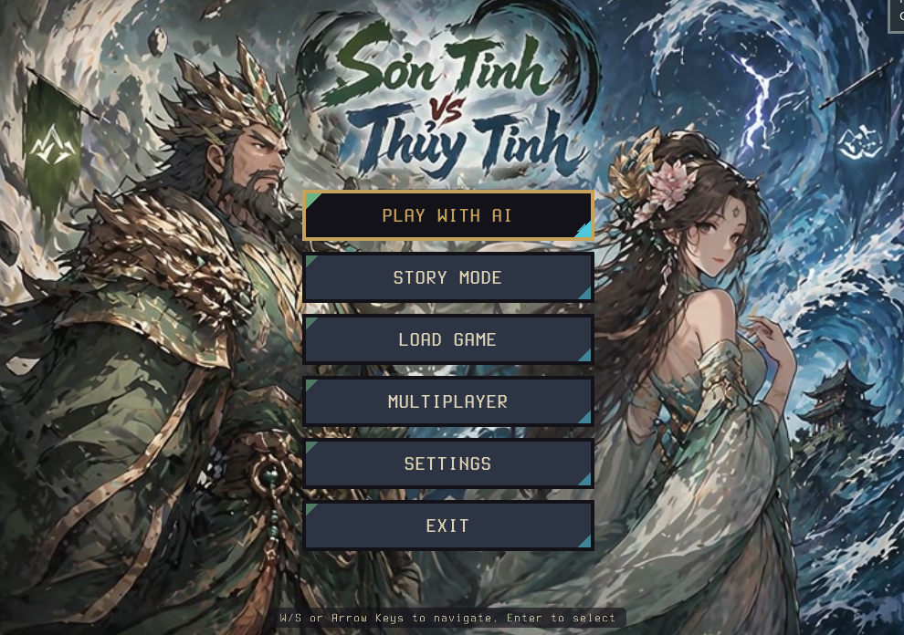
*Hình 4.1. Main Menu thể hiện visual direction tổng thể của sản phẩm, bao gồm typography, nền minh họa và bố cục điều hướng chính.*

## 4.2 Pipeline 3D và cách hiển thị

raylib cung cấp một pipeline khá trực tiếp: tạo cửa sổ, thiết lập camera, vẽ model trong `BeginMode3D`, sau đó chồng các thành phần 2D như HUD và nút điều hướng ở cuối frame. Cấu trúc này phù hợp với sản phẩm của nhóm vì phần "trò chơi" chủ yếu nằm trên một mặt phẳng duy nhất, nhưng vẫn cần chiều sâu thị giác để tạo cảm giác khác biệt so với bàn cờ 2D thông thường.

Nhóm dùng shader để phân biệt chất liệu giữa quân và bàn. Quân cờ có bề mặt sáng hơn, trong khi bàn cờ giữ cảm giác trầm hơn. Đây là thay đổi nhỏ nhưng giúp mắt người chơi tách lớp hình ảnh tốt hơn khi nhìn từ góc nghiêng.

## 4.3 Gameplay Screen và tương tác trực tiếp

Ở màn chơi chính, nhóm chọn camera quỹ đạo quanh bàn cờ. Người chơi có thể xoay góc nhìn, thay đổi khoảng cách và đưa camera về vị trí mặc định. Dù đây không phải là một game thế giới mở, khả năng xoay bàn vẫn giúp sản phẩm có cảm giác "đang chơi một vật thể 3D thật" thay vì nhìn vào một mặt phẳng tĩnh.

Về chọn ô, nhóm dùng raycast từ vị trí chuột vào mặt phẳng bàn cờ. Sau khi xác định điểm va chạm, chương trình chuyển tọa độ thế giới thành `(row, col)` của bàn 15×15. Cách làm này trực quan hơn nhiều so với việc gắn sẵn 225 hitbox 2D lên màn hình, nhất là khi camera có thể xoay.

HUD của trò chơi được giữ theo hướng rõ thông tin thay vì quá cầu kỳ. Những gì người chơi cần nhìn thấy ngay gồm: tên hai bên, quân đang đến lượt, thời gian chơi, số nước đã đi, trạng thái AI và các hotkey quan trọng.

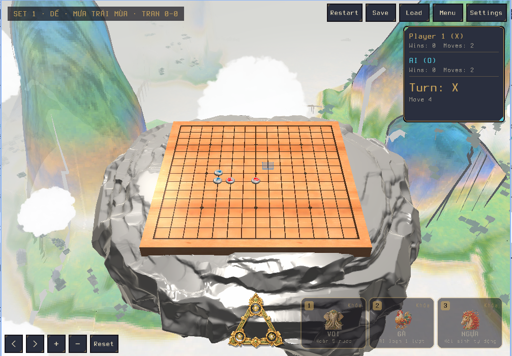
*Hình 4.2. Gameplay screen với camera quỹ đạo, mặt bàn 3D, HUD và vùng tương tác chính của người chơi.*

## 4.4 Hiệu ứng, âm thanh và cảm giác thao tác

Một phần khiến trò chơi bớt khô là các phản hồi thị giác và âm thanh sau mỗi hành động. Khi người chơi đặt quân, hệ thống phát hiệu ứng particle nhỏ và âm thanh ngắn. Khi có chiến thắng, đường thắng sáng lên, nền tối bớt ở bốn góc và hiệu ứng ăn mừng xuất hiện tại các ô liên quan. Những chi tiết này không thay đổi luật chơi, nhưng có ảnh hưởng rõ rệt đến cảm giác hoàn thiện của sản phẩm.

Âm thanh được chia thành nhạc nền và hiệu ứng. Nhóm cố gắng giữ nhạc ở mức vừa phải để không lấn át các tín hiệu thao tác như click, đặt quân hoặc chiến thắng. Đây là chi tiết nhỏ nhưng quan trọng vì trò chơi vốn thiên về nhịp suy nghĩ và quan sát.

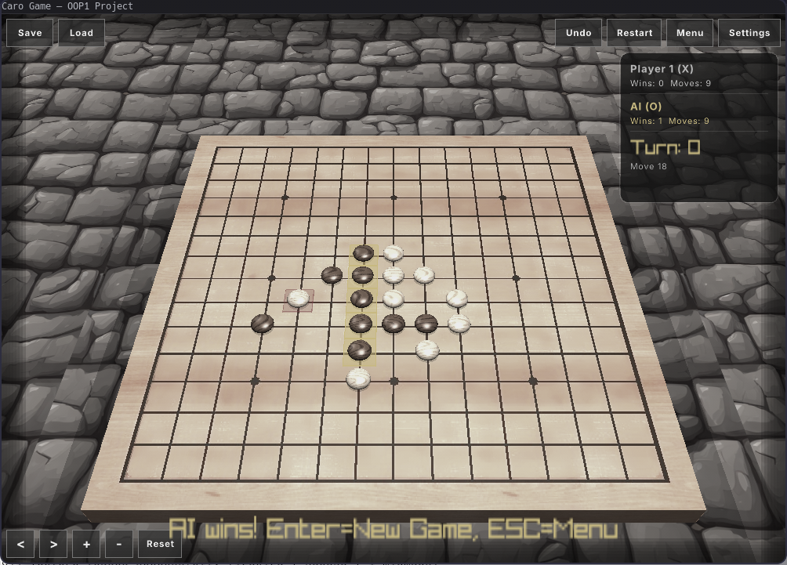
*Hình 4.3. Màn hình kết thúc ván cho thấy lớp overlay, hiệu ứng chiến thắng và cách trò chơi phản hồi sau một kết quả rõ ràng.*

## 4.5 Asset Loading và Launch Screen

Một thay đổi lớn ở giai đoạn hoàn thiện là nhóm bổ sung *launch screen* ở đầu chương trình. Màn hình này giữ trong khoảng 5 giây đầu, đồng thời cho phép hệ thống preload các tài nguyên lớn ở phía sau. Đây không chỉ là lớp trang trí thương hiệu; nó giải quyết một vấn đề thực tế là nếu tải nhiều texture và nền minh họa đồng loạt ngay khi mở cửa sổ, trải nghiệm khởi động sẽ bị giật.

Nhóm áp dụng cùng một nguyên tắc như phần AI: công việc nặng được chia thành các bước nhỏ và bàn giao lại cho main thread đúng lúc cần thiết. Nhờ đó, người dùng có cảm giác chương trình khởi động có chủ đích, thay vì nhìn vào một cửa sổ trống hoặc đứng hình trong vài giây đầu.

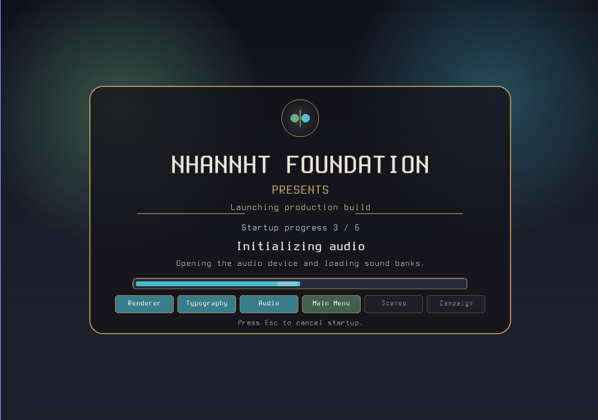
*Hình 4.4. Launch screen của bản production, vừa đóng vai trò nhận diện sản phẩm vừa che giai đoạn preload asset ở đầu chương trình.*

-----

# Chương 5 - Các tính năng mở rộng

## 5.1 Vì sao nhóm mở rộng thêm Story Mode và Multiplayer

Sau khi hai chế độ cơ bản PvP và PvE đã ổn định, nhóm nhận ra rằng nếu dừng ở đó thì sản phẩm vẫn còn khá giống nhiều bài làm Caro khác. Phần mở rộng được chọn không phải để làm "cho nhiều tính năng", mà để trả lời hai câu hỏi khác nhau. Câu hỏi thứ nhất: làm sao để một trò chơi bàn cờ có thêm nhịp kể chuyện và tiến trình? Câu hỏi thứ hai: làm sao để người chơi có thể đấu với nhau ngoài phạm vi một máy?

Story Mode trả lời câu hỏi thứ nhất. Multiplayer trả lời câu hỏi thứ hai. Hai hướng mở rộng này khá khác nhau về bản chất, nhưng lại là phép thử tốt cho kiến trúc của đồ án: nếu phần lõi được tách đúng, cả hai đều có thể cắm vào hệ thống hiện có mà không cần viết lại luật chơi.

Với riêng Story Mode, mục tiêu của nhóm còn đi xa hơn việc "thêm cốt truyện". Đây là nơi nhóm thử biến một trò chơi Caro thành chỗ gặp nhau giữa gameplay và trí nhớ văn hóa. Thay vì phủ lên game một lớp fantasy vô danh, nhóm chọn đi từ truyền thuyết *Sơn Tinh - Thủy Tinh*, ba sính lễ quen thuộc và cảm thức mùa nước của người Việt để xây dựng một campaign có màu sắc riêng. Nói ngắn gọn, Story Mode mang tham vọng làm cho văn hóa Việt hiện diện rõ hơn, sống động hơn và có khả năng tiếp tục nở rộ trong hình thức trò chơi số.

## 5.2 Story Mode và Campaign Progression

Story Mode biến các ván Caro rời rạc thành một campaign nhiều chặng. Thay vì chỉ vào game rồi đánh một ván duy nhất, người chơi đi qua các set có độ khó tăng dần, có lời dẫn riêng, có phần thưởng mở khóa và một trận đấu trùm ở cuối.

Điểm nhóm muốn nhấn mạnh là campaign này không được viết như một thần tích chép lại nguyên văn, cũng không đi theo kiểu fantasy dịch sẵn. Nhóm chọn cách tái kể truyền thuyết bằng một góc nhìn khác: *Cô Sử Tiên* vừa là người kể chuyện vừa là người mang mặc cảm lịch sử; *Sơn Tinh* và *Thủy Tinh* không chỉ là hai cái tên quen thuộc trong sách giáo khoa mà trở thành hai lực đối nghịch núi - nước tiếp tục va vào đời sống hiện đại; còn không gian truyện thì dịch chuyển từ huyền sử xa xăm về gần với miền Nam đương đại, nơi mưa, triều cường, đường ngập và nỗi lo mất đất có thể được cảm nhận trực tiếp.

| Set | Độ khó | `aiDepth` | Vai trò trong campaign progression |
|-----|--------|-----------|---------------------------|
| 1 | Dễ | 1 | Làm quen cơ chế Story |
| 2 | Vừa | 2 | Bắt đầu yêu cầu phòng thủ hợp lý |
| 3 | Khó | 3 | Áp lực chiến thuật rõ hơn |
| 4 | Final Boss | 4 | Cao trào của chiến dịch |

Điểm nhóm thấy thú vị nhất ở Story Mode là phần này không cần một hệ thống gameplay mới hoàn toàn. Nó chủ yếu là một lớp quản lý progression đặt bên trên `Board`, `AIPlayer` và FSM sẵn có. Nói cách khác, Story Mode là ví dụ tốt cho việc mở rộng sản phẩm bằng cách tái sử dụng phần lõi thay vì dựng thêm một "game thứ hai" bên trong game.

Chính vì bám vào phần lõi sẵn có, lớp cốt truyện ở đây không bị tách rời khỏi gameplay. Khi người chơi chặn nước, giữ thế cờ, mở khóa linh-vật hay bước vào trận trùm, họ không chỉ đi qua một chuỗi màn hình đẹp mắt mà đang được đặt vào một phiên bản mới của cuộc đối đầu *Sơn Tinh - Thủy Tinh*. Đây là chỗ nhóm muốn dùng trò chơi như một hình thức kể lại văn hóa: không phải chỉ để "nhắc tên" truyền thuyết, mà để người chơi thực sự tương tác với nó.

## 5.3 Luồng trạng thái của Story Mode

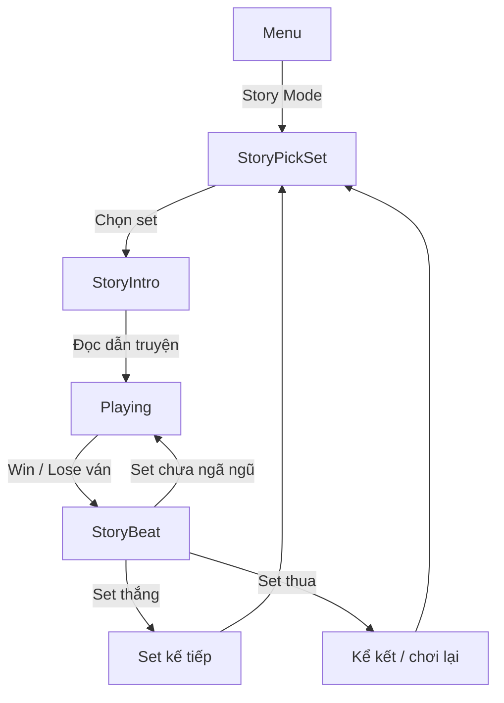
```mermaid
flowchart TD
    menu[Menu] -->|Story Mode| pickset[StoryPickSet]
    pickset -->|Chọn set| intro[StoryIntro]
    intro -->|Đọc dẫn truyện| playing[Playing]
    playing -->|Win / Lose ván| beat[StoryBeat]
    beat -->|Set chưa ngã ngũ| playing
    beat -->|Set thắng| nextset[Set kế tiếp]
    beat -->|Set thua| retry[Kể kết / chơi lại]
    nextset --> pickset
    retry --> pickset
```

Luồng này cho thấy Story Mode không thay thế hoàn toàn màn hình chơi chính; nó bọc quanh nó. `StoryPickSet`, `StoryIntro` và `StoryBeat` chỉ làm nhiệm vụ dẫn dắt, còn ván cờ thực tế vẫn diễn ra trong `Playing`. Nhờ đó, nhóm tránh được việc nhân đôi logic xử lý cờ chỉ để phục vụ một chế độ phụ.

Về mặt nội dung, cách tổ chức này cũng có lợi. Nhóm có thể giữ nhịp kể cô đọng, tránh biến đồ án thành một visual novel dài dòng, nhưng vẫn đủ chỗ để từng chặng mang một ý nghĩa riêng: mùa mưa trái nhịp, vết nứt long mạch, bức tường biển dựng đứng, rồi cao trào là cuộc đối đầu trực diện với Thủy Tinh. Các chặng vì thế không chỉ tăng độ khó AI, mà còn nâng dần quy mô biểu tượng của câu chuyện.

## 5.4 Linh-vật và trận trùm

Một điểm làm Story Mode khác với PvE thường là cơ chế *linh-vật*. Mỗi linh-vật tương ứng với một dạng hỗ trợ: hoàn tác, làm nhiễu nước đi của AI hoặc hồi sinh ở trận cuối. Về mặt triển khai, nhóm cố ý gắn các linh-vật này vào những cơ chế đã tồn tại thay vì dựng thêm hệ thống riêng. Undo dùng lại `moveHistory`, làm nhiễu AI dùng lại pipeline chọn nước đi, còn hồi sinh được gắn vào logic kiểm tra kết quả của trận trùm.

Ba linh-vật chủ đạo của campaign là Voi chín ngà, Gà chín cựa và Ngựa chín hồng mao. Đây không phải những cái tên được chọn ngẫu nhiên cho có màu dân gian. Chúng đi thẳng từ bộ sính lễ gắn với truyện *Sơn Tinh - Thủy Tinh*, rồi tiếp tục được nối sang các lớp ký ức văn hóa khác trong phần lời dẫn mở khóa. Nhờ vậy, mỗi linh-vật không chỉ là một power-up, mà còn là một điểm neo văn hóa giúp Story Mode giữ được căn tính Việt Nam của nó.

Nhóm cũng giữ đúng định hướng mỹ thuật của trò chơi khi thiết kế ba hình tượng này: màu sáng, chất liệu hội họa, dễ nhận diện và đủ khác nhau để người chơi nhớ vai trò của từng linh-vật ngay từ phần giới thiệu. Quan trọng hơn, nhóm muốn người chơi nhìn thấy ở đó không chỉ một con voi, một con gà, một con ngựa "đẹp để trang trí", mà là ba biểu tượng bước ra từ kho truyện dân gian Việt Nam và được làm mới trong ngôn ngữ hình ảnh của game.

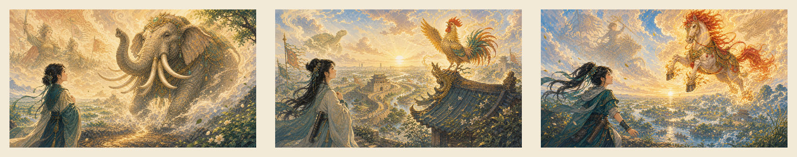

*Hình 5.1. Ba linh-vật của Story Mode: Voi chín ngà, Gà chín cựa và Ngựa chín hồng mao. Hình tổng hợp này được dựng từ bộ art đã dùng trực tiếp trong game.*

Trận Final Boss được xem như nơi đẩy độ khó lên cao nhất. AI ở đây dùng độ sâu lớn hơn thông thường và có cơ chế gây bất lợi cho người chơi sau một số lượt nhất định. Tuy nhiên, nhóm vẫn giữ nguyên tắc cân bằng: trận trùm khó hơn thật, nhưng không được trở thành phần chơi "ăn gian đến mức mất hứng". Vì vậy, người chơi vẫn có các cơ chế bù như best-of-3 và lượt hỗ trợ từ linh-vật.

Ở cấp ý tưởng, đây cũng là đoạn mà tham vọng "làm mới thần thoại Việt" bộc lộ rõ nhất. Thủy Tinh không còn chỉ là một cái tên quen thuộc trong truyện kể thiếu nhi, mà trở thành hình tượng của nước dữ, của mùa lũ lặp đi lặp lại, của nỗi đe dọa luôn quay lại với đất sống của con người. Còn người chơi, thông qua Sơn Tinh và ba linh-vật, được đặt vào vai trò giữ đất, giữ long mạch, giữ quyền được đứng vững. Nhóm muốn đoạn kết này khiến người chơi cảm nhận rằng truyền thuyết Việt không nằm chết trong sách, mà vẫn có thể được kể lại bằng gameplay, nhịp hình và tương tác.

## 5.5 Multiplayer

Multiplayer là phần mở rộng có tính kỹ thuật rõ rệt nhất của đồ án vì nó đưa thêm yếu tố data synchronization và asynchronous networking vào một hệ thống vốn ban đầu chỉ chạy nội bộ. Nhóm triển khai hai tình huống:

1. *LAN host-authoritative*: một máy làm host, giữ trạng thái bàn cờ chuẩn, máy còn lại gửi nước đi và nhận xác nhận.
2. *Online relay*: cả hai bên cùng kết nối đến một máy chủ trung gian, dùng mã phòng để ghép cặp và chuyển tiếp lệnh.

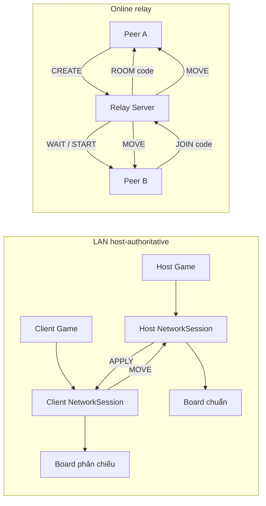
```mermaid
flowchart LR
    subgraph LAN["LAN host-authoritative"]
        host["Host Game"] --> hostnet["Host NetworkSession"]
        client["Client Game"] --> clientnet["Client NetworkSession"]
        clientnet -->|MOVE| hostnet
        hostnet -->|APPLY| clientnet
        hostnet --> hostboard["Board chuẩn"]
        clientnet --> clientboard["Board phản chiếu"]
    end

    subgraph ONLINE["Online relay"]
        peerA["Peer A"] -->|CREATE| relay["Relay Server"]
        relay -->|ROOM code| peerA
        peerB["Peer B"] -->|JOIN code| relay
        relay -->|WAIT / START| peerB
        relay -->|MOVE| peerA
        relay -->|MOVE| peerB
    end
```

Trong cả hai trường hợp, `NetworkSession` chỉ nên làm đúng một việc: nhận và gửi dữ liệu mạng. Nó không được tự ý sửa `Board`. Mọi sự kiện đều được đưa về main thread dưới dạng `NetEvent`, sau đó `Game` mới quyết định cập nhật state hay đổi screen. Cách làm này nhất quán với cách nhóm xử lý AI thread: background thread có thể thu thập hoặc tính toán dữ liệu, nhưng chỉ main thread mới được áp dụng thay đổi lên phần chơi.

Về giao thức, nhóm ưu tiên các lệnh dạng text đơn giản như `CREATE`, `JOIN`, `ROOM`, `WAIT`, `START`, `MOVE`, `ERROR`, `QUIT`. Lựa chọn này không phải tối ưu nhất về băng thông, nhưng lại rất dễ debug trong giai đoạn phát triển và đủ phù hợp với phạm vi đồ án môn học.

-----

# Chương 6 - Kết quả, hạn chế và bài học

## 6.1 Hình ảnh sản phẩm hoàn thiện

Phần này trình bày các screen tiêu biểu của phiên bản cuối cùng. Các ảnh được lấy trực tiếp từ thư mục `doancaro/public/`.


*Hình 6.1. Main Menu của trò chơi sau khi hoàn thiện giao diện và bố cục điều hướng.*

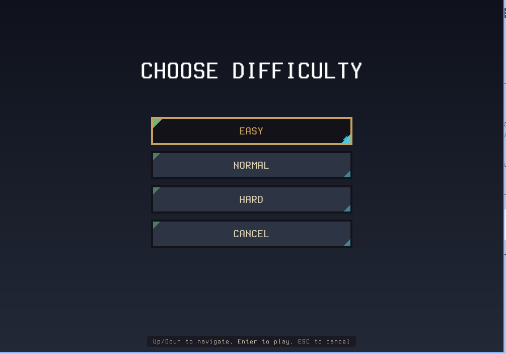
*Hình 6.2. Màn hình chọn độ khó AI trước khi bắt đầu chế độ PvE.*


*Hình 6.3. Màn chơi chính với bàn cờ 3D, camera nghiêng và HUD theo dõi thông tin ván đấu.*

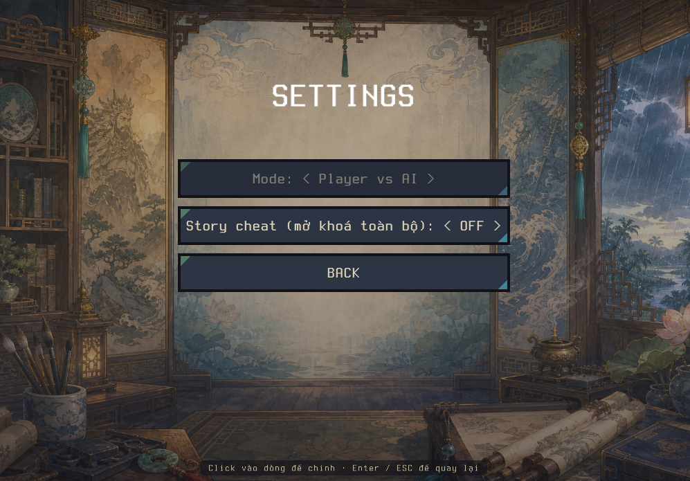
*Hình 6.4. Màn hình Settings với các tùy chọn cấu hình người chơi và chế độ.*

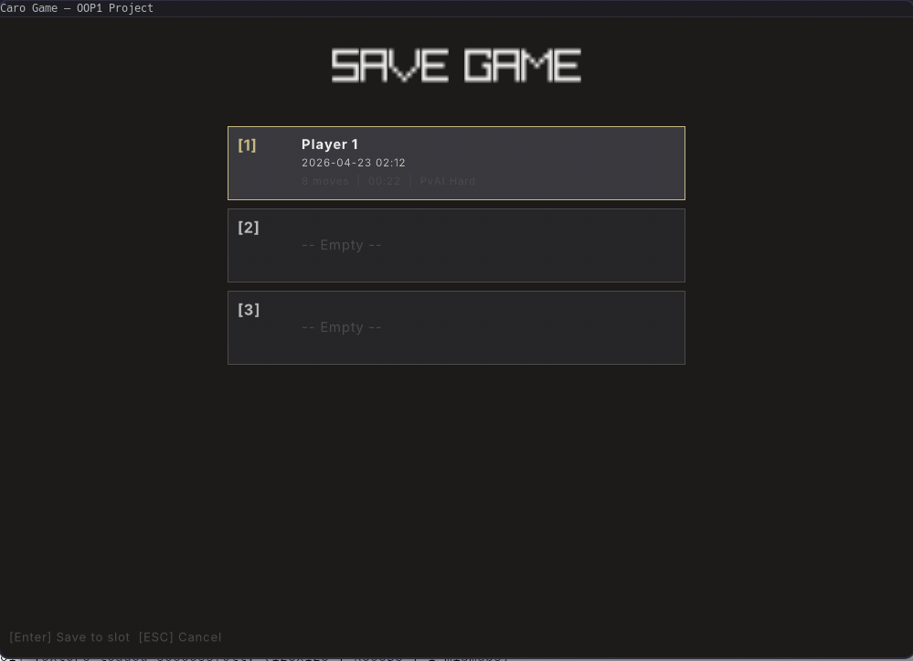
*Hình 6.5. Màn hình lưu ván cờ theo slot.*

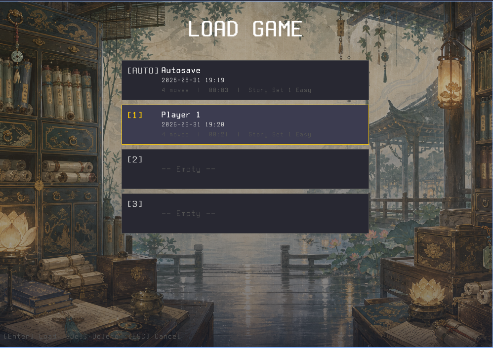
*Hình 6.6. Màn hình tải ván cờ, bao gồm autosave và save tay.*

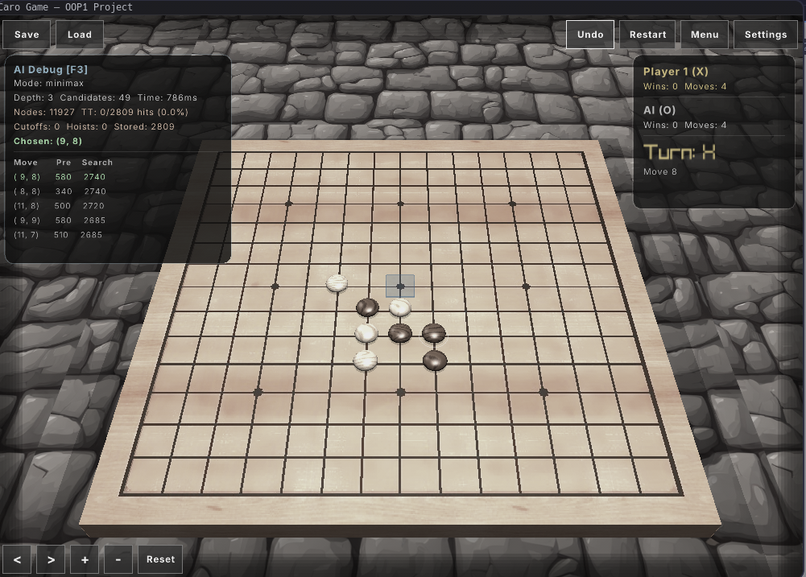
*Hình 6.7. Debug panel dùng để quan sát quá trình suy nghĩ của AI.*

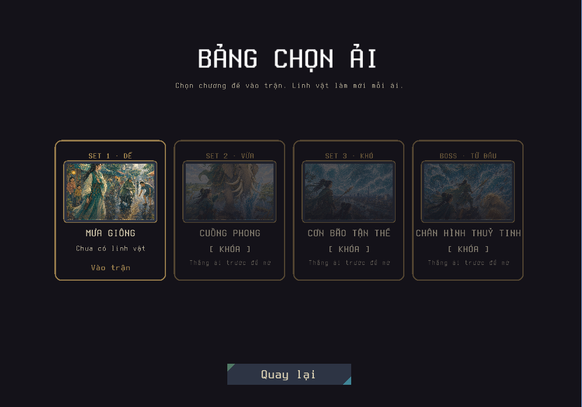
*Hình 6.8. Màn hình chọn chặng trong Story Mode, nơi campaign được tổ chức như một hành trình tái diễn giải truyền thuyết Việt theo các lớp tăng dần về độ khó và ý nghĩa biểu tượng.*

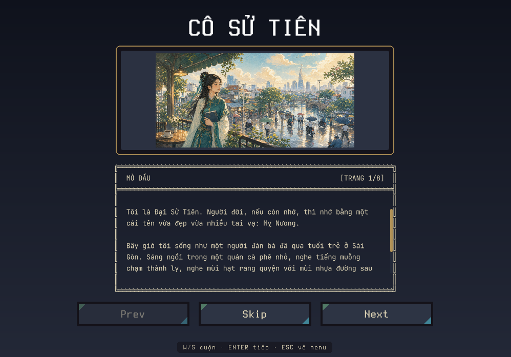
*Hình 6.9. Màn hình dẫn truyện trong Story Mode, cho thấy nỗ lực đưa nhịp kể và cảm thức của thần thoại Việt vào trải nghiệm chơi thay vì chỉ dùng truyện làm lớp trang trí.*

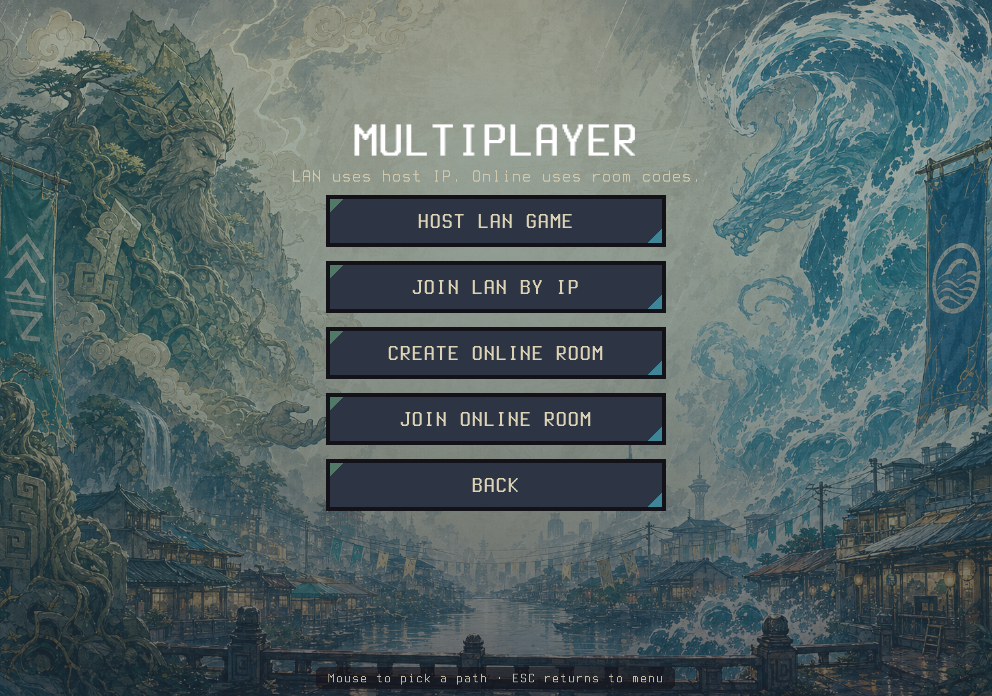
*Hình 6.10. Màn hình Multiplayer phục vụ việc tạo hoặc tham gia phòng đấu.*


*Hình 6.11. Màn hình kết thúc ván với hiệu ứng chiến thắng và lớp phủ tổng kết.*

Nhìn theo cụm chức năng, bộ ảnh trên cho thấy đồ án không chỉ dừng ở một màn cờ duy nhất. Sản phẩm đã có đủ các lớp cần thiết của một trò chơi hoàn chỉnh: khởi tạo phiên chơi, chọn chế độ, UI trong trận, lưu progression, xem lại, kiểm tra nội bộ, kể chuyện và đấu qua mạng.

## 6.2 Đánh giá kết quả đạt được

Sau khi hoàn thành phiên bản cuối, nhóm tự đánh giá đồ án đạt được ba kết quả chính.

Thứ nhất, phần *chức năng cốt lõi* đã ổn định. Luật chơi, kiểm tra thắng, undo, save/load, các màn hình chuyển trạng thái và phần lớn thao tác cơ bản đều vận hành đúng như kỳ vọng. Đây là nền tảng để các phần mở rộng phía trên không bị sụp theo.

Thứ hai, *kiến trúc phần mềm* thể hiện khá rõ tinh thần của môn học. Nhóm không chỉ sử dụng lớp và đối tượng theo hình thức, mà thực sự dựa vào đóng gói, kế thừa và phân tách trách nhiệm để mở rộng hệ thống. Việc Story Mode và Multiplayer cùng tái sử dụng `Board`, `Player`, `AIPlayer` và FSM là minh chứng rõ nhất cho điểm này.

Thứ ba, *trải nghiệm người dùng và bản sắc nội dung* tốt hơn mức tối thiểu thường thấy ở đồ án môn học. Camera 3D, âm thanh, hiệu ứng đặt quân, launch screen, Story progression và multiplayer online khiến sản phẩm có cảm giác gần với một trò chơi thật hơn là một bài demo thuật toán. Riêng Story Mode còn giúp sản phẩm có một tham vọng rõ ràng hơn: dùng hình thức game để kể lại, làm mới và góp phần lan tỏa văn hóa Việt trong một ngôn ngữ mà người chơi hiện nay dễ tiếp cận. Dù vẫn còn hạn chế, đây là phần mà nhóm thấy mình tiến bộ rõ nhất so với giai đoạn đầu.

## 6.3 Những hạn chế còn tồn tại

Nhóm không xem phiên bản hiện tại là hoàn hảo. Một số điểm hạn chế còn khá rõ:

1. AI thường dừng ở độ sâu 3 trong chế độ thông thường. Điều này hợp lý về tốc độ, nhưng đồng nghĩa với việc AI vẫn có thể bỏ lỡ các chuỗi đe dọa dài hơn.
2. Hệ thống heuristic hiện tại hoạt động tốt ở mức đồ án, nhưng chưa đạt đến những kỹ thuật chuyên sâu hơn như threat-space search hoàn chỉnh.
3. Multiplayer online vẫn phụ thuộc vào relay server bên ngoài. Đây chưa phải là một hạ tầng mạng đầy đủ với matchmaking, reconnect và giám sát kết nối tốt.
4. Story Mode đã tạo được tiến trình và bản sắc, nhưng phần nội dung văn bản và nhịp chuyển cảnh vẫn còn ngắn so với tiềm năng mở rộng của nó.
5. Một số tuỳ chọn người dùng như theme, cấu hình âm lượng chi tiết, replay hoặc tutorial vẫn chưa được bổ sung.

Việc nhìn thẳng vào những hạn chế này quan trọng hơn việc cố trình bày đồ án như một sản phẩm "đã xong mọi thứ". Với quy mô của một môn học một học kỳ, có giới hạn là điều bình thường; quan trọng là hiểu rõ giới hạn đó nằm ở đâu.

## 6.4 Bài học rút ra từ quá trình thực hiện

Đây là phần mà nhóm thấy có giá trị nhất sau khi hoàn thành đồ án.

**Bài học thứ nhất: thiết kế sớm quan trọng hơn viết nhanh.** Ở giai đoạn đầu, việc tách `Board`, `Player`, `AIPlayer`, `Renderer` và `FileManager` có thể làm tốc độ viết chậm đi một chút, nhưng về sau lại giúp nhóm thêm Story Mode và Multiplayer dễ hơn rất nhiều.

**Bài học thứ hai: trải nghiệm người dùng không phải phần "trang trí".** Một game có AI đúng, luật đúng nhưng cửa sổ đứng hình khi AI suy nghĩ hoặc khởi động quá chậm vẫn tạo cảm giác không tốt. Launch screen, âm thanh, effect và asset loading theo hướng asynchronous đều xuất phát từ những vấn đề thực tế như vậy.

**Bài học thứ ba: thuật toán mạnh chưa chắc là lựa chọn đúng nếu không phù hợp với thời gian phản hồi.** Trong game tương tác, người chơi chờ 1 giây và chờ 20 giây là hai trải nghiệm hoàn toàn khác nhau. Vì vậy, nhóm phải cân bằng giữa độ sâu tìm kiếm và nhịp chơi thay vì chỉ đẩy AI mạnh nhất có thể.

**Bài học thứ tư: phần báo cáo phải phản ánh được quá trình suy nghĩ của nhóm.** Nếu chỉ liệt kê class, công thức và tính năng, báo cáo sẽ dễ trở thành một bản mô tả máy móc. Sau quá trình chỉnh sửa, nhóm hiểu rõ hơn rằng một báo cáo kỹ thuật tốt cần cho người đọc thấy được cả mục tiêu, lý do chọn giải pháp và những đánh đổi đã chấp nhận.

## 6.5 Hướng phát triển

Nếu có thêm thời gian, nhóm muốn phát triển tiếp theo các hướng sau:

1. Bổ sung AI nâng cao với iterative deepening, giới hạn thời gian suy nghĩ và opening book.
2. Hoàn thiện threat-space search để cải thiện xử lý thế cờ ở giai đoạn cuối.
3. Mở rộng Story Mode bằng nhiều set hơn, nhiều nhánh lời dẫn hơn và cơ chế đặc biệt rõ cá tính từng chặng.
4. Nâng cấp Multiplayer theo hướng bền vững hơn: reconnect, theo dõi trạng thái phòng, spectators và hạ tầng relay chủ động hơn.
5. Thêm replay system, tutorial và các tùy chọn cá nhân hóa UI.
6. Tối ưu thêm quy trình phát hành để bản portable trên Linux và Windows ổn định hơn ở nhiều môi trường.

## 6.6 Phân công công việc

| Thành viên            | MSSV     | Phần đảm nhiệm chính | Đóng góp |
|-----------------------|----------|----------------------|----------|
| Nguyễn Hữu Thiện Nhân | 25310023 | Thiết kế kiến trúc, lập trình gameplay, AI, renderer, save/load, Story Mode, Multiplayer, unit test, hoàn thiện bản build | _____% |
| Bùi Thị Minh Hằng     | 25310057 | Biên tập báo cáo, dàn trang, thiết kế slide, hỗ trợ chuẩn bị phần trình bày | _____% |
| Phạm Ngọc Trâm        | 25310043 | Chuẩn bị hình ảnh minh họa, hỗ trợ thiết kế slide, rà soát phần trình bày | _____% |
| *Tổng*                |          |                      | *100 %* |

*(Tỉ lệ phần trăm được điền sau khi nhóm chốt lần cuối trước buổi báo cáo.)*

-----

# Tài liệu tham khảo

[1] *Raysan5* (2024). *raylib 5.5 Documentation*. <https://www.raylib.com>

[2] *Russell, S. & Norvig, P.* (2020). *Artificial Intelligence: A Modern Approach*, 4th ed. Pearson. - Chương về adversarial search, minimax và alpha-beta pruning.

[3] *Allis, L. V.* (1993). *Searching for Solutions in Games and Artificial Intelligence*. Ph.D. dissertation, University of Limburg. - Phần về Gomoku, threat-space search và tư duy giải bài toán cờ bàn.

[4] *Zobrist, A. L.* (1970). *A New Hashing Method with Application for Game Playing*. Technical Report 88, University of Wisconsin.

[5] *catchorg* (2024). *Catch2 v3*. <https://github.com/catchorg/Catch2>

[6] *Kitware* (2024). *CMake Documentation*. <https://cmake.org/documentation>

[7] *ISO/IEC 14882:2014*. C++14 Standard. <https://en.cppreference.com>

[8] *IEEE 802.3*. CRC-32 polynomial `0xEDB88320`.

*Hết báo cáo*
